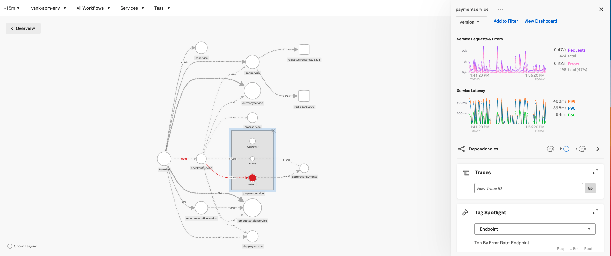

## サービスマップ

サービスマップの **paymentservice** をクリックし、**paymentservice** の下にある`breakdown`のドロップダウンフィルタから **version** を選択します。これにより、カスタムスパンタグの **version** でサービスマップがフィルタリングされます。

これで、サービスマップが以下のスクリーンショットのように更新され、**paymentservice** の異なるバージョンが表示されていることがわかります。

