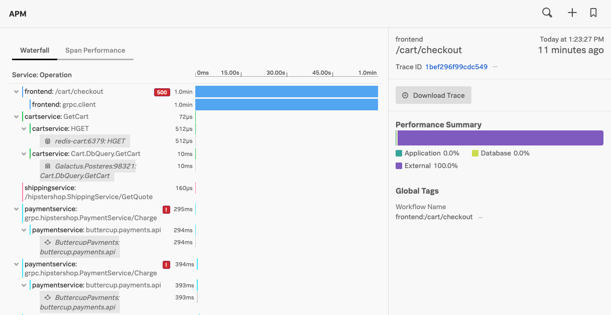

{}15 分{}

- APM の概要 - RED メトリクス
- サービスマップを利用する
- Tag Spotlight の紹介
- トレースの例
- インフラとのリンク

## トレースとスパンについて

トレースは、同じトレース ID を共有するスパンの集合体であり、アプリケーションとその構成サービスが処理する固有のトランザクションを表します。

各スパンには、そのスパンでキャプチャされた操作を表す名前と、その操作がどのサービス内で行われたかを表すサービス名があります。

さらにスパンは、その親として別のスパンを参照することができ、そのトランザクションを処理するために実行されたトレースでキャプチャされた処理の関係を定義します。

各スパンには、キャプチャされたメソッド、オペレーション、コードブロックに関する以下のような多くの情報が含まれています。例えば:

- 処理名
- 処理の開始時間（マイクロ秒単位の精度）
- 処理の実行時間（マイクロ秒単位の精度）
- 処理が行われたサービスの論理名
- 処理が行われたサービスインスタンスの IP アドレス
