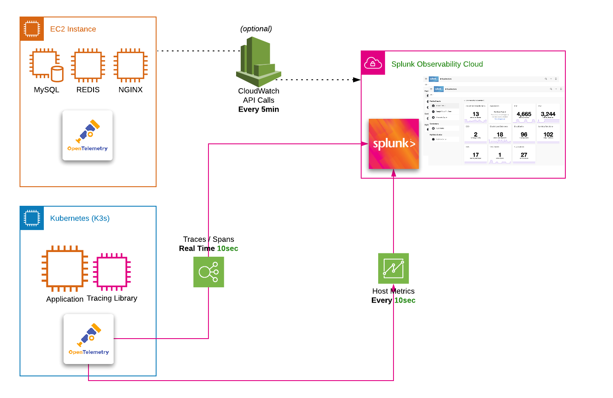

この _**テクニカル**_ Splunk Observability Cloud ワークショップでは、 [lightweight](https://k3s.io/) Kubernetes[^1] クラスタをベースにした環境を構築します。

ワークショップのモジュールを簡素化するために、あらかじめ設定されたAWS/EC2インスタンスが提供されます。

このインスタンスには、ワークショップに必要となるソフトウェアが予め設定されています。これに対してOpenTelemetery Collector[^2] を Kubernetes 上でデプロイし、 NGINX[^3] の ReplicaSet[^4] をデプロイし、最後に OpenTelemetry を使用して計装されたマイクロサービスベースのアプリケーションをデプロイして、メトリクス、トレース、スパン、ログ[^5]を送信していきます。

さらにこのワークショップでは、ダッシュボード、チャートの編集と作成、アラートを発するためのディテクターの作成、Monitoring as Code および Service Bureau[^6] についても紹介します。

このテクニカルワークショップを終える頃には、Splunk Observability Cloudの主要な機能や性能を十分に理解していることでしょう。

事前に設定された [AWS/EC2 インスタンス](./initial-setup/) へのアクセス方法をご紹介します。

[^1]: [Kubernetes](https://kubernetes.io/docs/concepts/overview/what-is-kubernetes/) は、コンテナ化されたワークロードやサービスを管理するためのポータブルで拡張可能なオープンソースのプラットフォームで、宣言的な構成と自動化の両方を促進します。
[^2]: OpenTelemetry Collector は、遠隔測定データの受信、処理、およびエクスポートの方法について、ベンダーに依存しない実装を提供します。さらに、複数のオープンソースまたは商用バックエンドに送信するオープンソースの遠隔測定データ形式（Jaeger、Prometheusなど）をサポートするために、複数のエージェント/コレクターを実行、運用、保守する必要性を排除します。
[^3]: NGINX は、リバースプロキシ、ロードバランサー、メールプロキシ、HTTPキャッシュとしても使用できるWebサーバーです。
[^4]: [Kubernetes ReplicaSet](https://kubernetes.io/docs/concepts/workloads/controllers/replicaset/) を使用しています。
[^5]: Jaeger は、Dapper や OpenZipkin にインスパイアされた、Uber Technologies がオープンソースとして公開している分散型トレースシステムです。マイクロサービスベースの分散システムの監視とトラブルシューティングに使用されています。
[^6]: [Monitoring as Code and Service Bureau](https://www.splunk.com/en_us/blog/it/monitoring-observability-enterprise-service.html) を使用しています。
