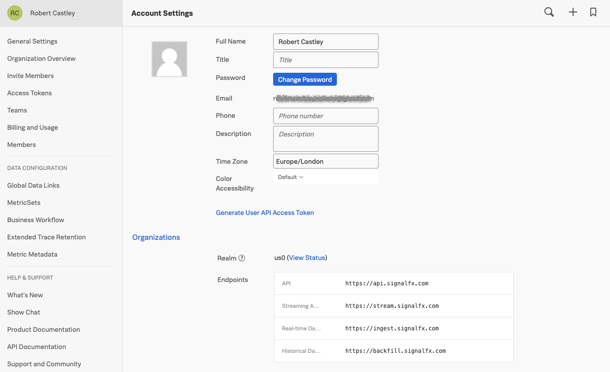
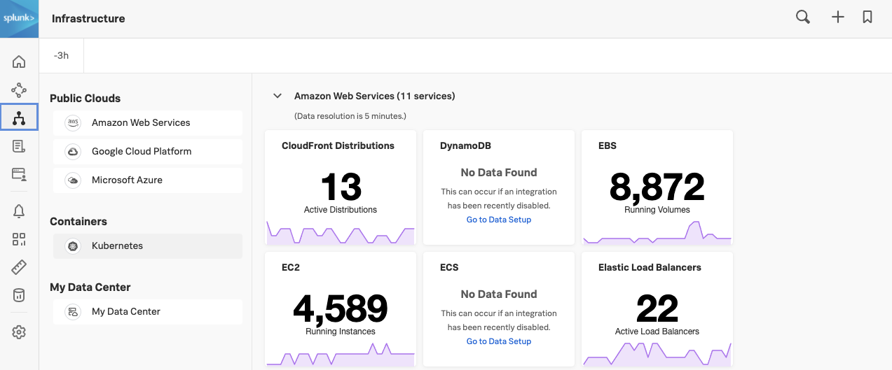
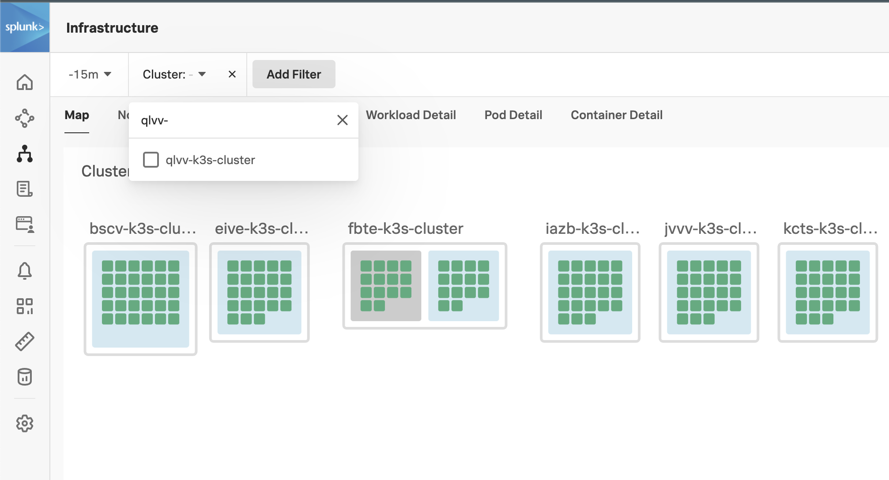
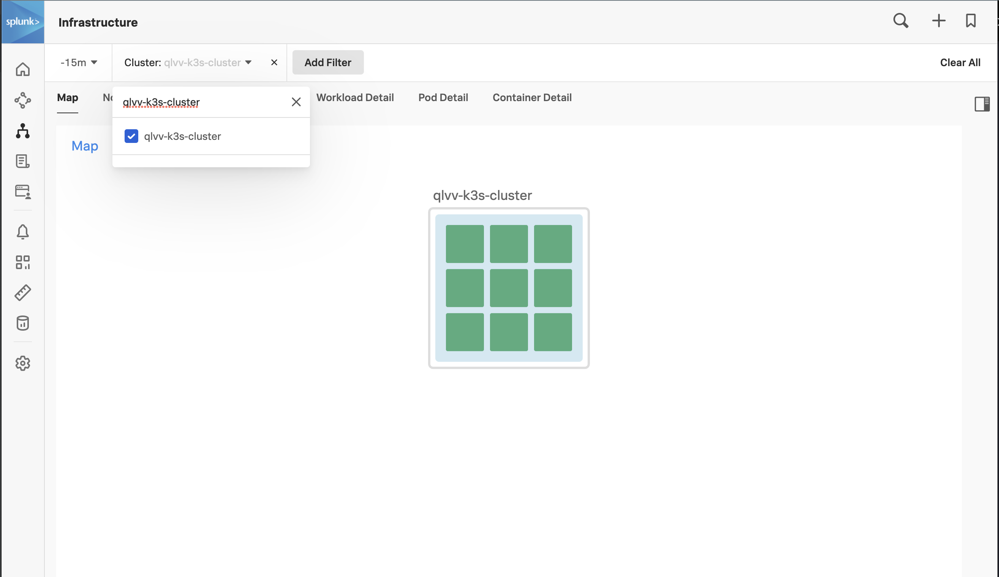
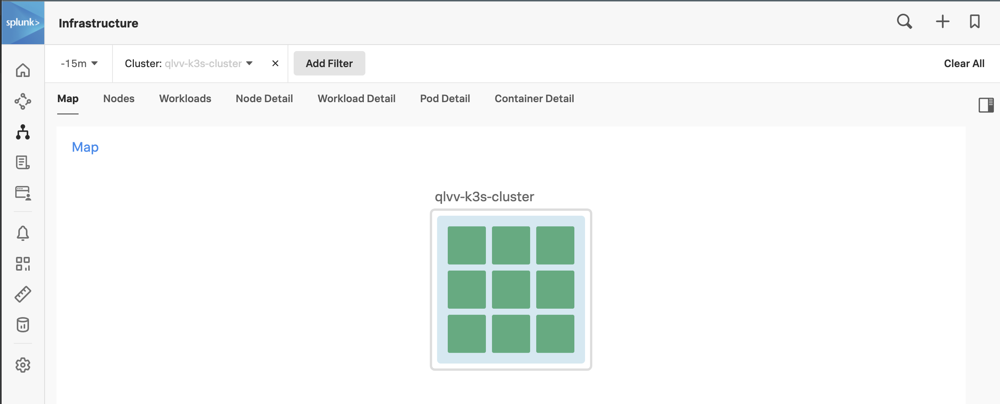

{}15分{}

* Splunk Helm chartを使用して、K3s に OpenTelemetry Collector をインストールします
* Kubernetes Navigatorでクラスタを探索します

---

## 1. Access Tokenの取得

Kubernetes が起動したら、Splunk の UI から Access Token[^1] を取得する必要があります。Access Token は、左下にある **>>** を開き、 **Settings → Access Tokens** を選択すると表示されます。

主催者が指示したワークショップトークン（例： **O11y-Workshop-ACCESS** 等）を開き、 **Show Token** をクリックしてトークンを公開します。{}Copy{} ボタンをクリックし、クリップボードにコピーしてください。 **Default** のトークンは使用しないでください。


{}
このワークショップのために設定のトークンを作成し、IngestとAPIの両方の権限を割り当てています。実運用でのベストプラクティスは、1つのTokenにはIngestまたはAPIまたはRUMのような単一のパーミッションを割り当て、必要な場合は複数のトークンを使用することです。
{}

また、Splunk アカウントの Realm[^2] の名前を取得する必要があります。サイドメニューの最上部の名前をクリックし、**Account Settings** ページに移動します。Organizations タブをクリックします。Realm はページの中央に表示されています。 この例では「us0」となっています。



## 2. Helmによるインストール

環境変数 `ACCESS_TOKEN` と `REALM` を作成して、進行中の Helm のインストールコマンドで使用します。例えば、Realm が `us1` の場合は、`export REALM=us1` と入力し、`eu0` の場合は、`export REALM=eu0` と入力します。


{}

```bash
export ACCESS_TOKEN="<replace_with_O11y-Workshop-ACCESS_TOKEN>"
```

{}



{}

```bash
export REALM="<replace_with_REALM>"
```

{}


Splunk Helm チャートを使って OpenTelemetry Collector をインストールします。まず、Splunk Helm chart のリポジトリを Helm に追加してアップデートします。


{}

``` bash
helm repo add splunk-otel-collector-chart https://signalfx.github.io/splunk-otel-collector-chart && helm repo update
```

{}
{}
Using ACCESS_TOKEN={REDACTED}
Using REALM=eu0
"splunk-otel-collector-chart" has been added to your repositories
Using ACCESS_TOKEN={REDACTED}
Using REALM=eu0
Hang tight while we grab the latest from your chart repositories...
...Successfully got an update from the "splunk-otel-collector-chart" chart repository
Update Complete. ⎈Happy Helming!⎈
{}


以下のコマンドでOpenTelemetry Collector Helmチャートをインストールします。これは **変更しないでください**。


{}

```bash
helm install splunk-otel-collector --version  \
--set="splunkObservability.realm=$REALM" \
--set="splunkObservability.accessToken=$ACCESS_TOKEN" \
--set="clusterName=$(hostname)-k3s-cluster" \
--set="splunkObservability.logsEnabled=true" \
--set="splunkObservability.profilingEnabled=true" \
--set="splunkObservability.infrastructureMonitoringEventsEnabled=true" \
--set="environment=$(hostname)-workshop" \
splunk-otel-collector-chart/splunk-otel-collector \
-f ~/workshop/k3s/otel-collector.yaml
```

{}
{}
Using ACCESS_TOKEN={REDACTED}
Using REALM=eu0
NAME: splunk-otel-collector
LAST DEPLOYED: Fri May  7 11:19:01 2021
NAMESPACE: default
STATUS: deployed
REVISION: 1
TEST SUITE: None
{}


約30秒程度待ってから `kubectl get pods` を実行すると、新しいポッドが稼働していることが報告され、デプロイメントの進捗を監視することができます。

続行する前に、ステータスがRunningと報告されていることを確認してください。


{}

```bash
kubectl get pods
```

{}
{}

``` text
NAME                                                          READY   STATUS    RESTARTS   AGE
splunk-otel-collector-agent-2sk6k                             0/1     Running   0          10s
splunk-otel-collector-k8s-cluster-receiver-6956d4446f-gwnd7   0/1     Running   0          10s
```

{}


OpenTelemetry Collector podのログを確認して、エラーがないことを確認します。出力は、以下の出力例にあるログに似ているはずです。

ログを確認するには、`helm` のインストールで設定したラベルを使用してください（終了するには **ctrl+c** を押します）。もしくは、インストールされている `k9s` ターミナル UI を使うとボーナスポイントがもらえます！


{}

```bash
kubectl logs -l app=splunk-otel-collector -f --container otel-collector
```

{}
{}

``` text
2021-03-21T16:11:10.900Z        INFO    service/service.go:364  Starting receivers...
2021-03-21T16:11:10.900Z        INFO    builder/receivers_builder.go:70 Receiver is starting... {"component_kind": "receiver", "component_type": "prometheus", "component_name": "prometheus"}
2021-03-21T16:11:11.009Z        INFO    builder/receivers_builder.go:75 Receiver started.       {"component_kind": "receiver", "component_type": "prometheus", "component_name": "prometheus"}
2021-03-21T16:11:11.009Z        INFO    builder/receivers_builder.go:70 Receiver is starting... {"component_kind": "receiver", "component_type": "k8s_cluster", "component_name": "k8s_cluster"}
2021-03-21T16:11:11.009Z        INFO    k8sclusterreceiver@v0.21.0/watcher.go:195       Configured Kubernetes MetadataExporter  {"component_kind": "receiver", "component_type": "k8s_cluster", "component_name": "k8s_cluster", "exporter_name": "signalfx"}
2021-03-21T16:11:11.009Z        INFO    builder/receivers_builder.go:75 Receiver started.       {"component_kind": "receiver", "component_type": "k8s_cluster", "component_name": "k8s_cluster"}
2021-03-21T16:11:11.009Z        INFO    healthcheck/handler.go:128      Health Check state change       {"component_kind": "extension", "component_type": "health_check", "component_name": "health_check", "status": "ready"}
2021-03-21T16:11:11.009Z        INFO    service/service.go:267  Everything is ready. Begin running and processing data.
2021-03-21T16:11:11.009Z        INFO    k8sclusterreceiver@v0.21.0/receiver.go:59       Starting shared informers and wait for initial cache sync.      {"component_kind": "receiver", "component_type": "k8s_cluster", "component_name": "k8s_cluster"}
2021-03-21T16:11:11.281Z        INFO    k8sclusterreceiver@v0.21.0/receiver.go:75       Completed syncing shared informer caches.       {"component_kind": "receiver", "component_type": "k8s_cluster", "component_name": "k8s_cluster"}
```

{}


{}
OpenTelemetry Collectorのインストールに失敗した場合は、次のようにしてインストールを削除することで、最初からやり直すことができます。

``` sh
helm delete splunk-otel-collector
```

{}

---

## 3. UI でメトリクスを確認する

Splunk の UI で左下の **>>** を開いて **Infrastructure** をクリックします。



**Containers** の下にある **Kubernetes** をクリックして Kubernetes Navigator Cluster Map を開き、メトリクスが送信されていることを確認します。

クラスタが検出され、レポートされていることを確認するには、自分のクラスタを探します（ワークショップでは、他の多くのクラスタが表示されます）。クラスタ名を見つけるには、以下のコマンドを実行し、出力をクリップボードにコピーしてください。


{}

```bash
echo $(hostname)-k3s-cluster
```

{}


次に、UIで、Splunkロゴのすぐ下にある「Cluster: - 」メニューをクリックし、先程コピーしたクラスタ名を検索ボックスに貼り付け、チェックボックスをクリックしてクラスタを選択し、最後にメニューのその他の部分をクリックしてフィルタを適用します。







ノードの状態を確認するには、クラスターの淡いブルーの背景にカーソルを置き、左上に表示される青い虫眼鏡をクリックしてください 。


これで、ノードレベルまでドリルダウンできます。 次に、サイドバーボタンをクリックしてサイドバーを開き、Metricsサイドバーを開きます。

サイドのスライダーを使って、CPU、メモリ、ネットワーク、イベントなど、クラスタ/ノードに関連する様々なチャートを見ることができます。


[^1]: Access Tokens (Org Tokensと呼ばれることもあります)は、長期間利用を前提とした組織レベルのトークンです。デフォルトでは、これらのトークンは 5 年間保存されます。そのため、長期間にわたってデータポイントを送信するエミッターに組み込んだり、Splunk API を呼び出す長期的なスクリプトに使用したりするのに適しています。

[^2]: Realm とは、Splunk内部の管理単位ので、その中で組織がホストされます。異なる Realm には異なる API エンドポイントがあります (たとえば、データを送信するためのエンドポイントは、**`us1`** realm では `ingest.us1.signalfx.com` 、**`eu0`** レルムでは `ingest.eu0.signalfx.com` となります)。このrealm名は、Splunk UI のプロファイルページに表示されます。エンドポイントを指定する際にレルム名を含めない場合、Splunk は **`us0`** レルムを指していると解釈します。
