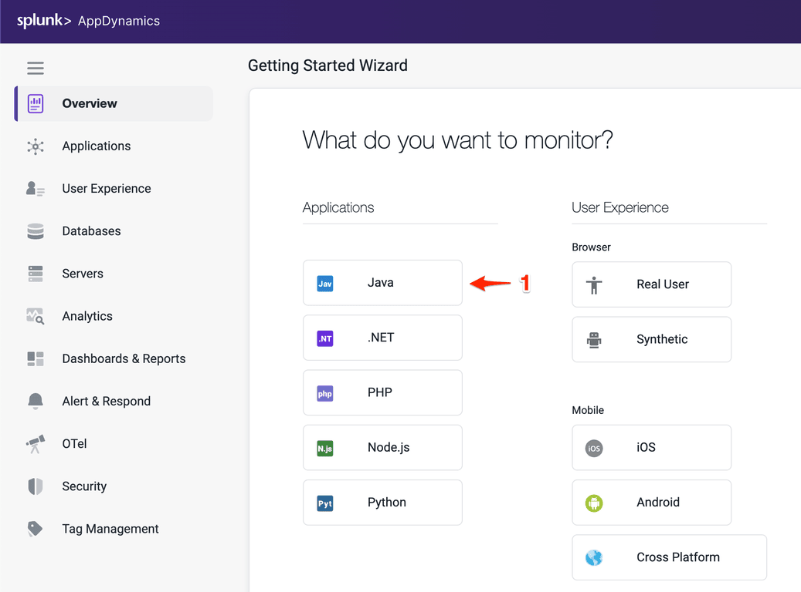

この演習では、Web ブラウザから AppDynamics Controller にアクセスし、Java APM エージェントをダウンロードします。

## Controller へのログイン

Cisco の資格情報を使用して [AppDynamics SE Lab Controller](https://se-lab.saas.appdynamics.com/controller/) にログインします。

## アプリケーションの設定

1. 左側のナビゲーションパネルで **Overview** を選択します
2. **Getting Started** タブをクリックします
3. **Getting Started Wizard** ボタンをクリックします

Java アプリケーションタイプを選択します

## Java Agent のダウンロード

1. JVM タイプとして **Sun/JRockit - Legacy** を選択します
2. Controller 接続のデフォルト設定を受け入れます
3. **Set Application and Tier** で **Create a new Application:** を選択します
4. アプリケーション名として **Supercar-Trader-YOURINITIALS** を入力します
5. 新しい Tier として **Web Portal** を入力します
6. Node Name として **Web-Portal_Node-01** を入力します
7. **Continue** をクリックします
8. **Click Here to Download** をクリックします

{}
アプリケーション名は一意である必要があります。アプリケーション名にイニシャルを追加するか、一意の識別子を追加してください
{}

ブラウザにエージェントがローカルファイルシステムにダウンロードされていることを示すプロンプトが表示されます。ファイルがダウンロードされた場所と完全なファイル名をメモしておいてください。

