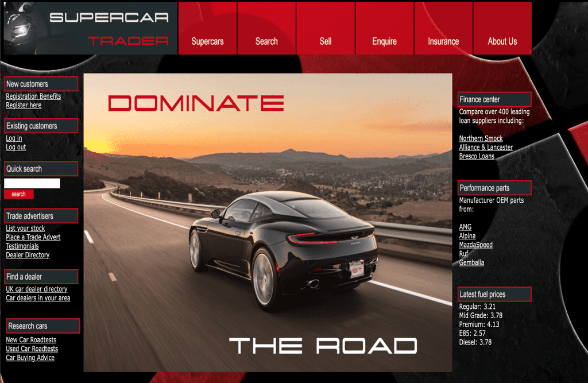
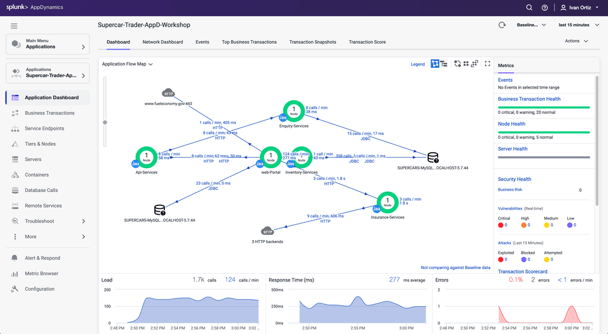

この演習では、以下のアクションを実行します：

* サンプルアプリが実行されていることを確認する
* サンプルアプリケーションの負荷生成を開始する
* Controller でトランザクション負荷を確認する

## サンプルアプリケーションが実行されていることの確認

サンプルアプリケーションのホームページには、以下の形式の URL を使用して Web ブラウザからアクセスできます。EC2 インスタンスの IP アドレスに置き換えて、ブラウザのナビゲーションバーに URL を入力してください。

```bash
http://[ec2-ip-address]:8080/Supercar-Trader/home.do
```

Supercar Trader アプリケーションのホームページが表示されるはずです。


## 負荷生成の開始

EC2 インスタンスに SSH 接続し、負荷生成を開始します。すべてのスクリプトが実行されるまで数分かかる場合があります。


{}

``` bash
cd /opt/appdynamics/lab-artifacts/phantomjs
./start_load.sh
```

{}
{}

``` bash
Cleaning up artifacts from previous load...
Starting home-init-01
Waiting for additional JVMs to initialize... 1
Waiting for additional JVMs to initialize... 2
Waiting for additional JVMs to initialize... 3
Waiting for additional JVMs to initialize... 4
Waiting for additional JVMs to initialize... 5
Waiting for additional JVMs to initialize... 6
Waiting for additional JVMs to initialize... 7
Waiting for additional JVMs to initialize... 8
Waiting for additional JVMs to initialize... 9
Waiting for additional JVMs to initialize... 10
Waiting for additional JVMs to initialize... 11
Waiting for additional JVMs to initialize... 12
Waiting for additional JVMs to initialize... 13
Waiting for additional JVMs to initialize... 14
Waiting for additional JVMs to initialize... 15
Waiting for additional JVMs to initialize... 16
Waiting for additional JVMs to initialize... 17
Waiting for additional JVMs to initialize... 18
Waiting for additional JVMs to initialize... 19
Waiting for additional JVMs to initialize... 20
Starting slow-query-01
Starting slow-query-02
Starting slow-query-03
Starting slow-query-04
Starting sessions-01
Starting sessions-02
Starting sell-car-01
Starting sell-car-02
Starting sessions-03
Starting sessions-04
Starting search-01
Starting request-error-01
Starting mem-leak-insurance
Finished starting load generator scripts                                                                100%   22MB 255.5KB/s   01:26
```

{}


## Controller でのトランザクション負荷の確認

Web ブラウザで Getting Started Wizard がまだ開いている場合、エージェントが接続され、Controller がデータを受信していることが確認できるはずです。


**Continue** をクリックすると、**Application Flow Map** に移動します（以下の Flow Map の画像にジャンプできます）。

Controller のブラウザウィンドウを以前に閉じた場合は、Controller に再度ログインしてください。

1. Overview ページ（ランディングページ）から、左側のナビゲーションパネルの **Applications** タブをクリックします。

    

2. **Applications** ページでは、アプリケーションを手動で検索するか、右上の検索バーを使用して検索を絞り込むことができます。

    

アプリケーション名をクリックすると、**Application Flow Map** に移動します。12分後にすべてのアプリケーションコンポーネントが表示されるはずです。

12分経ってもすべてのアプリケーションコンポーネントが表示されない場合は、さらに数分待ってからブラウザタブを更新してください。



エージェントのダウンロード手順で、Tomcat サーバーの Tier 名と Node 名を割り当てました。

``` bash
<tier-name>Web-Portal</tier-name>
<node-name>Web-Portal_Node-01</node-name>
```

他の4つのサービスの Tier 名と Node 名がどのように割り当てられたか疑問に思うかもしれません。サンプルアプリケーションは、最初の Tomcat JVM から4つの追加 JVM を動的に作成し、4つのサービスそれぞれの JVM 起動コマンドに -D プロパティとしてこれらのプロパティを渡すことで Tier 名と Node 名を割り当てます。JVM 起動コマンドラインに含まれる -D プロパティは、Java エージェントの ```controller-info.xml``` ファイルで定義されたプロパティよりも優先されます。

動的に起動された4つのサービスそれぞれに使用される JVM 起動パラメータを確認するには、EC2 インスタンスのターミナルウィンドウで以下のコマンドを実行します。  
  

{}

``` bash
ps -ef | grep appdynamics.agent.tierName
```

{}
{}

``` bash
splunk     47131   46757  3 15:34 pts/1    00:08:17 /usr/lib/jvm/java-8-openjdk-amd64/jre/bin/java -javaagent:/opt/appdynamics/javaagent/javaagent.jar -Dappdynamics.controller.hostName=se-lab.saas.appdynamics.com -Dappdynamics.controller.port=443 -Dappdynamics.controller.ssl.enabled=true -Dappdynamics.agent.applicationName=Supercar-Trader-AppD-Workshop -Dappdynamics.agent.tierName=Api-Services -Dappdynamics.agent.nodeName=Api-Services_Node-01 -Dappdynamics.agent.accountName=se-lab -Dappdynamics.agent.accountAccessKey=hj6a4d7h2cuq -Xms64m -Xmx512m -XX:MaxPermSize=256m supercars.services.api.ApiService
splunk     47133   46757  2 15:34 pts/1    00:08:11 /usr/lib/jvm/java-8-openjdk-amd64/jre/bin/java -javaagent:/opt/appdynamics/javaagent/javaagent.jar -Dappdynamics.controller.hostName=se-lab.saas.appdynamics.com -Dappdynamics.controller.port=443 -Dappdynamics.controller.ssl.enabled=true -Dappdynamics.agent.applicationName=Supercar-Trader-AppD-Workshop -Dappdynamics.agent.tierName=Inventory-Services -Dappdynamics.agent.nodeName=Inventory-Services_Node-01 -Dappdynamics.agent.accountName=se-lab -Dappdynamics.agent.accountAccessKey=hj6a4d7h2cuq -Xms64m -Xmx512m -XX:MaxPermSize=256m supercars.services.inventory.InventoryService
splunk     47151   46757  1 15:34 pts/1    00:04:58 /usr/lib/jvm/java-8-openjdk-amd64/jre/bin/java -javaagent:/opt/appdynamics/javaagent/javaagent.jar -Dappdynamics.controller.hostName=se-lab.saas.appdynamics.com -Dappdynamics.controller.port=443 -Dappdynamics.controller.ssl.enabled=true -Dappdynamics.agent.applicationName=Supercar-Trader-AppD-Workshop -Dappdynamics.agent.tierName=Insurance-Services -Dappdynamics.agent.nodeName=Insurance-Services_Node-01 -Dappdynamics.agent.accountName=se-lab -Dappdynamics.agent.accountAccessKey=hj6a4d7h2cuq -Xms64m -Xmx68m -XX:MaxPermSize=256m supercars.services.insurance.InsuranceService
splunk     47153   46757  3 15:34 pts/1    00:08:17 /usr/lib/jvm/java-8-openjdk-amd64/jre/bin/java -javaagent:/opt/appdynamics/javaagent/javaagent.jar -Dappdynamics.controller.hostName=se-lab.saas.appdynamics.com -Dappdynamics.controller.port=443 -Dappdynamics.controller.ssl.enabled=true -Dappdynamics.agent.applicationName=Supercar-Trader-AppD-Workshop -Dappdynamics.agent.tierName=Enquiry-Services -Dappdynamics.agent.nodeName=Enquiry-Services_Node-01 -Dappdynamics.agent.accountName=se-lab -Dappdynamics.agent.accountAccessKey=hj6a4d7h2cuq -Xms64m -Xmx512m -XX:MaxPermSize=256m supercars.services.enquiry.EnquiryService
splunk    144789   46722  0 20:09 pts/1    00:00:00 grep --color=auto appdynamics.agent.tierName
```

{}

  
フローマップにすべてのコンポーネントが表示されると、Insurance-Services Tier によって呼び出される3つの HTTP バックエンドを表す HTTP クラウドアイコンが表示されるはずです。

以下の手順に従って、3つの HTTP バックエンドのグループ化を解除します。

1. 3 HTTP backends とラベル付けされた HTTP クラウドアイコンを右クリックします
2. ドロップダウンメニューから **Ungroup Backends** を選択します


HTTP バックエンドのグループ化が解除されると、以下の画像のように3つすべての HTTP バックエンドが表示されます。


