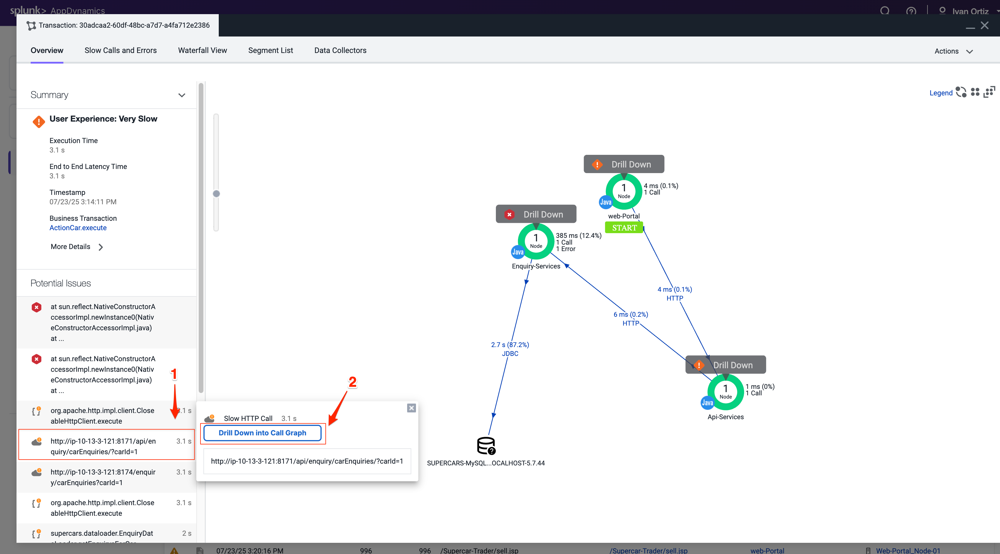
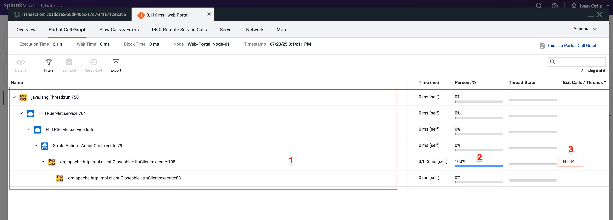

このセクションでは、Splunk AppDynamics APM機能の基本概念について学びます。このセクションを終了すると、以下の概念を理解できるようになります：

- Application Flow Maps
- Business Transactions (BTs)
- Snapshots
- Call Graphs

## Flow Maps

AppDynamicsアプリエージェントは、最も一般的なアプリケーションフレームワークとサービスを自動的に検出します。組み込みのアプリケーション検出および設定を使用して、エージェントはアプリケーションデータとメトリクスを収集し、Flow Mapsを構築します。

AppDynamicsはすべてのトランザクションを自動的にキャプチャしてスコアリングします。Flow Mapsは、選択した時間枠のコンテキストで、監視対象のアプリケーション環境のコンポーネントとアクティビティを動的に視覚化して表示します。

Flow Mapのさまざまな機能に慣れてください。

1. さまざまなレイアウトオプションを試してみてください（Flow Map上の各アイコンをクリックしてドラッグして位置を変更することもできます）。
2. スライダーとマウスのスクロールホイールを使用してズームレベルを調整してみてください。
3. Transaction Scorecardを確認してください。
4. Flow Mapを編集するオプションを探索してください。

Flow Mapsの詳細については[こちら](https://help.splunk.com/en/appdynamics-saas/application-performance-monitoring/25.7.0/business-applications/flow-maps/flow-map-overview)をご覧ください。

  

## Business Transactions

AppDynamicsモデルでは、Business Transactionはリクエスト（通常はユーザーリクエスト）のデータ処理フローを表します。現実世界では、アプリケーション内の多くの異なるコンポーネントが相互作用して、以下のようなタイプのリクエストを処理するサービスを提供します：

- eコマースアプリケーションでは、ユーザーのログイン、商品の検索、カートへの商品追加
- コンテンツポータルでは、スポーツ、ビジネス、エンターテインメントニュースなどのコンテンツのリクエスト
- 株式取引アプリケーションでは、株価の取得、株式の売買などの操作

AppDynamicsはBusiness Transactionsを中心にパフォーマンス監視を行うため、ユーザーの視点からアプリケーションコンポーネントのパフォーマンスに集中できます。コンポーネントがすぐに利用可能かどうか、またはパフォーマンスの問題が発生しているかどうかをすばやく特定できます。たとえば、ユーザーがログインできるか、チェックアウトできるか、データを表示できるかを確認できます。ユーザーの応答時間と、問題が発生した場合の原因を確認できます。

Business Transactionsの詳細については[こちら](https://help.splunk.com/en/appdynamics-saas/application-performance-monitoring/25.7.0/overview-of-application-monitoring/business-transactions)と[こちら](https://help.splunk.com/en/appdynamics-saas/application-performance-monitoring/25.7.0/business-transactions)をご覧ください。

## Business Transactions の確認

以下の手順に従って、Business Transactionsが自動的に検出されていることを確認します。

1. 左側のメニューで **Business Transactions** オプションをクリックします。
2. Business Transactionsのリストとそのパフォーマンスを確認します。

  
  
## Snapshots

AppDynamicsは、計装された環境内のすべてのBusiness Transactionの実行を監視し、メトリクスはそれらすべての実行を反映します。ただし、トラブルシューティングの目的で、AppDynamicsは問題が発生しているトランザクションの特定のインスタンスのスナップショット（詳細な診断情報を含む）を取得します。

以下の手順に従って、トランザクションスナップショットが自動的に収集されていることを確認します。

1. 左側のメニューで **Application Dashboard** オプションをクリックします。
2. **Transaction Snapshots** タブをクリックします。
3. **Exe Time (ms)** 列をクリックして、実行時間が最も長いスナップショットでソートします。
4. Business Transactionスナップショットをダブルクリックしてスナップショットビューアを表示します

トランザクションスナップショットは、単一のトランザクション呼び出しの処理フローをクロスティアビューで表示します。

**Potential Issues** パネルは、遅いメソッドと遅いリモートサービスコールを強調表示し、パフォーマンス問題の根本原因を調査するのに役立ちます。  

## Drill Downs と Call Graphs

Call graphsとdrill downsは、Tierでのトランザクション実行に関する重要な情報を提供します。これには、最も遅いメソッド、エラー、リモートサービスコールが含まれます。drill downには、部分的または完全なcall graphが含まれる場合があります。Call graphsは、特定のTierでのBusiness Transactionの処理をコードレベルで表示します。

Business TransactionスナップショットのFlow Mapで、Drill DownリンクがあるTierは、AppDynamicsがそのTierのcall graphを取得したことを示しています。

以下の手順に従って、トランザクションスナップショットのcall graphにドリルダウンします。

1. 左側のPotential Issuesリストで遅いコールをクリックします。
2. **Drill Down into Call Graph** をクリックします。

call graphビューには、以下の詳細が表示されます。

1. メソッド実行シーケンスは、このノードでBusiness Transactionの処理に参加したクラスとメソッドの名前を、制御フローの進行順序で表示します。
2. 各メソッドについて、処理に費やされた時間と割合、およびソースコード内の行番号を確認でき、トランザクションのパフォーマンスに影響を与えている可能性のあるコード内の場所を特定できます。
3. call graphは、データベースクエリやWebサービスコールなど、他のコンポーネントへの発信コールを行うメソッドのexit callリンクを表示します。

Transaction Snapshotsの詳細については[こちら](https://help.splunk.com/en/appdynamics-saas/application-performance-monitoring/25.7.0/business-transactions/troubleshoot-business-transaction-performance-with-transaction-snapshots)をご覧ください。

Call Graphsの詳細については[こちら](https://help.splunk.com/en/appdynamics-saas/application-performance-monitoring/25.7.0/business-transactions/troubleshoot-business-transaction-performance-with-transaction-snapshots/call-graphs)をご覧ください。

  
