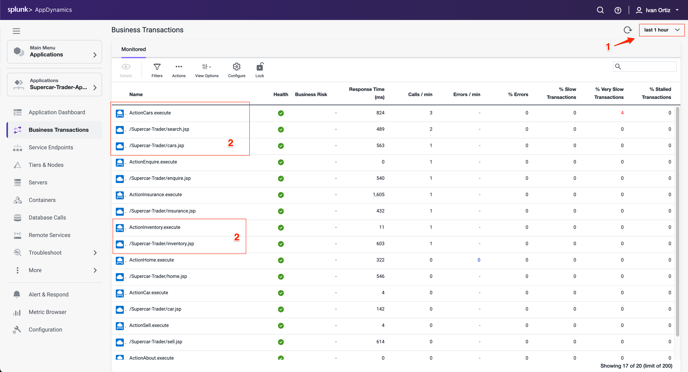
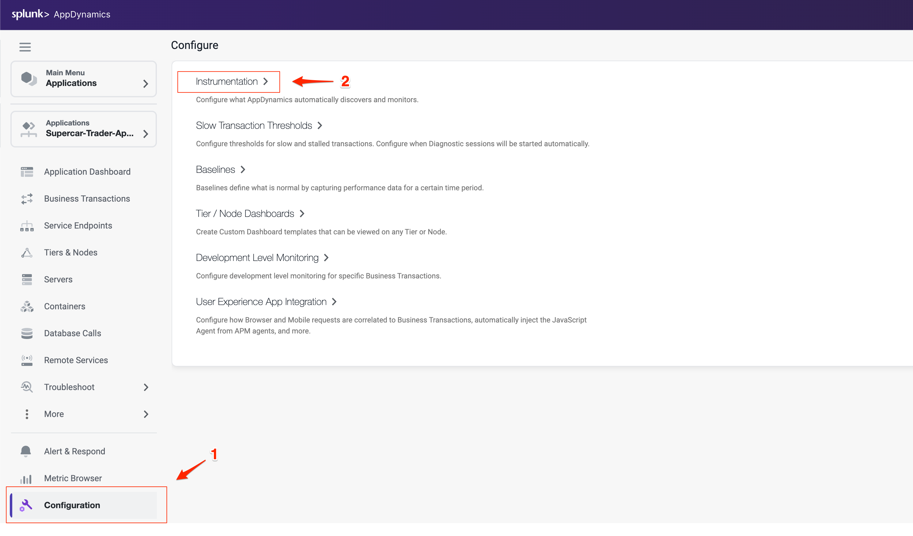
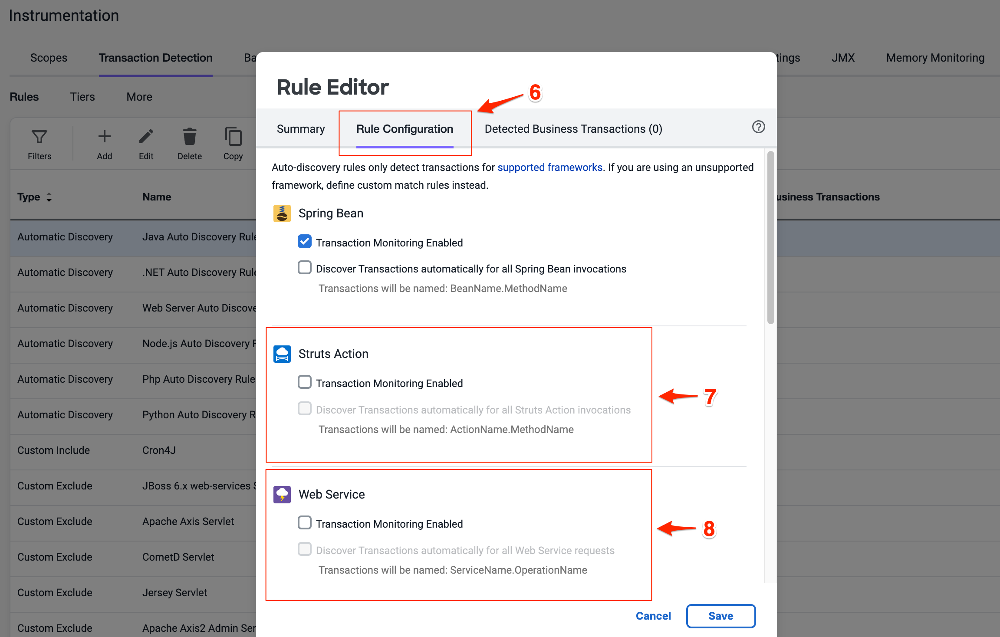
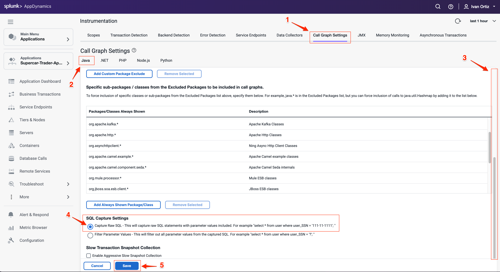
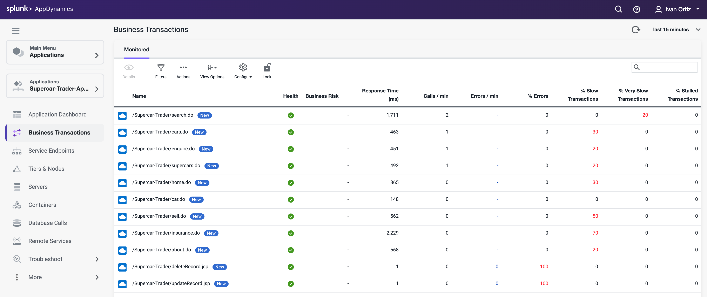

この演習では、以下のタスクを完了します

- Business Transaction設定を調整する
- Call Graph設定を調整する
- Business Transactionの変更を確認する

## Business Transaction 設定の調整

前の演習で、Business Transactionsが自動検出されていることを確認しました。Business Transactionの自動検出ルールを最適な状態に調整したい場合があります。これは、古いApache Strutsフレームワーク上に構築されたサンプルアプリケーションの場合に当てはまります。

以下の画像で強調表示されているBusiness Transactionsは、各ペアにStruts Action（.execute）とServletタイプ（.jsp）があることを示しています。これら2種類のトランザクションが1つに統合されるように、トランザクション検出ルールの設定を調整します。

AppDynamics UIに時間枠セレクターが表示されている場合、表示されるビューは選択した時間枠のコンテキストを表します。事前定義された時間枠の1つを選択するか、表示したい特定の日付と時間範囲でカスタム時間枠を作成できます。

1. 過去1時間の時間枠を選択します。
2. マウスを青いアイコンの上に移動して、トランザクションのEntry Point Typeを確認します。

以下の手順に従ってトランザクション検出を最適化します

1. 左下のメニューで **Configuration** オプションをクリックします。
2. **Instrumentation** リンクをクリックします。

    

3. Instrumentationメニューから **Transaction Detection** を選択します。
4. **Java Auto Discovery Rule** を選択します。
5. **Edit** をクリックします。

      

6. Rule Editorで **Rule Configuration** タブを選択します。
7. **Struts Action** セクションのすべてのボックスのチェックを外します。
8. **Web Service** セクションのすべてのボックスのチェックを外します。
9. 下にスクロールしてServlet設定を見つけます。
10. **Enable Servlet Filter Detection** ボックスにチェックを入れます（Servlet設定では3つのボックスすべてにチェックが入っている必要があります）。
11. **Save** をクリックして変更を保存します。

Transaction Detection Rulesの詳細については[こちら](https://help.splunk.com/en/appdynamics-saas/application-performance-monitoring/25.7.0/configure-instrumentation/transaction-detection-rules)をご覧ください。

## Call Graph 設定の調整

以下に示すCall Graph Settingsウィンドウで、トランザクションスナップショット内のcall graphsでキャプチャされるデータを制御できます。このステップでは、各SQLクエリのパラメータが完全なクエリと共にキャプチャされるようにSQL Capture設定を変更します。以下の手順に従ってSQL Capture設定を変更できます。

1. Instrumentationウィンドウから **Call Graph Settings** タブを選択します。これは、前の演習で移動した **Instrumentation** 設定内にあります。
2. 設定内で **Java** タブが選択されていることを確認します。
3. **SQL Capture Settings** が表示されるまで下にスクロールします。
4. **Capture Raw SQL** オプションをクリックします。
5. **Save** をクリックします。

Call Graph設定の詳細については[こちら](https://help.splunk.com/en/appdynamics-saas/application-performance-monitoring/25.7.0/configure-instrumentation/call-graph-settings)をご覧ください。

## Business Transaction の変更の確認

新しいBusiness Transactionsが以前のトランザクションを置き換えるまでに最大30分かかる場合があります。新しいトランザクションが検出されると、Business Transactionsのリストは以下の例のようになります。

1. 左側のメニューで **Business Transactions** をクリックします。
2. 時間範囲ピッカーを調整して **last 15 minutes** を確認します

