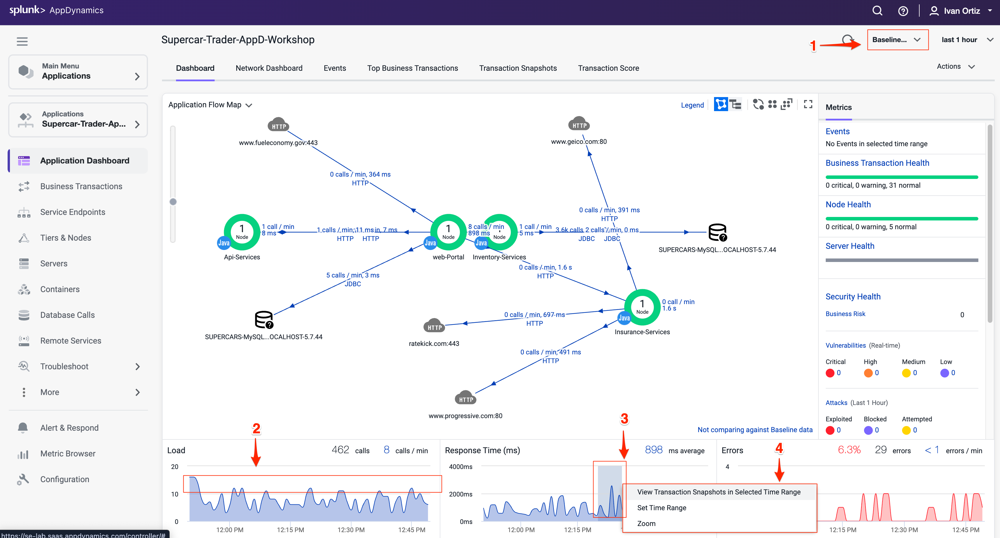
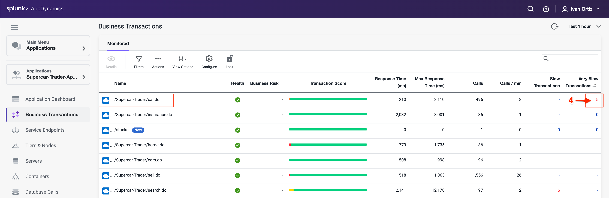
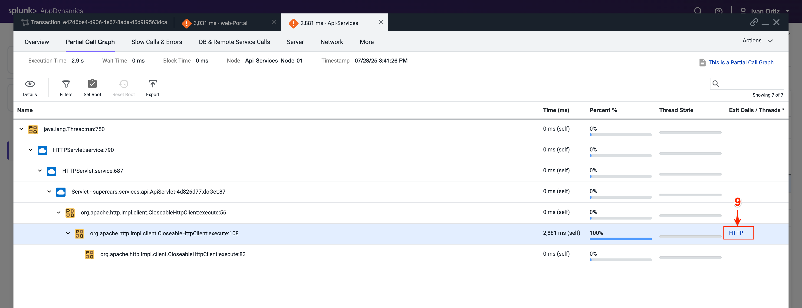

この演習では、以下のタスクを完了します：

- アプリケーションダッシュボードとフローマップを監視する
- 遅いトランザクションスナップショットをトラブルシューティングする

## アプリケーションダッシュボードとフローマップの監視

前の演習では、Application Flow Map の基本的な機能をいくつか見てきました。Application Dashboard と Flow Map を使用してアプリケーション内の問題を即座に特定する方法をより深く見ていきましょう。

1. Health Rule Violations、Node Health の問題、および Business Transactions の健全性は、選択した時間枠についてこのエリアに常に表示されます。ここで利用可能なリンクをクリックして詳細にドリルダウンできます。
2. Transaction Scorecard は、正常、遅い、非常に遅い、停止、エラーのあるトランザクションの数と割合を表示します。スコアカードには、例外タイプの高レベルのカテゴリも表示されます。ここで利用可能なリンクをクリックして詳細にドリルダウンできます。
3. 異なるアプリケーションコンポーネントを接続する青い線のいずれかを左クリック（シングルクリック）すると、2つのコンポーネント間のインタラクションの概要が表示されます。
4. Tier の色付きリング内を左クリック（シングルクリック）すると、Flow Map に留まりながらその Tier に関する詳細情報が表示されます。
5. ダッシュボードの下部にある3つのチャート（Load、Response Time、Errors）のいずれかの時系列にマウスを合わせると、記録されたメトリクスの詳細が表示されます。

    

次に、Dynamic Baselines とダッシュボードの下部にあるチャートのオプションを見てみましょう。

1. チャートのメトリクスを、各メトリクスに対して自動的に計算された Dynamic Baseline と比較します。
2. Dynamic Baseline は、以下の画像に示すように、負荷と応答時間のチャートに青い点線で表示されます。
3. ダッシュボードの下部にある3つのチャートのいずれかでスパイクを強調表示するには、マウスボタンを押したまま左から右にドラッグします。
4. マウスボタンを離し、ポップアップメニューの3つのオプションのいずれかを選択します。

    

AppDynamics 独自の Dynamic Baselining の精度は時間の経過とともに向上し、アプリケーション、そのコンポーネント、およびビジネストランザクションの状態を正確に把握できるようになります。これにより、事態が深刻な状態になる前にプロアクティブにアラートを受け取り、エンドユーザーに影響が及ぶ前に対処できます。

AppDynamics Dynamic Baselines の詳細については[こちら](https://help.splunk.com/en/appdynamics-saas/application-performance-monitoring/25.7.0/business-transactions/monitor-the-business-transaction-performance/dynamic-baselines)をご覧ください。  

## 遅いトランザクションスナップショットのトラブルシューティング

以下の手順に従って、Business Transactions を確認し、非常に遅いトランザクションが最も多いものを見つけましょう。

1. 左側のメニューで **Business Transactions** オプションをクリックします。
2. **View Options** ボタンをクリックします。
3. 以下の画像と一致するようにオプションのボックスのチェックを入れたり外したりします：

    

4. /Supercar-Trader/car.do という名前の Business Transaction を見つけ、その Business Transaction の Very Slow Transactions の数をクリックして、非常に遅いトランザクションスナップショットにドリルダウンします。

{}
/Supercar-Trader/car.do BT に Very Slow Transactions がない場合は、それがある Business Transaction を見つけて、その列の数字をクリックしてください。今後のスクリーンショットは若干異なる場合がありますが、概念は同じです。
{}

    

5. 非常に遅いトランザクションスナップショットのリストが表示されるはずです。以下に示すように、最も応答時間が長いスナップショットをダブルクリックします。

    

    トランザクションスナップショットビューアが開くと、この特定のトランザクションの一部であったすべてのコンポーネントのフローマップビューが表示されます。このスナップショットは、トランザクションが以下のコンポーネントを順番に通過したことを示しています。

    - Web-Portal Tier
    - Api-Services Tier
    - Enquiry-Services Tier
    - MySQL Database

    左側の Potential Issues パネルは、遅いメソッドと遅いリモートサービスを強調表示します。Potential Issues パネルを使用して call graph に直接ドリルダウンすることもできますが、この例ではスナップショット内の Flow Map を使用して完全なトランザクションを追跡します。

6. スナップショットの Flow Map に表示されている Web-Portal Tier の **Drill Down** をクリックします。

    

    開いたタブには Web-Portal Tier の call graph が表示されます。ほとんどの時間がアウトバウンド HTTP コールによるものであることがわかります。

7. ブロックをクリックして、問題が発生しているセグメントにドリルダウンします。HTTP リンクをクリックしてダウンストリームコールの詳細を表示します。

    

    ダウンストリームコールの詳細パネルは、Web-Portal Tier が Api-Services Tier へのアウトバウンド HTTP コールを行ったことを示しています。HTTP コールを追跡して Api-Services Tier に進みます。

8. **Drill Down into Downstream Call** をクリックします。

    

    次に開くタブには Api-Services Tier の call graph が表示されます。時間の100%がアウトバウンド HTTP コールによるものであることがわかります。

9. HTTP リンクをクリックしてダウンストリームコールの詳細パネルを開きます。

    

    ダウンストリームコールの詳細パネルは、Api-Services Tier が Enquiry-Services Tier へのアウトバウンド HTTP コールを行ったことを示しています。HTTP コールを追跡して Enquiry-Services Tier に進みます。

10. **Drill Down into Downstream Call** をクリックします。

    

    次に開くタブには Enquiry-Services Tier の call graph が表示されます。トランザクションに問題を引き起こしたデータベースへの JDBC コールがあったことがわかります。

11. 最も時間がかかった JDBC リンクをクリックして、JDBC コールの詳細パネルを開きます。

    

    JDBC exit コールの詳細パネルには、最も時間がかかった特定のクエリが表示されます。SQL パラメータ値とともに完全な SQL ステートメントを確認できます。

    

## まとめ

このラボでは、まず Business Transactions を使用して、トラブルシューティングが必要な非常に遅いトランザクションを特定しました。次に、call graph を調べて、遅延を引き起こしているコードの特定の部分を特定しました。その後、ダウンストリームサービスとデータベースにドリルダウンして、遅延の根本原因をさらに分析しました。最後に、パフォーマンスの問題の原因となっている非効率な SQL クエリを正確に特定することに成功しました。この包括的なアプローチは、AppDynamics がトランザクションのボトルネックを効果的に分離して解決するのにどのように役立つかを示しています。
