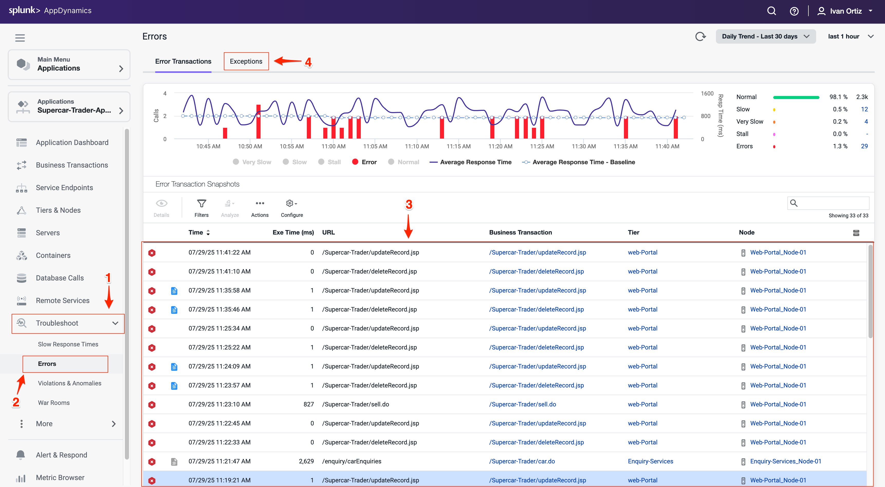
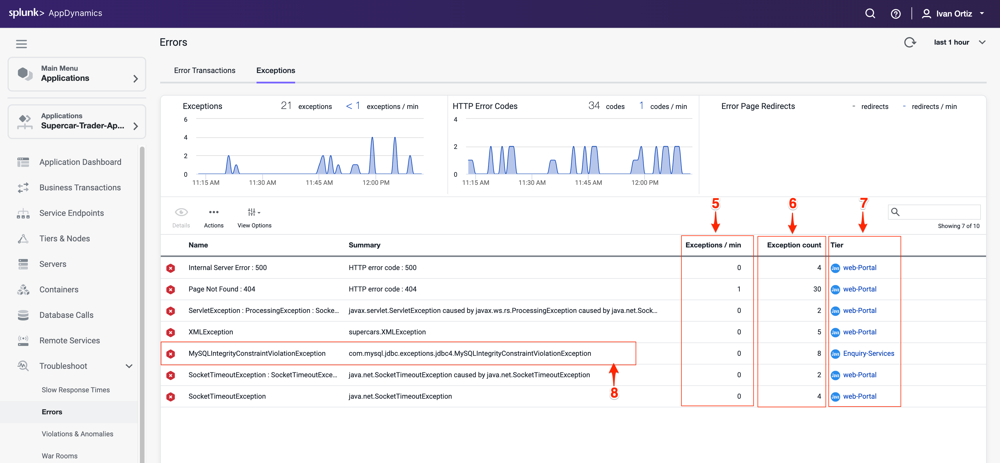
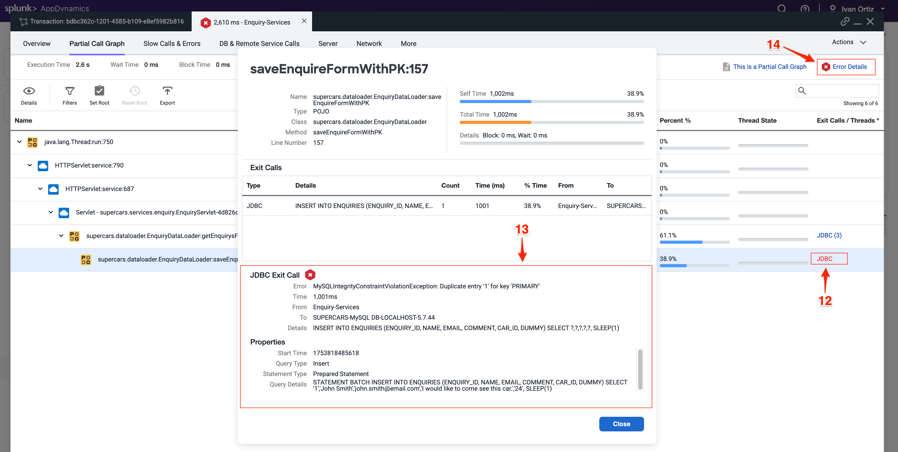
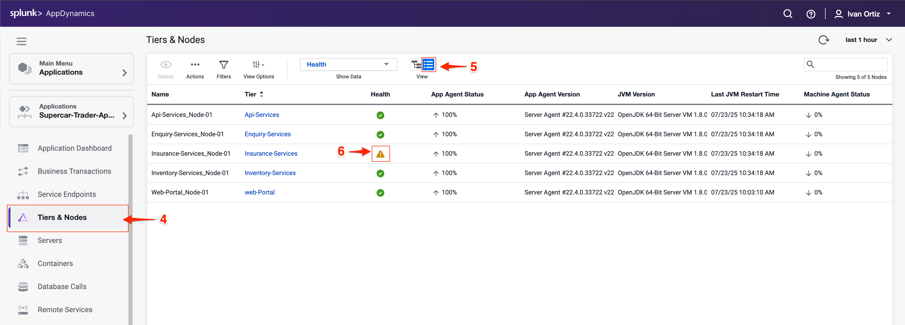

この演習では、アプリケーション内のエラーを効果的に検出および診断して根本原因を特定する方法を学びます。さらに、パフォーマンスが低下しているか、エラーが発生している特定のノードを特定し、これらのパフォーマンスの問題を解決するためのトラブルシューティング手法を適用する方法を探ります。このハンズオン体験により、アプリケーションの健全性を維持し、最適なパフォーマンスを確保する能力が向上します。

## アプリケーション内の特定のエラーの検出

AppDynamicsを使用すると、アプリケーション内のエラーと例外を簡単に見つけることができます。**Errors** ダッシュボードを使用して、エラーのあるトランザクションスナップショットを確認し、最も頻繁に発生している例外を見つけることができます。エラーを迅速に特定することで、アプリケーションの安定性とユーザーエクスペリエンスを向上させる修正の優先順位付けに役立ちます。例外のタイプと頻度を理解することで、最も影響の大きい問題に集中できます。

1. 左側のメニューで **Troubleshoot** オプションをクリックします。
2. 左側のメニューで **Errors** オプションをクリックします。これにより、エラーのあるBusiness Transactionsをすばやく特定できるErrorsダッシュボードに移動します。
3. いくつかのエラートランザクションスナップショットを調べます。スナップショットを確認すると、エラーが発生したときの正確なコンテキストとフローを確認できます。
4. **Exceptions** タブをクリックして、タイプ別にグループ化された例外を表示します。例外タイプ別にグループ化することで、繰り返し発生する問題とパターンを特定できます。

    

    **Exceptions** タブには、アプリケーション内で最も多く発生している例外のタイプが表示されるため、最も影響の大きいものの修正を優先できます。

5. **Exceptions per minute** と **Exception count**（6）を確認して、エラーの頻度を把握します。高頻度の例外は、即座に対応が必要な重大な問題を示していることが多いです。
6. 例外が発生している **Tier** を確認して、アプリケーションアーキテクチャ内で問題を特定します。影響を受けているTierを知ることで、根本原因を絞り込むことができます。
7. MySQLIntegrityConstraintViolationExceptionタイプをダブルクリックして、より深くドリルダウンします。

    
  
8. この例外タイプが発生したスナップショットを示す概要ダッシュボードを確認します。
9. **Stack Traces for this Exception** というラベルのタブには、この例外タイプによって生成された一意のスタックトレースの集約リストが表示されます。スタックトレースは、エラーを引き起こしている正確なコードパスを提供し、デバッグに不可欠です。
10. スナップショットをダブルクリックして開き、コンテキスト内でエラーを確認します。
これにより、トランザクションフローとエラーが発生した場所が表示されます。

    

    例外画面からエラースナップショットを開くと、スナップショットはエラーが発生したスナップショット内の特定のセグメントで開きます。

11. 赤いテキストで表示されているexitコールに注目してください。これはエラーまたは例外を示しています。
12. exitコールにドリルインして、詳細なエラー情報を表示します。
13. **Error Details** をクリックして、完全なスタックトレースを表示します。完全なスタックトレースは、開発者がバグを追跡して修正するために不可欠です。

{}
エラー処理と例外について詳しく知りたい場合は、次のリンクの公式AppDynamicsドキュメントを参照してください：[こちら](https://help.splunk.com/en/appdynamics-saas/application-performance-monitoring/25.7.0/troubleshooting-applications/errors-and-exceptions)
{}

  

## ノードの問題のトラブルシューティング

ノードの健全性は、アプリケーションのパフォーマンスと可用性に直接影響します。ノードの問題を早期に検出することで、停止を防ぎ、スムーズな運用を確保できます。AppDynamicsはUI全体で視覚的なインジケーターを提供し、問題をすばやく特定しやすくしています。

Application Dashboardの3つのエリアでノードの問題のインジケーターを確認できます。

1. **Application Dashboard** でノードの問題の視覚的なインジケーターを確認します。色の変化とアイコンは、問題に対する即座のアラートを提供します。
2. **Events** パネルには、Node Healthに関連するものを含むHealth Rule Violationsが表示されます。
3. **Node Health** パネルには、ノードで発生している重大または警告の問題の数が表示されます。**Node Health** パネルのNode Healthリンクをクリックして、**Tiers & Nodes dashboard** にドリルダウンします。

    

4. または、左側のメニューで **Tiers & Nodes** をクリックして **Tiers & Nodes dashboard** にアクセスすることもできます。
5. Grid Viewに切り替えて、整理されたノードのリストを表示します。Grid viewを使用すると、警告のあるノードをスキャンして見つけやすくなります。
6. Insurance-Services_Node-01ノードの警告アイコンをクリックします。

    

7. Health Rule Violationsのサマリーを確認し、違反の説明をクリックします。
8. **Details** ボタンをクリックして詳細を表示します。

    

    **Health Rule Violation** 詳細ビューアには以下が表示されます

9. 違反の現在の状態。
10. 違反が発生していた時間のタイムライン。
11. 違反の詳細と、それをトリガーした条件。
12. **View Dashboard During Health Rule Violation** をクリックして、問題発生時のノードメトリクスを確認します。違反とパフォーマンスメトリクスを関連付けることで、診断に役立ちます。

    

    **View Dashboard During Health Rule Violation** ボタンをクリックすると、デフォルトでNodeダッシュボードの **Server** タブが開きます。

    AppDynamics Server Visibility Monitoringエージェントをまだインストールしていない場合、ノードのホストのリソースメトリクスは表示されません。これらのメトリクスは次のラボで確認できます。AppDynamics Javaエージェントは、JMX経由でJVMからメモリメトリクスを収集します。

    以下の手順でJVMヒープデータを調査します。

13. **Memory** タブをクリックします。
14. 現在のヒープ使用率を確認します。
15. 発生しているMajor Garbage Collectionsに注目します。

注：Memory画面の表示に問題がある場合は、別のブラウザを試してください（FirefoxはWindows、Linux、Macで正しくレンダリングされるはずです）。

    

16. 外側のスクロールバーを使用して、画面の下部までスクロールします。
17. **PS Old Gen** のメモリ使用量が高い場合は、メモリリークまたは非効率なガベージコレクションの潜在的な兆候として注意してください。メモリ圧力を早期に特定することで、停止を防ぐことができます。

NodeとJVMの監視の詳細については[こちら](https://help.splunk.com/en/appdynamics-saas/application-performance-monitoring/25.7.0/tiers-and-nodes/troubleshoot-node-problems)と[こちら](https://help.splunk.com/en/appdynamics-saas/application-performance-monitoring/25.7.0/tiers-and-nodes/monitor-jvms)をご覧ください。

## まとめ

このラボでは、AppDynamicsを効果的に使用してアプリケーションエラーとノードの健全性の問題を特定およびトラブルシューティングする方法を学びました。まず、Errorsダッシュボードを使用して特定のエラーと例外を見つけ、その頻度、タイプ、およびアプリケーションへの影響を理解しました。エラースナップショットとスタックトレースにドリルダウンして、障害の根本原因を特定しました。

次に、Application Dashboardの視覚的なインジケーターを解釈し、Health Rule Violationsを調査することで、ノードの健全性監視を探りました。ガベージコレクションとヒープ使用量に関連する潜在的なパフォーマンスボトルネックを検出するために、JVMメモリメトリクスを分析する方法を学びました。

これらのスキルを組み合わせることで、アプリケーションのパフォーマンスと信頼性を維持するためのプロアクティブな監視と迅速なトラブルシューティングが可能になります。
