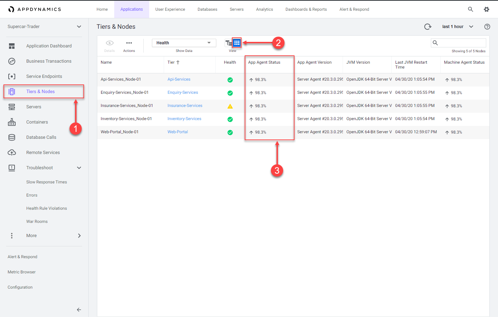

## Controller へのログイン

Ciscoの認証情報を使用して [AppDynamics SE Lab Controller](https://se-lab.saas.appdynamics.com/controller/) にログインしてください。

## アプリケーションへのトランザクション負荷の確認

アプリケーションフローマップを確認します：

1. 過去1時間の時間枠を選択します。
2. フローマップに5つの異なるTierが表示されていることを確認します。
3. 過去1時間にわたって一貫した負荷があったことを確認します。


ビジネストランザクションのリストを確認します：

1. 左側のメニューで **Business Transactions** オプションをクリックします。
2. 以下に示す11個のビジネストランザクションが表示されていることを確認します。
3. 過去1時間に何らかのコール数があることを確認します。

注：**Calls** カラムが表示されていない場合は、**View Options** ツールバーボタンをクリックしてそのカラムを表示できます。


Nodeのエージェントステータスを確認します：

1. 左側のメニューで **Tiers & Nodes** オプションをクリックします。
2. **Grid View** をクリックします。
3. 各NodeのApp Agent Statusが過去1時間で90%以上であることを確認します。



## 必要に応じてアプリケーションとトランザクション負荷を再起動する

前のステップで実行した確認のいずれかが確認できなかった場合は、Application VMにSSH接続し、以下のステップに従ってアプリケーションとトランザクション負荷を再起動してください。EC2インスタンスのIPアドレス、SSH接続に必要なユーザー名とパスワードを用意してください。ローカルマシンでターミナルを開き、以下を入力します：

``` bash
ssh -P 2222 [username]@http://[ec2-ip-address]
```

パスワードの入力を求められます。

以下のコマンドを使用して、実行中のApache Tomcatインスタンスを停止します。

```bash
cd /usr/local/apache/apache-tomcat-9/bin
./shutdown.sh
```

以下のコマンドを使用して、まだ実行中のアプリケーションJVMが残っていないか確認します。

```bash
ps -ef | grep Supercar-Trader
```

まだ実行中のアプリケーションJVMが見つかった場合は、以下のコマンドを使用して残りのJVMを終了します。

```bash
sudo pkill -f Supercar-Trader
```

以下のコマンドを使用して、アプリケーションの負荷生成を停止します。

```bash
cd /opt/appdynamics/lab-artifacts/phantomjs
./stop_load.sh
```

以下の画像のような出力が表示されるはずです。


次に、以下のコマンドを使用してApache Tomcatを起動します。

```bash
cd /usr/local/apache/apache-tomcat-9/bin
./startup.sh
```

2分待ってから、以下のコマンドを使用してApache Tomcatがポート8080で実行されていることを確認します。

```bash
sudo netstat -tulpn | grep LISTEN
```

Apache Tomcatがポート8080を使用していることを示す、以下の画像のような出力が表示されるはずです。


以下のコマンドを使用して、アプリケーションの負荷生成を開始します。

```bash
cd /opt/appdynamics/lab-artifacts/phantomjs
./start_load.sh
```

以下の画像のような出力が表示されるはずです。


