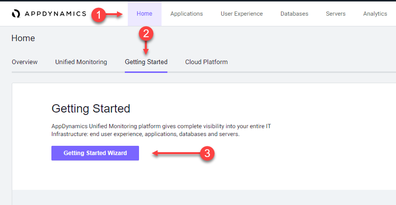
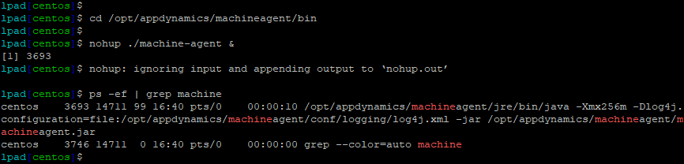

{}
このラボはApplication Performance Monitoringラボの続きです。アプリケーションが実行中であり、過去1時間にわたって負荷がかかっていることを確認してください。必要に応じて、generate-application-loadセクションに戻ってロードジェネレーターを再起動してください。
{}

以下のステップに従ってSelect the agent type for downloadセクションまで進み、**Servers** タイルが表示されない場合は、Deploy Server Agent - Option 2のアプローチを使用する必要があります。

オプション1を使用する利点は、エージェントがControllerに接続するように事前設定されていることです。一方、オプション2を使用する場合は、エージェントの設定を編集してControllerに接続する必要があります。

## Controller へのログイン

Ciscoの認証情報を使用して [AppDynamics SE Lab Controller](https://se-lab.saas.appdynamics.com/controller/) にログインしてください。

## Getting Started Wizard への移動

1. 画面左上の **Home** タブを選択します。
2. **Getting Started** タブを選択します。
3. **Getting Started Wizard** をクリックします。



## ダウンロードするエージェントタイプの選択

1. **Servers** ボタンをクリックします。


## Server Agent のダウンロード

1. Platform BundleはLinuxと64-bitのままにします。
2. Controller接続のデフォルトを受け入れます。
3. **Click Here to Download** をクリックします。


Server Visibility Agentファイルをローカルワークステーションに保存します。

ブラウザがエージェントファイルをローカルファイルシステムに保存するようプロンプトを表示します。以下の画像のような表示になります（OSによって異なります）。


## Application VM への Server Agent のアップロード

Server Agentファイルのアップロードプロセスは、ワークステーションのオペレーティングシステムによって異なります。OSがMAC/Linuxの場合はSCPを使用し、OSがWindowsの場合はWinSCPを使用してServer AgentのZIPファイルをコピーしてください。

## Server Agent のインストール

Server Agentのzipファイルを解凍するディレクトリ構造を作成します。

```bash
cd /opt/appdynamics
mkdir machineagent
```

以下のコマンドを使用して、Server Visibility Agentのzipファイルをディレクトリにコピーし、ファイルを解凍します。Server Visibility Agentファイルの名前は、以下の例とは若干異なる場合があります（zipファイルを /tmpディレクトリにアップロードしたことを前提としています）。

```bash
cp /tmp/machineagent-bundle-64bit-linux-20.4.0.2571.zip /opt/appdynamics/machineagent/
cd /opt/appdynamics/machineagent
unzip machineagent-bundle-64bit-linux-20.4.0.2571.zip
```

## Server Visibility Agent の起動

以下のコマンドを使用して、Server Visibility Agentを起動し、起動したことを確認します。

```bash
cd /opt/appdynamics/machineagent/bin
nohup ./machine-agent &
ps -ef | grep machine
```

以下の画像のような出力が表示されるはずです。


