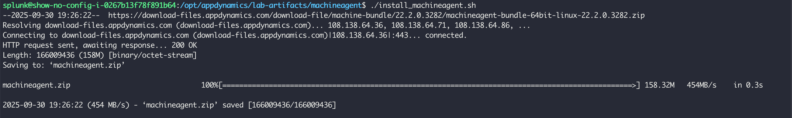
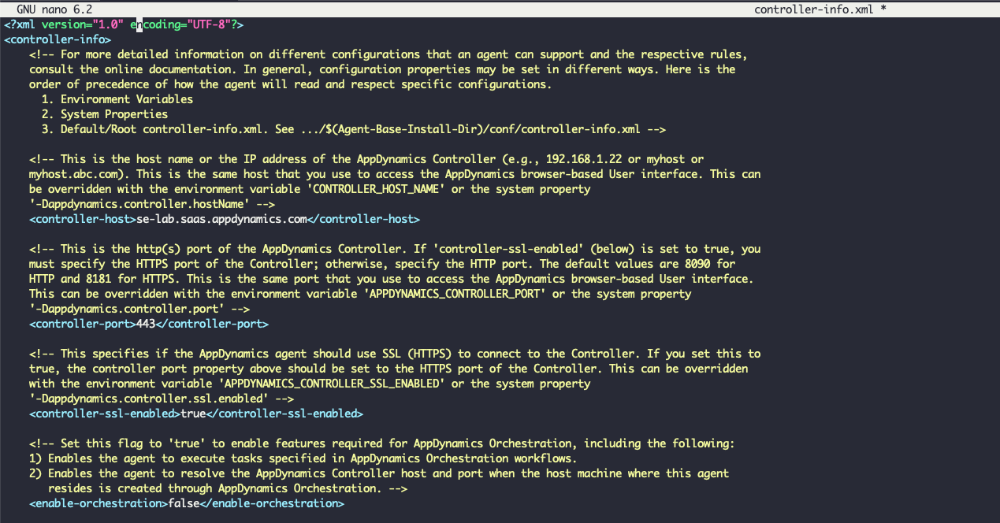
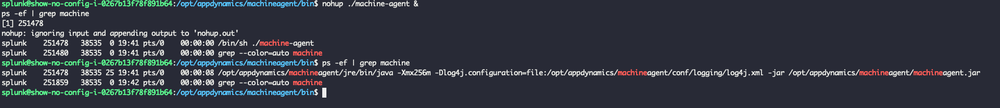

この演習では、以下のアクションを実行します

1. Machine Agentをインストールするスクリプトを実行する
2. Machine Agentを設定する
3. Machine Agentを起動する

{}
スクリプトを使用してMachine AgentをEC2インスタンスにダウンロードします。通常は [https://accounts.appdynamics.com/](https://accounts.appdynamics.com/) にログインしてMachine Agentをダウンロードする必要がありますが、アクセス制限の可能性があるため、ポータルから直接ダウンロードするスクリプトを使用します。AppDynamicsポータルにアクセスでき、Machine Agentをダウンロードしたい場合は、以下のステップに従ってダウンロードし、APMラボのInstall Agentセクションで使用したステップを参照してVMにSCPしてください。

1. [AppDynamics Portal](https://accounts.appdynamics.com/) にログインします
2. 左側のメニューで **Downloads** をクリックします
3. **Type** で **Machine Agent** を選択します
4. **Operating System** で **Linux** を選択します
5. **Machine Agent Bundle - 64-bit linux (zip)** を見つけて **Download** ボタンをクリックします
6. Install Agentセクションのステップに従って、ダウンロードしたファイルをEC2インスタンスにSCPします
7. zipファイルを /opt/appdynamics/machineagentディレクトリに解凍し、このラボの設定セクションに進みます
{}

## インストールスクリプトの実行

以下のコマンドを使用して、スクリプトが配置されているディレクトリに移動します。スクリプトはMachine Agentをダウンロードして解凍します。

```bash
cd /opt/appdynamics/lab-artifacts/machineagent/
```

以下のコマンドを使用してインストールスクリプトを実行します。

```bash
chmod +x install_machineagent.sh
./install_machineagent.sh
```

以下の画像のような出力が表示されるはずです。



## Server Agent の設定

Java Agentの "controller-info.xml" から以下の設定プロパティ値を取得し、次のステップで使用できるようにしておきます。

```bash
cat /opt/appdynamics/javaagent/conf/controller-info.xml
```

- controller-host
- controller-port
- controller-ssl-enabled
- account-name
- account-access-key

Machine Agentの "controller-info.xml" ファイルを編集し、Java Agent設定ファイルから取得した以下のプロパティの値を挿入します。

- controller-host
- controller-port
- controller-ssl-enabled
- account-name
- account-access-key

"sim-enabled" プロパティをtrueに設定してファイルを保存する必要があります。ファイルは以下の画像のようになります。

```bash
cd /opt/appdynamics/machineagent/conf
nano controller-info.xml
```



## Server Visibility Agent の起動

以下のコマンドを使用して、Server Visibility Agentを起動し、起動したことを確認します。

```bash
cd /opt/appdynamics/machineagent/bin
nohup ./machine-agent &
ps -ef | grep machine
```

以下の画像のような出力が表示されるはずです。


