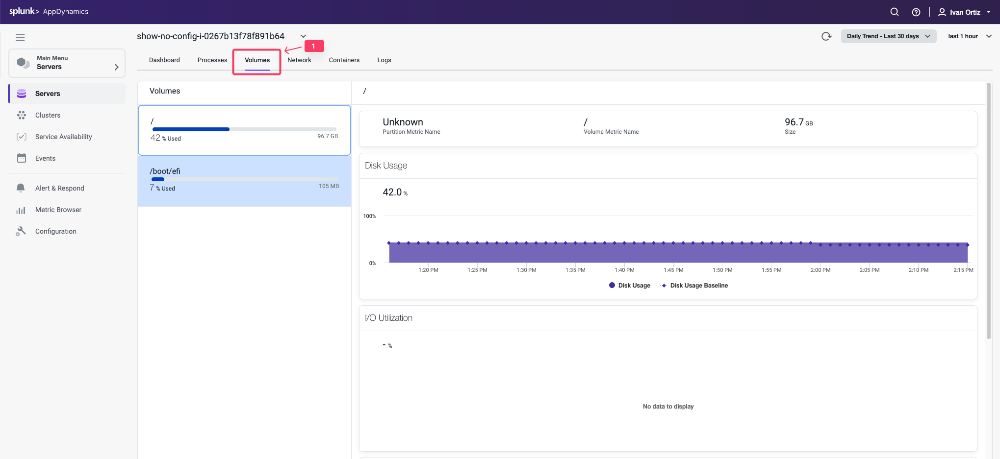

この演習では、以下のタスクを完了します：

- Server Mainダッシュボードを確認する
- Server Processesダッシュボードを確認する
- Server Volumesダッシュボードを確認する
- Server Networkダッシュボードを確認する
- サーバーとアプリケーションのコンテキスト間を移動する

## Server Main Dashboard の確認

Machine Agentがインストールされたので、Server Visibilityモジュールで利用可能な機能のいくつかを見てみましょう。**Application Dashboard** から **Servers** タブをクリックし、以下のステップに従ってサーバーメインダッシュボードにドリルダウンします。

1. 左側のメニューで **Servers** タブをクリックします。
2. サーバーの左側にある **checkbox** をチェックします。
3. **View Details** をクリックします。

これでサーバーダッシュボードを探索できます。このダッシュボードでは、以下のタスクを実行できます：

選択した監視対象サーバーの主要なパフォーマンスメトリクスのチャートを表示します。これには以下が含まれます：

- サーバーの可用性
- CPU、メモリ、ネットワーク使用率
- サーバープロパティ
- ディスク、パーティション、ボリュームのメトリクス
- CPUリソースとメモリを消費している上位10プロセス

Server Mainダッシュボードについて詳しくは[こちら](https://help.splunk.com/en/appdynamics-saas/infrastructure-visibility/25.7.0/server-visibility/monitor-your-servers-using-server-visibility/server-dashboard)をご覧ください。

ダッシュボードの **Top Pane** を確認します。以下の情報が表示されます：

- Host Id: Splunk AppDynamics Controllerで一意のサーバー IDです
- Health: サーバーの全体的な健全性を表示します
- Hierarchy: サーバーをグループ化するための任意の階層です。詳細については[こちら](https://help.splunk.com/en/appdynamics-saas/infrastructure-visibility/25.7.0/machine-agent/configure-the-machine-agent/machine-agent-configuration-properties)のドキュメントをご覧ください

1. サーバーの健全性アイコンをクリックして **Violations & Anomalies** パネルを表示します。パネルを確認して潜在的な問題を特定します
2. **Current Health Rule Evaluation Status** をクリックして、このサーバーに対して現在アラートが発生している問題があるかどうかを確認します

1. **CPU Usage too high** ルールをクリックします
2. **Edit Health Rule** をクリックします。**Edit Health Rule** パネルが開きます

このパネルではHealth Ruleを設定できます。別のラボでHealth Ruleの作成とカスタマイズについて詳しく説明します。ここでは既存のルールを確認するだけにします。

1. **Warning Criteria** をクリックします

この例では、CPUが5%を超えたときに警告条件が設定されていることがわかります。これが、Health Ruleが正常な状態ではなく警告を表示している理由です。**Edit Health Rule** パネルをキャンセルして **Server Dashboard** に戻ります。

## Server Processes Dashboard の確認

1. **Processes** タブをクリックします。
2. **View Options** をクリックして異なるデータカラムを選択します。表示可能なKPIを確認します。

これでサーバープロセスダッシュボードを探索できます。このダッシュボードでは、以下のタスクを実行できます：

- 選択した期間中にアクティブなすべてのプロセスを表示します。プロセスはServerMonitoring.ymlファイルで指定されたクラスごとにグループ化されます。
- Command Lineカラムのプロセスエントリにマウスを合わせると、このプロセスを開始したフルコマンドラインを表示できます。
- プロセスクラスを展開して、そのクラスに関連するプロセスを確認できます。
- View Optionsを使用して、チャートに表示するカラムを設定できます。
- 表示されるメトリクスの期間を変更できます。
- カラムをソートキーとして使用してチャートをソートできます。スパークラインチャート（CPU TrendとMemory Trend）ではソートできません。
- CPUとメモリの使用傾向を一目で確認できます。

Server Processesダッシュボードについて詳しくは[こちら](https://help.splunk.com/en/appdynamics-saas/infrastructure-visibility/25.7.0/server-visibility/monitor-your-servers-using-server-visibility/server-process-metrics)をご覧ください。

## Server Volumes Dashboard の確認

1. **Volumes** タブをクリックします。

これでサーバーボリュームダッシュボードを探索できます。このダッシュボードでは、以下のタスクを実行できます：

- ボリュームのリスト、使用率、およびディスク、パーティション、またはボリュームで利用可能な総ストレージ容量を確認できます。
- ディスク使用量とI/O使用率、レート、1秒あたりの操作数、待機時間を確認できます。
- 収集および表示されるメトリクスの期間を変更できます。
- チャート上の任意のポイントをクリックして、その時点のメトリクス値を確認できます。

Server Volumesダッシュボードについて詳しくは[こちら](https://help.splunk.com/en/appdynamics-saas/infrastructure-visibility/25.7.0/server-visibility/monitor-your-servers-using-server-visibility/server-volumes-metrics)をご覧ください。

## Server Network Dashboard の確認

1. **Network** タブをクリックします。

これで **Server Network** ダッシュボードを探索できます。このダッシュボードでは、以下のタスクを実行できます：

- 各ネットワークインターフェースのMAC、IPv4、IPv6アドレスを確認できます。
- ネットワークインターフェースが有効かどうか、機能しているかどうか、イーサネットケーブルが接続された動作状態、全二重または半二重モードで動作しているか、ネットワークインターフェースが渡すことができる最大プロトコルデータユニットの最大転送単位（MTU）またはサイズ（バイト単位）、Mbit/sec単位のイーサネット接続速度を確認できます。
- ネットワークスループット（キロバイト/秒）とパケットトラフィックを表示できます。
- 表示されるメトリクスの期間を変更できます。
- チャート上の任意のポイントにマウスを合わせると、その時点のメトリクス値を確認できます。

Server Networkダッシュボードについて詳しくは[こちら](https://help.splunk.com/en/appdynamics-saas/infrastructure-visibility/25.7.0/server-visibility/monitor-your-servers-using-server-visibility/server-network-metrics)をご覧ください。

