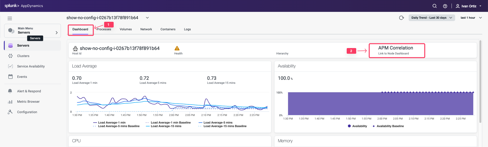
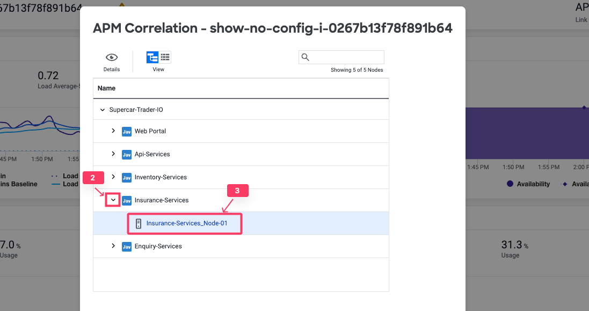

## サーバーとアプリケーションのコンテキスト間の移動

Server Visibility Monitoring エージェントは、同じホスト上で実行されている Splunk AppDynamics APM エージェントと自動的に関連付けられます。

Server Visibility を有効にすると、アプリケーションのコンテキストでサーバーパフォーマンスメトリクスにアクセスできます。さまざまな方法でサーバーとアプリケーションのコンテキストを切り替えることができます。以下のステップに従って、サーバーメインダッシュボードからサーバー上で実行されている Node の1つに移動します。

1. **Dashboard** タブをクリックしてメインの Server Dashboard に戻ります。
2. **APM Correlation** リンクをクリックします。

2. リストされている Tier の1つで下矢印をクリックします。
3. Tier の Node リンクをクリックします。

これで **Node Dashboard** に移動しました。

4. **Server** タブをクリックして関連するホストメトリクスを確認します。

Server Visibility Monitoring エージェントがインストールされている場合、ホストメトリクスは関連する Node のコンテキスト内で常に利用可能です。

サーバーとアプリケーションのコンテキスト間の移動について詳しくは[こちら](https://help.splunk.com/en/appdynamics-saas/infrastructure-visibility/25.7.0/server-visibility/monitor-your-servers-using-server-visibility/navigating-between-server-and-application-contexts)をご覧ください。