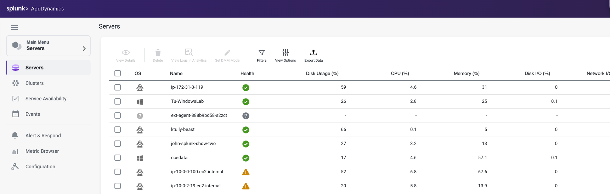

{}
このラボは Application Performance Monitoring ラボの続きです。アプリケーションが実行中であり、過去1時間にわたって負荷がかかっていることを確認してください。必要に応じて、Generate Application Load セクションに戻ってロードジェネレーターを再起動してください。
{}

## 目標

このラボでは、AppDynamics Server Visibility Monitoring と Service Availability Monitoring について学びます。

このラボを完了すると、以下のことができるようになります：

- AppDynamics Server Visibility Agent をダウンロードする
- AppDynamics Server Visibility Agent をインストールする
- サーバーの健全性を監視する
- エージェントの拡張ハードウェアメトリクスを理解する
- アプリケーションパフォーマンスに影響を与えている基盤インフラストラクチャの問題を迅速に確認する

## ワークショップ環境

ラボ環境には2つのホストがあります：

- 1つ目のホストは AppDynamics Controller を実行しており、以降は Controller と呼びます。
- 2つ目のホストはラボで使用する Supercar Trader アプリケーションを実行しています。このホストに AppDynamics エージェントをインストールし、以降は Application VM と呼びます。

## Controller

このワークショップでは [AppDynamics SE Lab Controller](https://se-lab.saas.appdynamics.com/controller/) を使用します。

## Application VM

Supercar Trader は Java ベースの Web アプリケーションです。

Supercar-Trader コレクションの目的は、AppDynamics Controller に対して動的なトラフィック（ビジネストランザクション）を生成することです。

