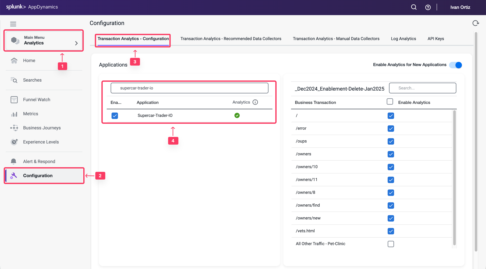

Analyticsは以前、Machine Agentにバンドルされた別のエージェントが必要でした。しかし、現在Analyticsはエージェントレスで、Controller 4.5.16以降の.NET Agent 20.10以降およびJava Agent 4.5.15以降のAPM Agentに組み込まれています。

この演習では、WebブラウザからAppDynamics Controllerにアクセスし、エージェントレスAnalyticsを有効化します。

## Controllerへのログイン
Ciscoの認証情報を使用して[AppDynamics SE Lab Controller](https://se-lab.saas.appdynamics.com/controller/)にログインします。

## Analytics設定への移動

1. ** 画面左上の **Analytics** タブを選択します。
2. ** 左側の **Configuration** タブを選択します。
3. ** **Transaction Analytics - Configuration** タブを選択します。
4. ** アプリケーション **Supercat-Trader-YOURINITIALS** の横にある**チェックボックスをオン**にします。
5. ** **Save** ボタンをクリックします。

## Transaction Summaryの検証

Analyticsがそのアプリケーションで機能し、トランザクションが表示されていることを確認します。

1.  左メニューの **Analytics tab** タブを選択します。
2.  **Home** タブを選択します。
3.  **Transactions from** でアプリケーション **Supercar-Trader-YOURINITIALS** にフィルターします。

