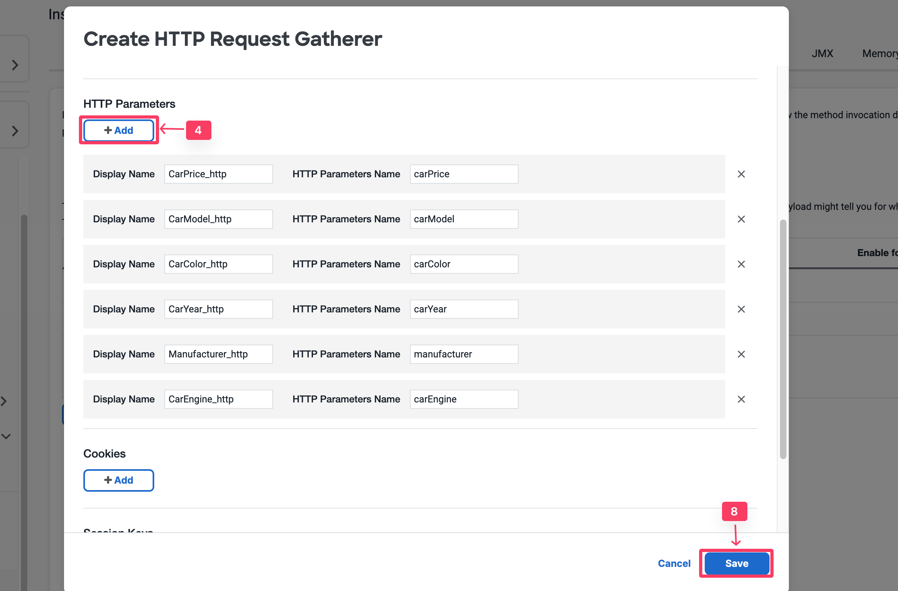
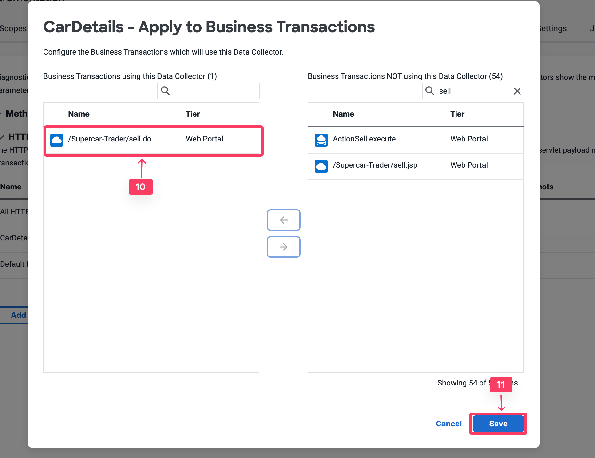
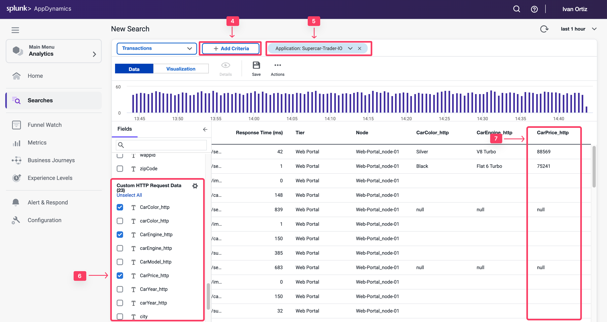

データコレクターを使用すると、ビジネストランザクションとTransaction Analyticsデータをアプリケーションデータで補完できます。アプリケーションデータは、ビジネストランザクションのパフォーマンス問題にコンテキストを追加できます。例えば、パフォーマンス問題の影響を受けたビジネストランザクションの特定のパラメータや戻り値（特定のユーザー、注文、製品など）を表示します。

HTTPデータコレクターは、ビジネストランザクションで交換されるHTTPメッセージのURL、パラメータ値、ヘッダー、Cookieをキャプチャします。

この演習では、以下のタスクを実行します：

*   すべてのHTTPデータコレクターを有効化する。
*   関連するHTTPデータコレクターを観察して選択する。
*   HTTPパラメータを使用してAnalyticsでビジネスデータをキャプチャする。
*   HTTPパラメータのAnalyticsを検証する。

## すべてのHTTPデータコレクターの有効化

最初に、すべてのHTTPデータコレクターをキャプチャして、Analyticsにキャプチャしてダッシュボードで使用できる有用なパラメータを把握します。

{}
このステップは本番環境ではなく、UAT環境で実行することを強く推奨します。
{}

1. 画面左上の **Applications** タブを選択します。
2. **Supercar-Trader-YOURINITIALS** アプリケーションを選択します。
3. 左側の **Configuration** タブを選択します。
4. **Instrumentation** リンクをクリックします。
5. **Data Collectors** タブを選択します。
6. **HTTP Request Data Collectors** の **Add** ボタンをクリックします。

次に、すべてのHTTPパラメータをキャプチャするHTTPデータコレクターを設定します。Transaction Analyticsに必要な正確なパラメータを特定するまで、オーバーヘッドを避けるためにTransaction Snapshotsでのみ有効にします。

1. **Name** に **All HTTP Param** を指定します。
2. **Enable Data Collector for** で **Transaction Snapshots** のチェックボックスをオンにします。
3. Transaction Analyticsは**有効にしないでください**。
4. HTTP Parametersセクションで **\+ Add** をクリックします。
5. 新しいパラメータのDisplay Nameに **All** を指定します。
6. HTTP Parameter nameにアスタリスク **\*** を指定します。
7. **Save** をクリックします。

8. "Ok"をクリックしてデータコレクターを確認します。
9. **/Supercar-Trader/sell.do** トランザクションを有効にします。
10. **Save** をクリックします。

## 関連するHTTPデータコレクターの観察と選択

1. アプリケーションに負荷をかけ、特に **SellCar** トランザクションに負荷をかけます。Full Call Graphを含むスナップショットの1つを開き、**Data Collectors Tab** を選択します。

これですべてのHTTPパラメータを確認できます。Car Price、Color、Yearなど、多くの重要なメトリクスが表示されます。

2. 正確なパラメータ名をメモし、**HTTP Parameters** リストに再度追加してTransaction Analyticsで有効にします。
3. 追加したら、**All HTTP Param** HTTPデータコレクターを削除します。

## HTTPパラメータを使用したAnalyticsでのビジネスデータのキャプチャ

次に、HTTPデータコレクターを再度設定しますが、今回は有用なHTTPパラメータのみをキャプチャしてTransaction Analyticsで有効にします。新しいHTTP Data Collectorを追加します：Application -> Configuration -> Instrumentation -> Data Collectorタブ -> **HTTP Request Data Collectors** セクションで **Add** をクリックします。

1. Nameに **CarDetails** を指定します。
2. **Transaction Snapshots** を有効にします。
3. **Transaction Analytics** を有効にします。
4. HTTP Parametersセクションで **\+ Add** をクリックします。
5. 新しいパラメータのDisplay Nameに **CarPrice\_http** を指定します。
6. HTTP Parameter nameに **carPrice** を指定します。
7. 以下に示すように、残りのCarパラメータについても同様に繰り返します。
8. **Save** をクリックします。
9. **Ok** をクリックしてData Collectorの実装を確認します。

10. **/Supercar-Trader/sell.do** トランザクションを有効にします。
11. **Save** をクリックします。

12. **All HTTP Param** コレクターをクリックして選択し、**Delete** ボタンをクリックして削除します。

## HTTPパラメータのAnalyticsの検証

次に、ビジネスデータがHTTPデータコレクターによってAppDynamics Analyticsでキャプチャされたかどうかを検証します。

1. 画面左上の **Analytics** タブを選択します。
2. **Searches** タブを選択します。
3. **+ Add** ボタンをクリックし、新しい **Drag and Drop Search** を作成します。

4. **+ Add Criteria** をクリックします。
5. **Application** を選択し、アプリケーション名 **Supercar-Trader-YOURINITIALS** を検索します。
6. **Fields** パネルで、**Business Parameters** がCustom HTTP Request Dataのフィールドとして表示されていることを確認します。
7. **CarPrice_http** のチェックボックスをオンにし、フィールドにデータがあることを確認します。

