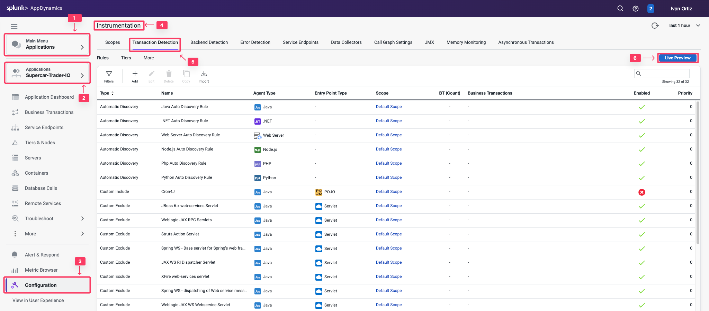
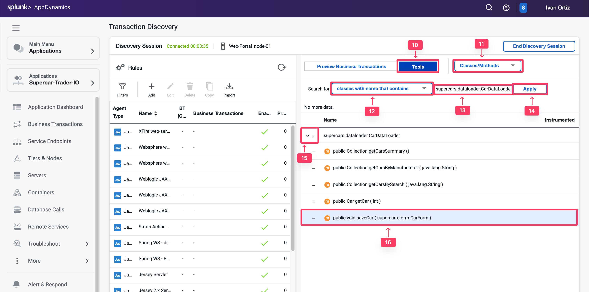
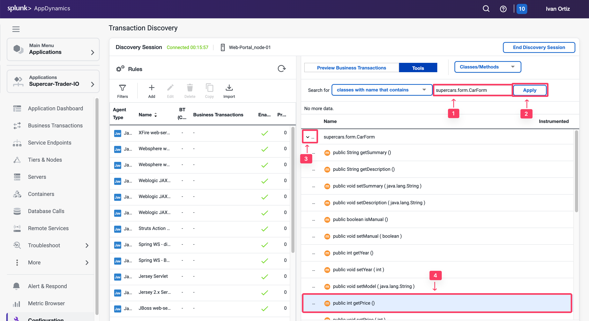
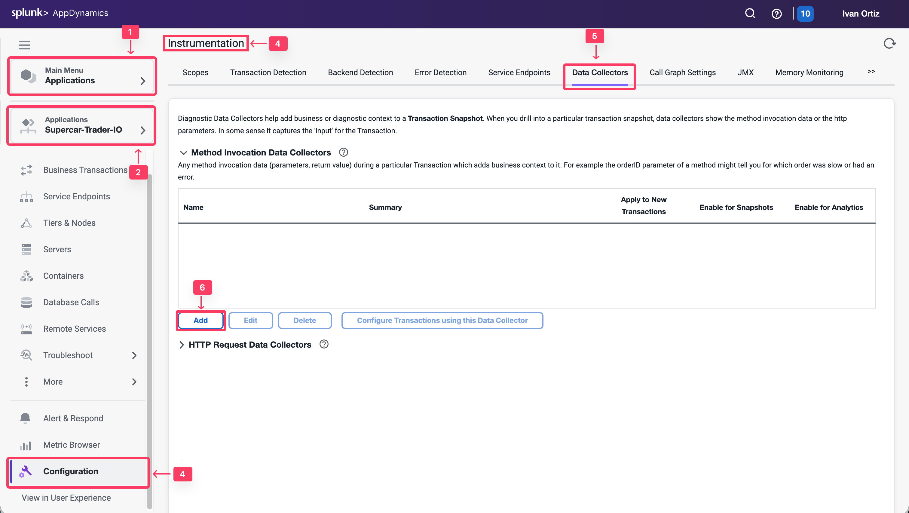

メソッド呼び出しデータコレクターは、メソッド引数、変数、戻り値などのコードデータをキャプチャします。HTTPデータコレクターに十分なビジネスデータがない場合でも、コード実行からこれらの情報をキャプチャできます。

この演習では、以下のタスクを実行します：

* メソッドを発見する。
* ディスカバリーセッションを開く。
* メソッドパラメータを発見する。
* コード内のオブジェクトにドリルダウンする。
* メソッド呼び出しデータコレクターを作成する。
* メソッド呼び出しデータコレクターのAnalyticsを検証する。

## ディスカバリーセッションを開く

ソースコードからメソッドやパラメータを特定するアプリケーション開発者がいない場合があります。しかし、AppDynamicsから直接アプリケーションメソッドとオブジェクトを発見するアプローチがあります。

1. 画面左上の **Applications** タブを選択します。
2. **Supercar-Trader-YOURINITIALS** アプリケーションを選択します。
3. **Configuration** タブを選択します。
4. **Instrumentation** リンクをクリックします。
5. **Transaction Detection** タブを選択します。
6. 右側の **Live Preview Button** をクリックします。



1. **Start Discovery Session** ボタンをクリックします。
2. ポップアップウィンドウで **Web-Portal Node** を選択します。調査しているメソッドが実行されているのと同じNodeである必要があります。
3. **Ok** をクリックします。


1. 右側のトグルで **Tools** を選択します。
2. ドロップダウンリストで **Classes/Methods** を選択します。
3. **Search** セクションで **Classes** with nameを選択します。
4. テキストボックスにクラス名 **supercars.dataloader.CarDataLoader** を入力します。クラス名を見つけるには、コールグラフを検索するか、理想的にはソースコードで見つけます。
5. **Apply** をクリックして一致するクラスメソッドを検索します。
6. 結果が表示されたら、検索に一致するクラスを展開します。
7. 同じメソッド **saveCar** を探します。



**saveCar** メソッドは入力パラメータとして **CarForm** オブジェクトを取ることに注意してください。

## オブジェクトへのドリルダウン

メソッドを見つけたら、そのパラメータを調べて車の詳細プロパティを取得できる場所を見つけます。

**saveCar** メソッドは入力パラメータとして複合オブジェクト **CarForm** を取ることがわかりました。このオブジェクトにはアプリケーションWebページで入力されたフォームデータが保持されます。次に、そのオブジェクトを検査して、車の詳細をどのように取得できるかを見つける必要があります。

1. テキストボックスに入力オブジェクトのクラス名 **supercars.form.CarForm** を入力します。
2. **Apply** をクリックしてクラスメソッドを検索します。
3. 結果が表示されたら、検索に一致する **supercars.form.CarForm** クラスを展開します。
4. 必要な車の詳細を返すメソッドを探します。price、model、colorなどの **get** メソッドが見つかります。



## メソッド呼び出しデータコレクターの作成

前の演習で得た知見を使用して、実行時に実行中のコードから車の詳細を直接取得するメソッド呼び出しデータコレクターを設定できます。

1. **Applications** タブを選択します。
2. **Supercar-Trader-YOURINITIALS** アプリケーションを選択します。
3. **Configuration** タブを選択します。
4. **Instrumentation** リンクをクリックします。
5. **Data Collectors** タブを選択します。
6. **Method Invocation Data Collectors** の **Add** をクリックします。



車の詳細をキャプチャするメソッド呼び出しデータコレクターを作成します。

1. **Name** に **SellCarMI-YOURINITIALS** を指定します。
2. **Transaction Snapshots** を有効にします。
3. **Transaction Analytics** を有効にします。
4. **with a Class Name that** を選択します。
5. **Class Name** に **supercars.dataloader.CarDataLoader** を追加します。
6. **Method Name** に **saveCar** を追加します。


観察したように、SaveCarメソッドのインデックス0の入力パラメータはクラス **CarForm** のオブジェクトであり、そのオブジェクト内には **getPrice()** などの車の詳細プロパティを返すGetterメソッドがあります。

MIDCでその値をどのように取得したかを説明すると、以下のようになります：

1. MIDCパネルの下部にある **Add** をクリックして、収集する新しいデータを指定します。
2. Display Nameに **CarPrice_MIDC** を指定します。
3. Collect Data Fromで、**CarForm Object** である **Method Parameter of Index 0** を選択します。
4. **Operation on Method Parameter** で **Use Getter Chain** を選択します。CarForm内のメソッドを呼び出して車の詳細を返します。
5. 次に、価格を返す **CarForm** クラス内のGetterメソッド **getPrice()** を指定します。
6. **Save** をクリックします。


1. color、modelなど、データを収集したいすべてのプロパティについて、上記の手順を繰り返します。


1. **MIDC** を保存し、**"/Supercar-Trader/sell.do"** ビジネストランザクションに適用します。

MIDCの実装にはJVMの再起動が必要です：

1. EC2インスタンスにSSH接続します。
2. Tomcatサーバーをシャットダウンします。

``` bash
cd /usr/local/apache/apache-tomcat-9/bin
./shutdown.sh
```

まだ実行中のアプリケーションJVMが見つかった場合は、以下のコマンドを使用して残りのJVMを終了します。


{}

``` bash
sudo pkill -f Supercar-Trader
```

{}


1. Tomcatサーバーを再起動します。

``` bash
./startup.sh
```

1. Tomcatサーバーが実行されていることを確認します。これには数分かかる場合があります。


{}

``` bash
curl localhost:8080
```

{}
{}

``` bash
<!DOCTYPE html>
<html lang="en">
    <head>
        <meta charset="UTF-8" />
        <title>Apache Tomcat/9.0.50</title>
        <link href="favicon.ico" rel="icon" type="image/x-icon" />
        <link href="tomcat.css" rel="stylesheet" type="text/css" />
    </head>

    <body>
        <div id="wrapper"
....
```

{}


## MDパラメータのAnalyticsの検証

Webサイトにアクセスし、Sell Carページでフォームを数回送信して手動で負荷をかけます。

次に、ビジネスデータがHTTPデータコレクターによってAppDynamics Analyticsでキャプチャされたかどうかを検証します。

1. **Analytics** タブを選択します。
2. **Searches** タブを選択し、新しい **Drag and Drop Search** を追加します。
3. **+ Add** ボタンをクリックし、新しい **Drag and Drop Search** を作成します。
4. **+ Add Criteria** をクリックします。
5. **Application** を選択し、アプリケーション名 **Supercar-Trader-YOURINITIALS** を検索します。
6. **Business Parameters** が **Custom Method Data** のフィールドとして表示されていることを確認します。
7. **CarPrice Field** にデータがあることを確認します。


## まとめ

これで、実行時にNodeからSell Carトランザクションのビジネスデータをキャプチャしました。このデータは、AppDynamicsのAnalyticsおよびダッシュボード機能で使用でき、ビジネスにより多くのコンテキストを提供し、ITがビジネスに与える影響を測定できます。
