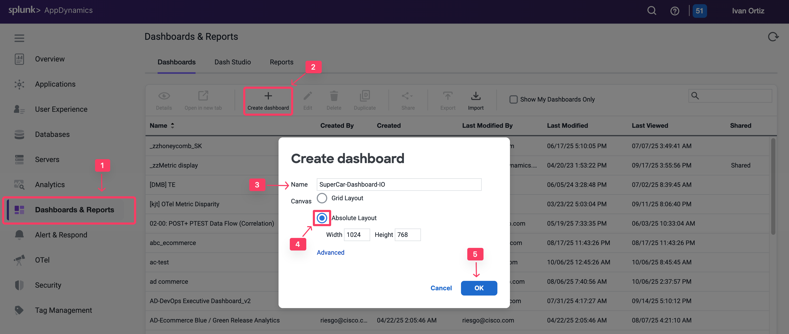
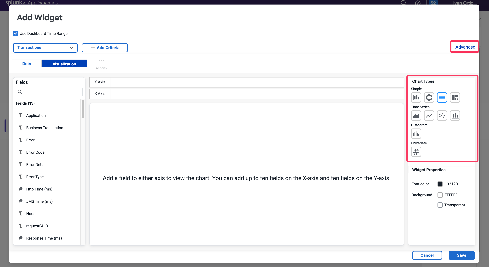
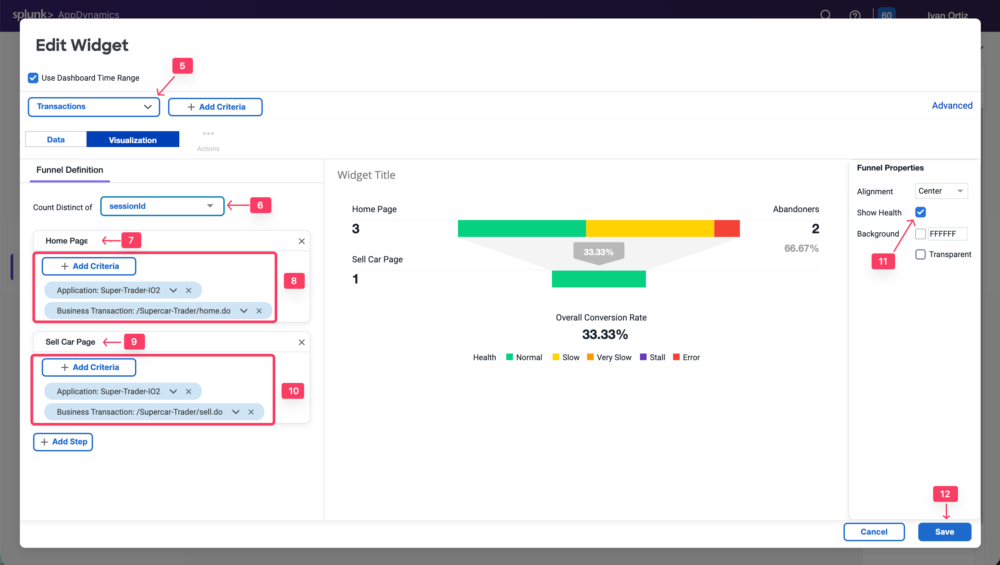

ダッシュボードを構築する機能は、AppDynamicsの機能と価値の重要なコンポーネントです。この演習では、魅力的なダッシュボードを構築するために使用できるダッシュボードコンポーネントのいくつかを操作します。

## 新しいダッシュボードの作成

1. **Dashboard & Reports** タブを選択します。
2. **Create Dashboard** をクリックします。
3. **SuperCar-Dashboard-YOURINITIALS** などのダッシュボード名を入力します。
4. **Canvas Type** として **Absolute Layout** を選択します。
5. **OK** をクリックします。

新しく作成した空のダッシュボードを開きます。次に、さまざまなウィジェットタイプを追加します。

## ダッシュボードコンポーネント：カスタムウィジェットビルダー

カスタムウィジェットビルダーは、数値ビュー、時系列、円グラフなど、データの表現を生成できる非常に柔軟なツールです。AppDynamics ADクエリ言語に基づいています。

ウィジェットを作成するには、以下の手順に従います：

1. ダッシュボードの左上隅にある **Edit Mode** を切り替えます。
2. **Add Widget** をクリックします。
3. 左側の **Analytics** タブを選択します。
4. **Custom Widget Builder** をクリックします。

カスタムウィジェットビルダーでは、多くのチャートタイプを作成できます。情報をドラッグアンドドロップするか、Advancedペインでクエリを作成できます。

ここでは、数値チャート、棒グラフ、円グラフについて説明します。

### 数値チャート

**演習：** エラーによって影響を受けた金額を定量化することで、ITパフォーマンスがビジネス収益に与える影響を示すことができます。

1. **Numeric** チャートタイプを選択します。
2. Applicationフィールドにフィルターを追加し、アプリケーション名 **Supercar-Trader-YOURINITIALS** を選択します。
3. **/Supercar-Trader/sell.do** ビジネストランザクションにフィルターを追加します。
4. User Experienceフィールドにフィルターを追加し、**Error** のみを選択してエラーの影響を表示します。
5. 左側のパネルで **CarPrice_MIDC** フィールドを見つけ、Y軸にドラッグアンドドロップします。SUMがモデルごとの合計価格をキャプチャするために使用される集計であることに注意してください。
6. 見やすくするためにフォントの色を赤に変更します。
7. **Save** をクリックします。

User ExperienceフィルターをNORMAL、SLOW、VERY SLOWのみに変更することで、**正常に処理された金額**についても同様のことができます。

また、Analyticsモジュールでカスタムメトリクスを作成し、**影響を受けた金額**がベースライン以上かどうかを示すヘルスルールを定義することで、このメトリクスをベースライン化することもできます。通貨のラベルを追加することもできます。

### 棒グラフ

**演習：** 次に、影響を受けた車種のトップを視覚化する棒グラフを作成します。このチャートは、User Experienceで分類されたすべての **SellCar** トランザクションの車種を表示します。

1. **+ Add Widget**、**Analytics**、**Custom Widger Builder** をクリックして新しいウィジェットを作成します。
2. **Column** チャートタイプを選択します。
3. 以下のフィルターを追加します：Application = **Supercar-Trader-YOURINITIALS** および Business Transaction = **/Supercar-Trader/sell.do**。
4. X軸に **CarModel\_MIDC** と **User Experience** を追加します。
5. **Save** をクリックします。

このチャートタイプは、ニーズに応じて調整できます。例えば、X軸を顧客タイプ、会社、組織などでグループ化できます。以下の例を参照してください。

### 円グラフ

次に、`sellCar`トランザクションによって報告されたすべての車種とモデルごとの価格の合計を表示する円グラフを作成します。これにより、アプリケーションで最も需要の高いモデルが表示されます。

1. 新しいウィジェットを作成します。
2. **Pie** チャートタイプを選択します。
3. 以下のフィルターを追加します：Application = **Supercar-Trader-YOURINITIALS** および Business Transaction = **/Supercar-Trader/sell.do**。
4. X軸に **CarModel\_MIDC** を追加します。
5. Y軸に **CarPrice\_MIDC** を追加します。**SUM** がモデルごとの合計価格をキャプチャするために使用される集計であることに注意してください。
6. タイトルに **Sold by Car Model** を追加します。
7. **Save** をクリックします。

円グラフウィジェットのその他の使用例については、以下の例を参照してください。

## ダッシュボードコンポーネント：コンバージョンファネル

コンバージョンファネルは、複数のステップからなるプロセスを通じたユーザーまたはイベントのフローを視覚化するのに役立ちます。これにより、より成功した収束のためにどのステップを最適化できるかをより良く理解できます。また、コンバージョンファネルを使用して各ステップのITパフォーマンスを調べ、ユーザーエクスペリエンスへの影響とユーザー離脱の原因を理解することもできます。

ファネルは、その特定の順序でこのパスを実行したユーザーに基づいてフィルタリングされており、ステップごとの総訪問数ではないことに注意してください。

ファネル作成の最初のステップは、ファネルを通じた各ユーザーナビゲーションを表すことができるトランザクションの一意の識別子を選択することです。通常、Session IDはファネルの各ステップを通じて永続するため、最良の選択です。

Session IDはトランザクションからキャプチャできます。ファネルトランザクションのカウンターとして使用するには、**SessionId** データコレクターが必要です。

Javaアプリケーションの場合、AppDynamicsにはデフォルトのHTTPデータコレクターでSession IDをキャプチャする機能があります。有効になっていることを確認し、すべてのビジネストランザクションに適用してすべてのトランザクションでSession IDをキャプチャします。

1. **Applications** タブを選択します。
2. **Supercar-Trader-YOURINITIALS** アプリケーションを選択します。
3. 左側の **Configuration** タブを選択します。
4. **Instrumentation** をクリックします。
5. **Data Collectors** タブを選択します。
6. **Default HTTP Request Request Data Collectors** を編集します。
7. **Transaction Analytics** を選択します。
8. **SessionID** が選択されていることを確認します。
9. **Save** をクリックします。

次に、**/Supercar-Trader/home.do** ページから複数回ナビゲートして負荷をかけます。その後、アプリケーションの **/Supercar-Trader/sell.do** ページに直接ナビゲートします。

ダッシュボードに戻ってファネルウィジェットを作成します。

1. **Edit** スライダーを切り替えます。
2. **Add Widget** をクリックします。
3. **Analytics** タブを選択します。
4. **Funnel Analysis** をクリックします。
5. ドロップダウンリストから **Transactions** を選択します。
6. **Count Distinct of** でドロップダウンリストから **uniqueSessionId** を選択します。
7. **Add Step** をクリックします。**Home Page** と名前を付けます。
8. **Add Criteria** をクリックします。以下の条件を追加します：**Application**: Supercar-Trader-YOURINITIALS & **Business Transactions**: **/Supercar-Trader/home.do**。
9. **Add Step** をクリックします。**SellCar Page** と名前を付けます。
10. **Add Criteria** をクリックします。以下の条件を追加します：**Application:** Supercar-Trader-YOURINITIALS & **Business Transactions:** /Supercar-Trader/sell.do。
11. 右側のパネルで **Show Health** チェックボックスを選択して、フローマップでトランザクションの正常性を視覚化します。
12. **Save** をクリックします。

