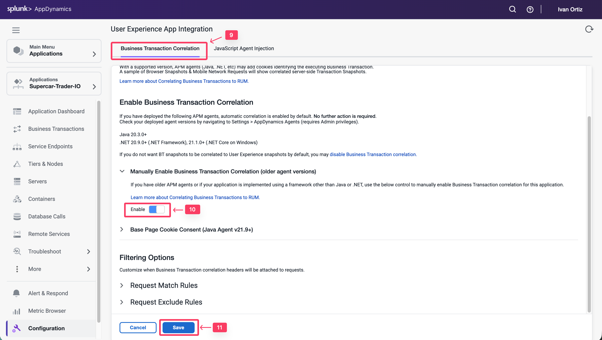

この演習では、以下のタスクを完了します

* JavaScript Agentインジェクションを有効化する。
* インジェクション用のビジネストランザクションを選択する。

## JavaScript Agentインジェクションの有効化

AppDynamicsはJavaScript Agentをインジェクトするさまざまな方法をサポートしていますが、このラボではAuto-Injection方式を使用します。以下の手順に従ってJavaScript Agentの自動インジェクションを有効化します。

1. 左メニューの **Applications** タブをクリックし、Supercar-Trader-##アプリケーションにドリルダウンします。
2. 下部にある左メニューの **Configuration** タブをクリックします。
3. **User Experience App Integration** オプションをクリックします。

1. **JavaScript Agent Injection** タブをクリックします。
2. **Enable** をクリックして青色に切り替えます。
3. **Supercar-Trader-Web-##-####** が選択されたブラウザアプリであることを確認します。前のセクションで作成したアプリケーションを選択してください。
4. **Enable JavaScript Injection** の下にある **Enable** チェックボックスをオンにします。
5. **Save** をクリックします。

Auto-Injectionが潜在的なビジネストランザクションを検出するまで数分かかります。この間に、以下の手順でBusiness Transaction Correlationを有効化します。新しいAPMエージェントでは、これは自動的に行われます。

1. **Business Transaction Correlation** タブをクリックします。
2. **Manually Enable Business Transactions** セクションの下にある **Enable** ボタンをクリックします。
3. **Save** をクリックします。

## インジェクション用のビジネストランザクションの選択

以下の手順に従って、Auto-Injection用のビジネストランザクションを選択します。

1. **JavaScript Agent Injection** タブをクリックします。
2. 検索ボックスに **.do** と入力します。
3. すべての9つのBTが表示されるまで **Refresh List** リンクをクリックします。
4. 右側のリストボックスからすべてのビジネストランザクションを選択します。
5. 矢印ボタンをクリックして左側のリストボックスに移動します。
6. すべてのビジネストランザクションが左側のリストボックスに移動されていることを確認します。
7. **Save** をクリックします。

JavaScript Agentの自動インジェクションの設定について詳しくは、[**こちら**](https://help.splunk.com/en/appdynamics-saas/end-user-monitoring/25.7.0/end-user-monitoring/browser-monitoring/browser-real-user-monitoring/inject-the-javascript-agent/automatic-injection-of-the-javascript-agent)をご覧ください。

ブラウザアプリケーションに負荷が表示され始めるまで数分待ちます。
