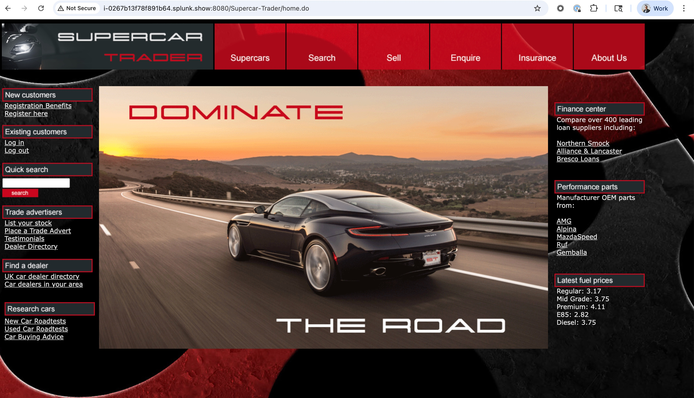
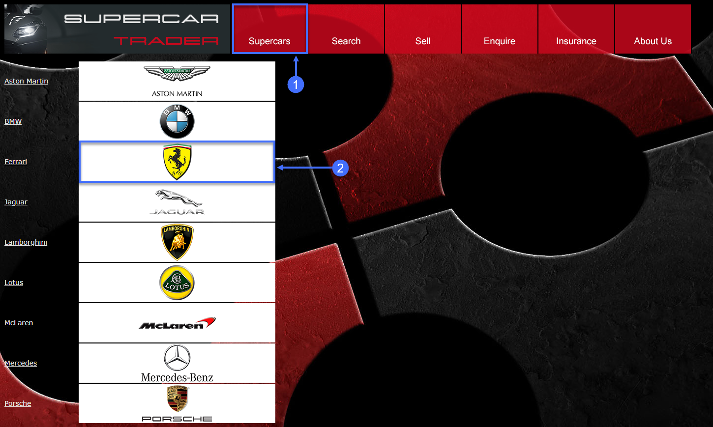
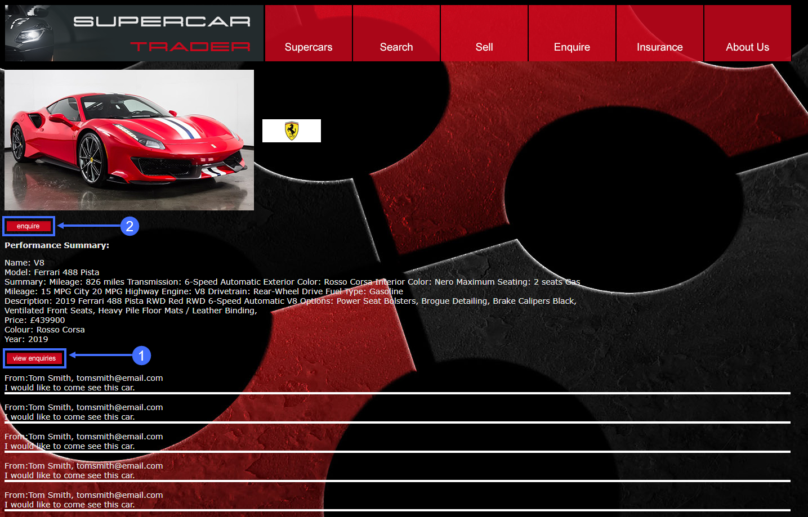
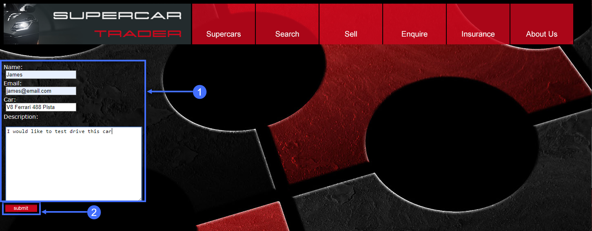

この演習では、以下のタスクを完了します：

* Browser Application Overviewダッシュボードをレビューする
* Browser Application Geoダッシュボードをレビューする
* Browser Application Usage Statsダッシュボードをレビューする
* Supercar-Traderアプリケーションのウェブページをナビゲートする

## Browser Application Overviewダッシュボードのレビュー

User Experienceダッシュボードに移動し、以下の手順に従ってブラウザアプリケーションのOverviewダッシュボードにドリルダウンします。

1. 左メニューの **User Experience** タブをクリックします。
2. Webアプリケーション **Supercar-Trader-Web-##-###** を検索します。
3. **Details** をクリックするか、アプリケーション名をダブルクリックします。


Overviewダッシュボードには、設定可能なウィジェットのセットが表示されます。デフォルトのウィジェットには、アプリケーションパフォーマンスの一般的な高レベル指標を含む複数のグラフとリストが含まれています：

* End User Response Time Distribution
* End User Response Time Trend
* Total Page Requests by Geo
* End User Response Time by Geo
* Top 10 Browsers
* Top 10 Devices
* Page Requests per Minute
* Top 5 Pages by Total Requests
* Top 5 Countries by Total Page Requests

ダッシュボードの機能を探索します。

1. **+** をクリックして、ダッシュボードに追加するグラフとウィジェットを選択します。
2. 任意のウィジェットの右下隅をクリックしてドラッグしてサイズを変更します。
3. 任意のウィジェットの枠線部分を選択して、ダッシュボード上で移動して配置します。
4. 任意のウィジェットのタイトルをクリックして、詳細ダッシュボードにドリルダウンします。
5. 任意のウィジェットの右上隅にある **X** をクリックしてダッシュボードから削除します。

ダッシュボードウィジェットのレイアウトに加えた変更は自動的に保存されます。

Browser Application Overviewダッシュボードについて詳しくは、[**こちら**](https://help.splunk.com/en/appdynamics-saas/end-user-monitoring/25.7.0/end-user-monitoring/browser-monitoring/browser-app-dashboard/overview)をご覧ください。


## Browser Application Geoダッシュボードのレビュー

Geoダッシュボードは、ページロードに基づいて地理的な場所ごとに主要なパフォーマンスメトリクスを表示します。ダッシュボード全体に表示されるメトリクスは、マップまたはグリッドで現在選択されているリージョンのものです。マップビューは、右側のパネルに表示されるキータイミングメトリクスの国に対してラベル付きの負荷円を表示します。ただし、一部の国とリージョンはグリッドビューでのみ表示されます。

Browser Application Geoダッシュボードに移動し、以下に説明するダッシュボードの機能を探索します。

1. **Geo Dashboard** オプションをクリックします。
2. 負荷円の1つをクリックしてリージョンにドリルダウンします。
3. リージョンの1つにカーソルを合わせてリージョンの詳細を表示します。
4. ズームスライダーを使用してズームレベルを調整します。
5. **Configuration** をクリックしてマップオプションを探索します。
6. グリッドビューとマップビューを切り替えます。

Browser Application Geoダッシュボードについて詳しくは、[**こちら**](https://help.splunk.com/en/appdynamics-saas/end-user-monitoring/25.7.0/end-user-monitoring/browser-monitoring/browser-app-dashboard/geo-tab)をご覧ください。


## Browser Application Usage Statsダッシュボードのレビュー

**Usage Stats** ダッシュボードは、ユーザーのブラウザタイプとデバイス/プラットフォームに基づいて集約されたページロード使用データを表示します。

Browser Application Usage Statsダッシュボードは、以下のことを発見するのに役立ちます：

* 合計エンドユーザー応答時間の面で最も遅いブラウザ。
* 応答ページをレンダリングするのに最も遅いブラウザ。
* エンドユーザーの大半が使用しているブラウザ。
* 特定の国やリージョンでエンドユーザーの大半が使用しているブラウザ。

Browser Application Usage Statsダッシュボードに移動し、以下に説明するダッシュボードの機能を探索します。

1. **Usage Stats** オプションをクリックします。
2. **Show Versions** オプションをクリックします。
3. 負荷ごとにさまざまなブラウザとバージョンを確認します。
4. 円グラフのセクションにカーソルを合わせて詳細を確認します。


以下の手順を使用して、ブラウザとバージョンごとのその他のメトリクスを探索します。

1. 右側のスクロールバーを使用してページの下部までスクロールします。
2. ブラウザとバージョンごとの利用可能なメトリクスを探索します。
3. 国ごとの利用可能なメトリクスを探索します。


Devicesダッシュボードに移動し、以下に説明するダッシュボードの機能を探索します。

1. **Devices** オプションをクリックします。
2. デバイス別の負荷の内訳を確認します。
3. 円グラフのセクションにカーソルを合わせて詳細を確認します。
4. デバイス別の利用可能なパフォーマンスメトリクスを探索します。

Browser Application Usage Statsダッシュボードについて詳しくは、[**こちら**](https://help.splunk.com/en/appdynamics-saas/end-user-monitoring/25.7.0/end-user-monitoring/browser-monitoring/browser-app-dashboard/usage-stats)をご覧ください。


## Supercar-TraderアプリケーションのWebページのナビゲート

Browser Real User Monitoringエージェントを設定し、最初の一連の機能を探索したので、Supercar-TraderアプリケーションのWebページをナビゲートして追加の負荷を生成し、ユニークなブラウザセッションを記録しましょう。

Webブラウザでアプリのメインページを開きます。以下の例のURLでは、Application VMのIPアドレスまたは完全修飾ドメイン名を置き換えてください。

``` bash
http://[application-vm-ip-address]:8080/Supercar-Trader/home.do
```

アプリケーションのホームページが表示されるはずです。



利用可能なフェラーリのリストを開きます。

1. トップメニューの **Supercars** タブをクリックします。
2. フェラーリのロゴをクリックします。



フェラーリのリストが表示されるはずです。


最初のフェラーリの画像をクリックします。

1. **View Enquiries** をクリックします。
2. **Enquire** をクリックします。



車に関する問い合わせを送信します。

1. 問い合わせフォームのフィールドに適切なデータを入力します。
2. **Submit** をクリックします。



車を検索し、サイトの閲覧を続けます。

1. トップメニューの **Search** タブをクリックします。
2. 検索ボックスに文字 **A** を入力し、**Search** をクリックします。
3. 残りのタブをクリックしてWebサイトを探索します。


