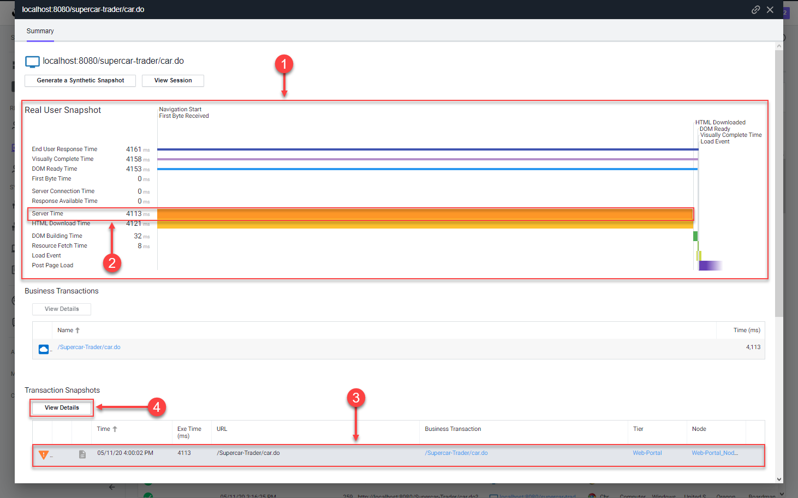
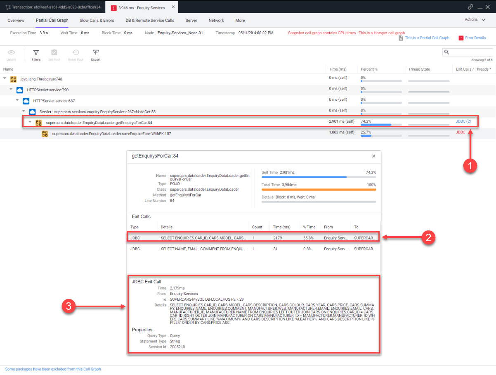

この演習では、以下のタスクを完了します：

*   作成したBrowser Sessionをレビューする。
*   Pages & AJAX Requestsダッシュボードをレビューする。
*   特定のBase Pageのダッシュボードをレビューする。
*   Browser Snapshotをトラブルシューティングする。

## 作成したBrowser Sessionのレビュー

セッションは、ユーザーがアプリケーションとやり取りする体験を分析するための時間ベースのコンテキストと考えることができます。ブラウザセッションを調べることで、アプリケーションがどのように動作しているか、ユーザーがどのようにアプリケーションとやり取りしているかを理解できます。これにより、UIの変更やサーバー側のパフォーマンスの最適化など、アプリケーションをより適切に管理および改善できます。

Sessionsダッシュボードに移動し、前の演習でWebアプリケーションのページをナビゲートして作成したブラウザセッションを見つけます。以下の手順に従います。

{}
Webアプリケーションの最後のページにアクセスしてからブラウザセッションがセッションリストに表示されるまで、10分程度待つ必要がある場合があります。10分経ってもセッションが表示されない場合は、使用中のJava Agentのバージョンに問題がある可能性があります。
{}

1. 左メニューの **Sessions** タブをクリックします。
2. Session FieldsリストでIPアドレスのチェックをオンにします。
3. IPアドレスで作成したセッションを見つけます。
4. セッションをクリックし、**View Details** をクリックします。

作成したセッションを見つけて開いたら、以下の手順に従ってセッションビューのさまざまな機能を探索します。

> _注意:_ ステップ5に示されているように、セッション内のどのページにも **View Snapshot** リンクがない場合があります。後でこの演習で、リンクがあるセッションを見つけて探索します。

5. **Session Summary** リンクをクリックしてサマリーデータを表示します。
6. 左側に表示されているページをクリックすると、右側にそのページの詳細が表示されます。
7. 左側のリストで選択したページの完全名を常に確認できます。
8. ウォーターフォールビューの水平の青いバーをクリックすると、そのアイテムの詳細が表示されます。
9. 一部のページには、サーバー側でキャプチャされた相関スナップショットへのリンクがある場合があります。
10. 設定アイコンをクリックして、ページリストに表示される列を変更します。

Browser RUM Sessionsについて詳しくは、[**こちら**](https://help.splunk.com/en/appdynamics-saas/end-user-monitoring/25.7.0/end-user-monitoring/browser-monitoring/browser-real-user-monitoring/overview-of-the-controller-ui-for-browser-rum/browser-rum-sessions)をご覧ください。

## Pages & AJAX Requestsダッシュボードのレビュー

Pages & AJAX Requestsダッシュボードに移動し、そこにあるオプションを確認し、以下の手順に従って特定のBase Pageダッシュボードを開きます。

1. 左メニューの **Pages & AJAX Requests** タブをクリックします。
2. ツールバーのオプションを探索します。
3. **localhost:8080/supercar-trader/car.do** ページをクリックします。
4. **Details** をクリックしてBase Pageダッシュボードを開きます。

## 特定のBase Pageのダッシュボードのレビュー

Base Pageダッシュボードの上部には、Controller UIの右上隅にあるタイムフレームドロップダウンで選択された期間全体のEnd User Response Time、Load、Cache Hits、Page Views with JS errorsなどの主要なパフォーマンス指標が表示されます。Cache Hitsは、ソースからではなくCDNなどのキャッシュから取得されたリソースを示します。

Timing Breakdownセクションには、ページロードプロセスの各側面に必要な平均時間を表示するウォーターフォールグラフが表示されます。各メトリクスが何を測定するかについての詳細情報は、左側の名前にカーソルを合わせると定義がポップアップ表示されます。より詳細な情報については、[**Browser RUM Metrics**](https://help.splunk.com/en/appdynamics-saas/end-user-monitoring/25.7.0/end-user-monitoring/browser-monitoring/browser-real-user-monitoring/browser-rum-metrics)を参照してください。

以下の手順に従って、**localhost:8080/supercar-trader/car.do** Base Pageの詳細を確認します。

1. タイムフレームドロップダウンを **last 2 hours** に変更します。
2. 主要なパフォーマンス指標を探索します。
3. ウォーターフォールビューのメトリクスを探索します。
4. 垂直スクロールバーを使用してページを下にスクロールします。
5. すべてのKPI Trendsのグラフを探索します。

Base Pageダッシュボードについて詳しくは、[**こちら**](https://help.splunk.com/en/appdynamics-saas/end-user-monitoring/25.7.0/end-user-monitoring/browser-monitoring/browser-real-user-monitoring/overview-of-the-controller-ui-for-browser-rum/pages-and-ajax-requests/page-ajax-and-iframe-dashboards/page-and-iframe-dashboards)をご覧ください。

## Browser Snapshotのトラブルシューティング

{}
アプリケーションにブラウザスナップショットがない場合があり、その場合はワークフロー全体を実行できません。このセクションを別のデモアプリケーションで実行したい場合は、ブラウザアプリケーション **AD-Ecommerce-Browser** に切り替えることができます。
{}

Browser Snapshotsリストダッシュボードに移動し、以下の手順に従って特定のBrowser Snapshotを開きます。

1. **Browser Snapshots** オプションをクリックします。
2. **End User Response Time** 列ヘッダーを2回クリックして、最も長い応答時間を上部に表示します。
3. 左から3番目の列にグレーまたは青のアイコンがあるブラウザスナップショットをクリックします。
4. **Details** をクリックしてブラウザスナップショットを開きます。

ブラウザスナップショットを開いたら、詳細を確認し、以下の手順に従って長い応答時間の根本原因を見つけます。

1. ウォーターフォールビューを確認して、応答時間がどこで影響を受けたかを理解します。
2. **Server Time** メトリクスが長くなっていることに注意してください。**Server Time** のラベルにカーソルを合わせてその意味を理解します。
3. ブラウザスナップショットに自動的にキャプチャされ相関付けられたサーバー側トランザクションをクリックします。
4. **View Details** をクリックして、関連するサーバー側スナップショットを開きます。

相関するサーバー側スナップショットを開いたら、以下の手順を使用してパフォーマンス低下の根本原因を特定します。

1. ブラウザで費やされたトランザクション時間の割合が最小限であることがわかります。
2. ブラウザとWeb-Portal Tier間のタイミングは、ブラウザからの初期接続から完全な応答が返されるまでを表しています。
3. JDBCコールが最も時間がかかっていたことがわかります。
4. **Drill Down** をクリックして、Enquiry-Services Tier内のコードレベルビューを確認します。

Enquiry-Services Tierのスナップショットセグメントを開くと、データベースへのJDBCコールがトランザクションの問題を引き起こしていたことがわかります。

1. 最も時間がかかった **JDBC** リンクをクリックして、JDBCコールの詳細パネルを開きます。
2. JDBC exit callの詳細パネルには、最も時間がかかった特定のクエリが表示されます。
3. 完全なSQLステートメントとSQLパラメータ値を確認できます。

Browser Snapshotsについて詳しくは、[**こちら**](https://help.splunk.com/en/appdynamics-saas/end-user-monitoring/25.7.0/end-user-monitoring/browser-monitoring/browser-app-dashboard/browser-snapshots_1)と[**こちら**](https://help.splunk.com/en/appdynamics-saas/end-user-monitoring/25.7.0/end-user-monitoring/browser-monitoring/browser-app-dashboard/browser-snapshots_1/page-snapshots)をご覧ください。

