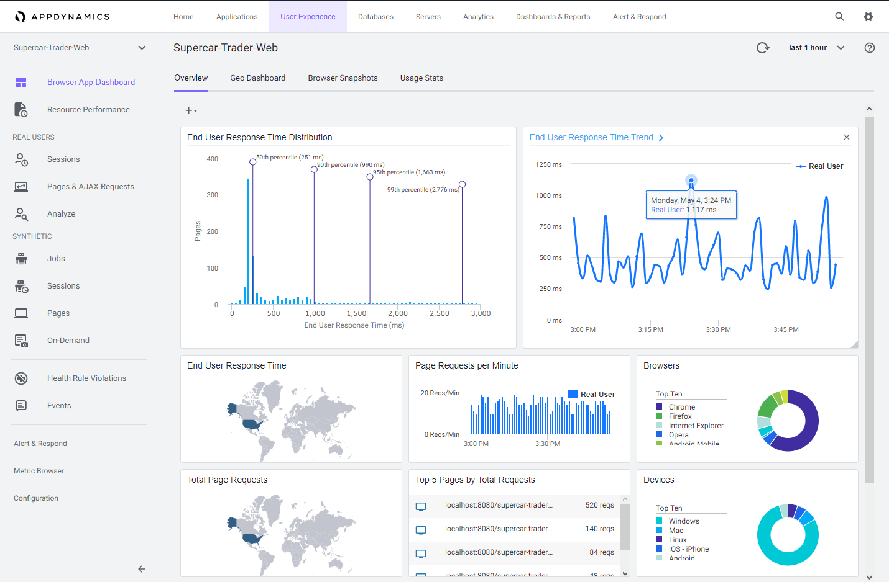

## 目標

このラーニングラボでは、AppDynamicsを使用してブラウザベースのアプリケーションの正常性を監視する方法を学習します。

このラボを完了すると、以下のことができるようになります：

- Controllerでブラウザアプリケーションを作成する
- Browser Real User Monitoring (BRUM) エージェントを設定してWebアプリケーションの正常性を監視する
- パフォーマンス問題をトラブルシューティングし、ブラウザ側またはサーバー側のどちらで発生したかにかかわらず根本原因を見つける

## ワークショップ環境

ワークショップ環境には2つのホストがあります：

- 1つ目のホストはAppDynamics Controllerを実行しており、以降Controllerと呼びます。
- 2つ目のホストはラボで使用するSupercar Traderアプリケーションを実行しています。このホストにAppDynamicsエージェントをインストールし、以降Application VMと呼びます。

## Controller

このワークショップでは、[AppDynamics SE Lab Controller](https://se-lab.saas.appdynamics.com/controller/)を使用します。

## Application VM

Supercar TraderはJavaベースのWebアプリケーションです。

Supercar-Traderコレクションの目的は、AppDynamics Controllerの動的なトラフィック（ビジネストランザクション）を生成することです。

