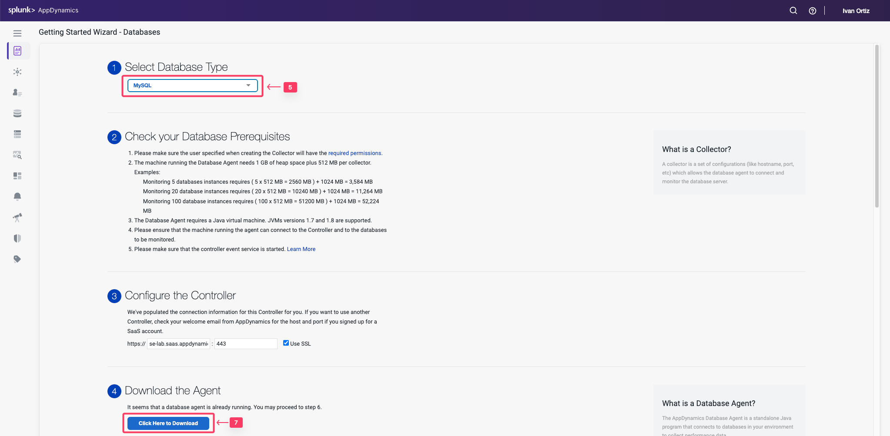

この演習では、Web ブラウザから AppDynamics Controller にアクセスし、Database Visibility エージェントをダウンロードします。

## Controller へのログイン

Cisco の認証情報を使用して [AppDynamics SE Lab Controller](https://se-lab.saas.appdynamics.com/controller/) にログインします。

## Database Agent のダウンロード

1. 画面左上の Home タブを選択します。
2. **Getting Started** タブを選択します。
3. **Getting Started Wizard** をクリックします。

1. **Databases** をクリックします。

## Database Agent のダウンロード

1. Select Database Type ドロップダウンメニューから **MySQL** を選択します。
2. Controller 接続のデフォルト設定を受け入れます。
3. **Click Here to Download** をクリックします。

Database Visibility Agent ファイルをローカルファイルシステムに保存します。

ブラウザから、以下の画像のようにエージェントファイルをローカルファイルシステムに保存するよう求められます（OS によって表示が異なる場合があります）。

