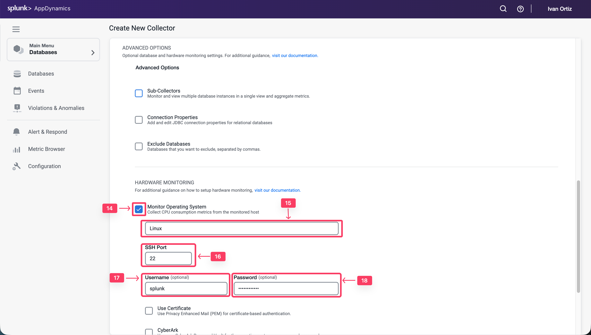
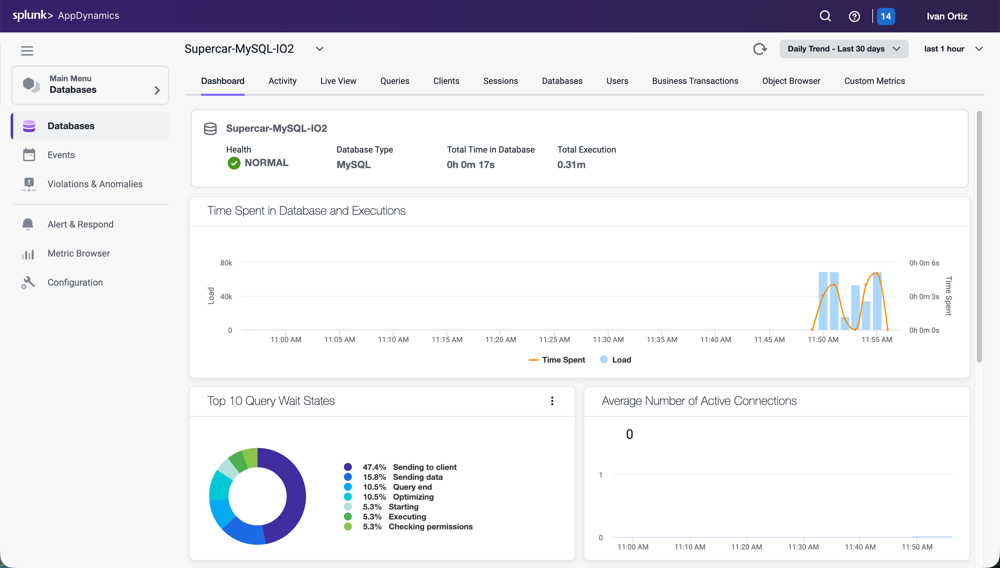

## Database Collector の構成

Database Agent Collector は、Database Agent 内で実行され、データベースインスタンスとデータベースサーバーのパフォーマンスメトリクスを収集するプロセスです。1つのコレクターは1つのデータベースインスタンスのメトリクスを収集します。1つの Database Agent で複数のコレクターを実行できます。Database Agent が Controller に接続されると、Controller で1つ以上のコレクターを構成できます。

この演習では、以下のタスクを実行します：

- Web ブラウザから AppDynamics Controller にアクセスする
- Controller で Database Collector を構成する
- Database Collector がデータを収集していることを確認する

## Controller へのログイン

Cisco の認証情報を使用して [AppDynamics SE Lab Controller](https://se-lab.saas.appdynamics.com/controller/) にログインします。

## Controller での Database Collector の構成

以下の手順に従って、クエリリテラルの設定を変更し、コレクター構成に移動します。

1. 左メニューの **Databases** タブをクリックします。
2. 左下の **Configuration** タブをクリックします。
3. **Remove literals from the queries** のチェックボックスのチェックを外します。
4. **Collectors** オプションをクリックします。

以下の手順に従って、新しい Database Collector を構成します。

1. **Add** ボタンをクリックします。
2. データベースタイプとして **MySQL** を選択します。
3. Database Agent として **DBMon-Lab-Agent** を選択し、以下のパラメータを入力します。
4. Collector Name: **Supercar-MySQL-YOURINITIALS**
5. Hostname or IP Address: **localhost**
6. Listener Port: **3306**

1. Username: **root**
2. Password: **Welcome1!**

1. **Advanced Options** の下にある **Monitor Operating System** チェックボックスを選択します。
2. オペレーティングシステムとして **Linux** を選択し、以下のパラメータを入力します。
3. SSH Port: **22**
4. Username: **splunk**
5. Password: **EC2 インスタンスに SSH 接続するためにインストラクターから提供されたパスワード**
6. **OK** をクリックしてコレクターを保存します。

## Database Collector がデータを収集していることの確認

コレクターが実行されてデータを送信するまで10分間待ってから、以下の手順に従って Database Collector がデータベースに接続し、データベースメトリクスを収集していることを確認します。

1. 左メニューの **Databases** タブをクリックします。
2. 前のセクションで作成した Collector を検索します：**Supercar-MySQL-YOURINITIALS**
3. ステータスが緑色で、エラーが表示されていないことを確認します。
4. Supercar-MySQL リンクをクリックしてデータベースの詳細を表示します。

_注意：コレクターを構成してから Top 10 SQL Wait States と Queries タブのクエリが表示されるまで、最大18分かかる場合があります。_

Database Collector の構成の詳細については、[こちら](https://docs.appdynamics.com/appd/24.x/latest/en/database-visibility/add-database-collectors)を参照してください。
