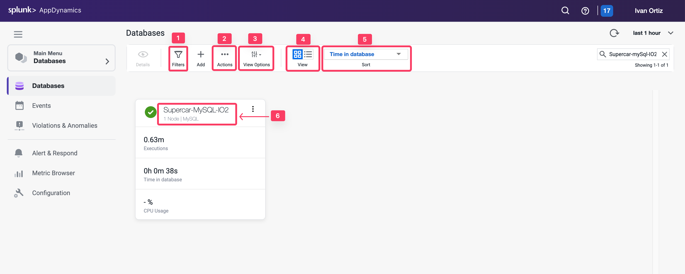
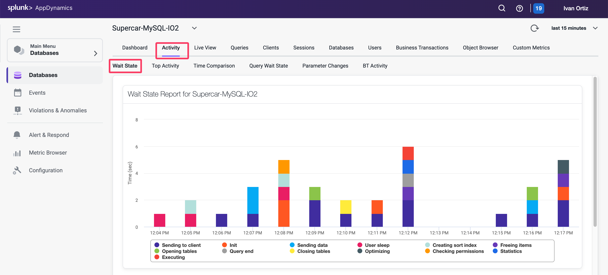
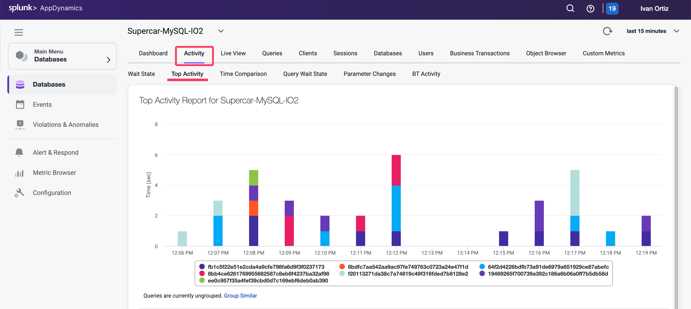
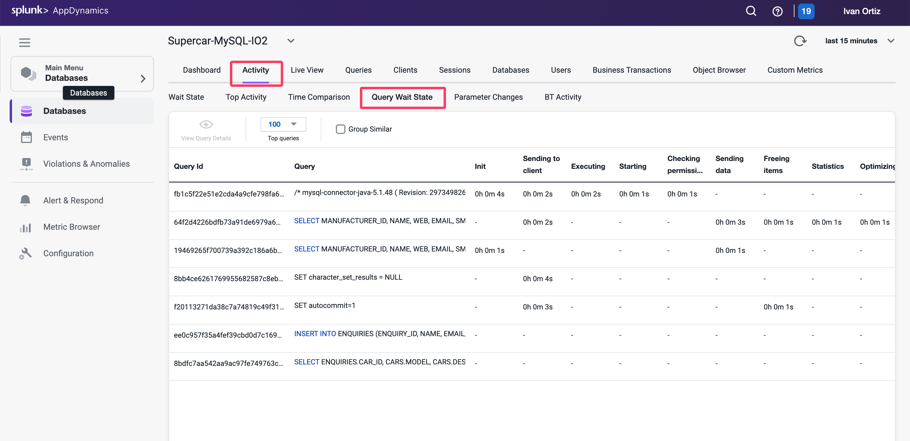

## 監視とトラブルシューティング - パート1

この演習では、以下のタスクを実行します：

- データベースとサーバーのパフォーマンス全体ダッシュボードの確認
- メインデータベースダッシュボードの確認
- データベースアクティビティウィンドウのレポートの確認

## データベースとサーバーのパフォーマンス全体ダッシュボードの確認

データベースとサーバーのパフォーマンス全体ダッシュボードでは、各データベースの健全性を一目で確認できます。

1. Filters：健全性、負荷、データベースの時間、またはタイプでフィルタリングするオプションを探索できます。
2. Actions：このウィンドウのデータを .csv 形式のファイルでエクスポートします。
3. View Options：スパークチャートのオン/オフを切り替えます。
4. View：カードビューとリストビューを切り替えます。
5. Sort：ソートオプションを表示します。
6. Supercar-MySQL：メインデータベースダッシュボードにドリルダウンします。

## メインデータベースダッシュボードの確認

メインデータベースダッシュボードには、以下を含むデータベースの主要なインサイトが表示されます：

- データベースを実行しているサーバーの健全性
- 指定された時間期間中の合計呼び出し回数
- 任意の時点での呼び出し回数
- 指定された時間期間中に SQL 文の実行に費やされた合計時間
- 上位10件のクエリ待機状態
- 平均接続数
- データベースタイプまたはベンダー
- ダッシュボードの機能を探索します

1. ヘルスステータスの円をクリックして、サーバーの健全性の詳細を確認します：

- Green（緑）：サーバーは正常
- Yellow（黄）：警告レベルの違反があるサーバー
- Red（赤）：重大レベルの違反があるサーバー

1. データベースタイプまたはベンダーは常にここに表示されます。
2. 指定された時間期間中に SQL 文の実行に費やされた合計時間を確認します。
3. 指定された時間期間中の合計実行回数を確認します。
4. チャート上の時系列にマウスを合わせて、記録されたメトリクスの詳細を確認します。

データポイントの上部にあるオレンジ色の円をクリックすると、選択した時間の前後15分のクエリ実行時間と待機状態を表示する時間比較レポートが表示されます。

1. チャートに表示されるスパイクを強調表示するには、マウスの左ボタンを押したまま左から右にドラッグします。
2. 構成ボタンをクリックして、上位10件から不要な待機状態を除外します。
3. 各待機状態のラベルにマウスを合わせて、より詳細な説明を確認します。
4. 選択した時間期間中にクエリを実行しているアクティブな接続の平均数を確認します。

選択した時間期間の DB サーバーの OS メトリクスを表示するには：

1. 右側のスクロールバーを使用してダッシュボードの下部にスクロールします
2. CPU
3. Memory
4. Disk IO
5. Network IO

## データベースアクティビティウィンドウのレポートの確認

Database Visibility のデータベースアクティビティウィンドウには、最大9種類のレポートがあります。利用可能なレポートは、監視対象のデータベースプラットフォームによって異なります。この演習では、最も一般的な3つのレポートを確認します。

- Wait State Report
- Top Activity Report
- Query Wait State Report

## Wait State Report

このレポートは、データベース内の Wait Events（待機状態）の時系列データを表示します。各待機状態は色分けされており、Y軸は秒単位の時間を表示します。このレポートは、テーブル形式でもデータを表示し、各 SQL 文の各待機状態に費やされた時間を強調表示します。

最も時間を消費している待機状態は、パフォーマンスのボトルネックを示している可能性があります。たとえば、db file sequential reads は、インデックスのセグメントヘッダー競合またはディスク競合が原因である可能性があります。

## Top Activity Report

このレポートは、データベース SQL 文の上位の時間を時系列ビューで表示します。このレポートは、テーブル形式でもデータを表示し、上位10件の SQL 文それぞれがデータベースで費やした時間を強調表示します。

このレポートを使用して、どの SQL 文が最もデータベース時間を使用しているかを確認します。これにより、特定の SQL 文がシステム全体のパフォーマンスに与える影響を判断でき、データベースパフォーマンスに最も影響を与えている文にチューニングの努力を集中させることができます。

## Query Wait State Report

このレポートは、上位（10、50、100、200）クエリの待機時間を表示します。このレポートは、テーブル形式でもデータを表示し、各クエリが異なる待機状態で費やしている時間を強調表示します。列を使用して、異なる待機状態でクエリをソートします。

データベースアクティビティウィンドウのレポートの詳細については、[こちら](https://help.splunk.com/en/appdynamics-on-premises/database-visibility/25.4.0/monitor-databases-and-database-servers/monitor-database-performance/database-activity-window/features-of-the-database-activity-windows)を参照してください。

