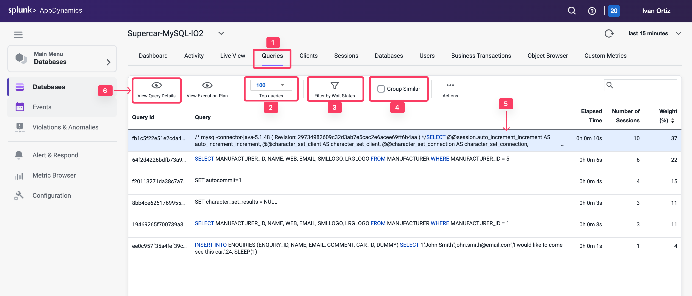
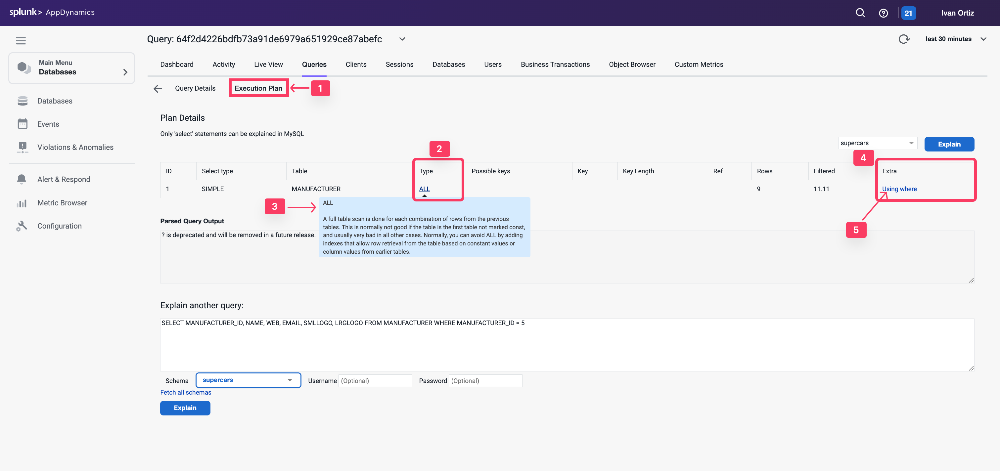
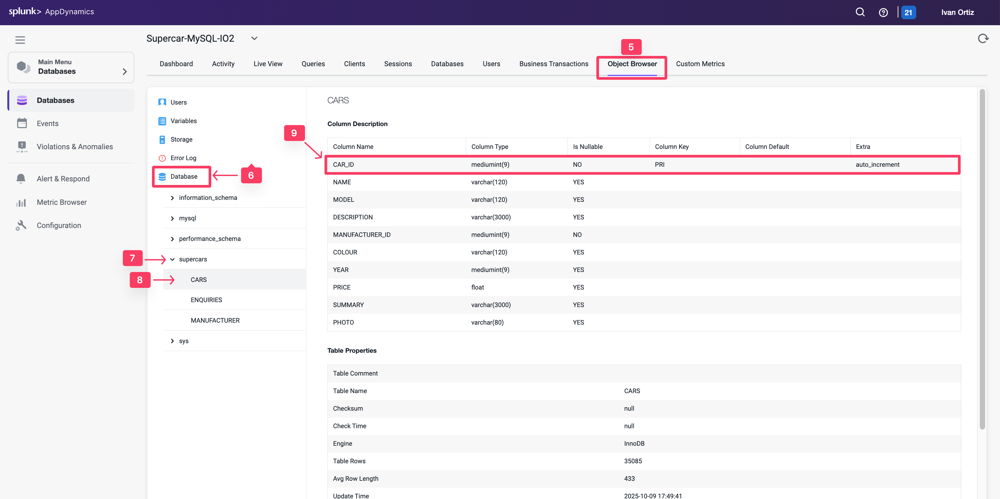
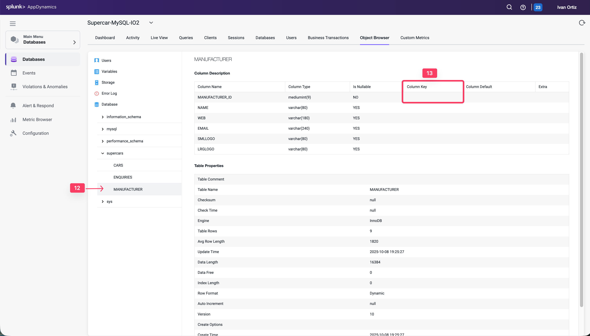

## クエリダッシュボードの確認

Queriesウィンドウには、データベースで最も時間を消費しているSQL文とストアドプロシージャが表示されます。クエリの重みをSQL待機時間などの他のメトリクスと比較して、チューニングが必要なSQLを特定できます。

1. **Queries** タブ：クエリウィンドウを表示します。
2. **Top Queries** ドロップダウン：上位5、10、100、または200件のクエリを表示します。
3. **Filter by Wait States**：クエリリストをフィルタリングする待機状態を選択できます。
4. **Group Similar**：同じ構文を持つクエリをグループ化します。
5. **Weight (%)** が最も大きいクエリをクリックします。
6. **View Query Details**：クエリの詳細にドリルダウンします。

## コストの高いクエリの詳細確認

Database Queriesウィンドウでデータベースで最も時間を費やしている文を特定したら、それらのSQL文をチューニングするのに役立つ詳細をさらに掘り下げることができます。データベースインスタンスのQuery Detailsウィンドウには、Database Queriesウィンドウで選択したクエリの詳細が表示されます。

1. **Resource consumption over time**：クエリがリソースを使用してデータベースで費やした時間、実行回数、および消費したCPU時間を表示します。
2. **Wait states**：選択したSQL文をデータベースが処理するのにかかる時間に寄与するアクティビティです。最も時間を消費している待機状態は、パフォーマンスのボトルネックを示している可能性があります。
3. **Components Executing Similar Queries**：このクエリに類似したクエリを実行しているノードを表示します。
4. **Business Transactions Executing Similar Queries**：このクエリに類似したクエリを実行しているJavaビジネストランザクションを表示します。

1. 右側の外側のスクロールバーを使用して下にスクロールします。
2. **Clients**：選択したSQL文を実行したマシンと、各マシンが文の実行に要した合計時間の割合を表示します。
3. **Sessions**：各データベースインスタンスの使用状況のセッションです。
4. **Query Active in Database**：このSQLによってアクセスされたスキーマを表示します。
5. **Users**：このクエリを実行したユーザーを表示します。
6. **Query Hashcode**：データベースサーバーがキャッシュ内でこのSQL文をより迅速に見つけるための一意のIDを表示します。
7. **Query**：選択したSQL文の完全な構文を表示します。Queryカードの右上隅にある鉛筆アイコンをクリックして、識別しやすいようにクエリ名を編集できます。
8. **Execution Plan**：クエリ実行プランウィンドウを表示します。

## コストの高いクエリのトラブルシューティング

Database Query Execution Planウィンドウは、クエリに最も効率的な実行プランを決定するのに役立ちます。問題のある可能性のあるクエリを発見したら、EXPLAIN PLAN文を実行して、データベースが作成した実行プランを確認できます。

クエリの実行プランは、クエリがインデックスの使用を最適化し、効率的に実行されているかどうかを示します。この情報は、実行が遅いクエリのトラブルシューティングに役立ちます。

1. **Execution Plan** タブをクリックします。
2. **Type** 列の結合タイプが各テーブルでALLであることに注目してください。
3. 結合タイプの1つにマウスを合わせて、結合タイプの説明を確認します。
4. **Extras** 列のエントリを調べます。
5. 各エントリにマウスを合わせて、エントリの説明を確認します。

次に、Object Browserを使用してテーブルのインデックスを調査しましょう。

1. **Object Browser** オプションをクリックして、テーブルのスキーマの詳細を表示します。
2. **Database** オプションをクリックします。
3. **supercars** スキーマをクリックして、テーブルのリストを展開します。
4. **CARS** テーブルをクリックして、テーブルの詳細を表示します。
5. CAR_ID列が主キーとして定義されていることがわかります。

1. 外側のスクロールバーを使用してページを下にスクロールします。
2. テーブルに定義された主キーインデックスに注目してください。

1. **MANUFACTURER** テーブルをクリックして、その詳細を表示します。
2. **MANUFACTURER_ID** 列が主キーとして定義されていないことに注目してください。
3. ページを下にスクロールして、テーブルにインデックスが定義されていないことを確認します。

MANUFACTURER_ID列には、テーブルに対するクエリのパフォーマンスを向上させるためにインデックスを作成する必要があります。異なるクエリを分析した場合、根本的な問題は異なる可能性がありますが、このラボで示される最も一般的な問題は、クエリがMANUFACTURERテーブルとの結合を実行しているか、そのテーブルを直接クエリしていることが原因です。
