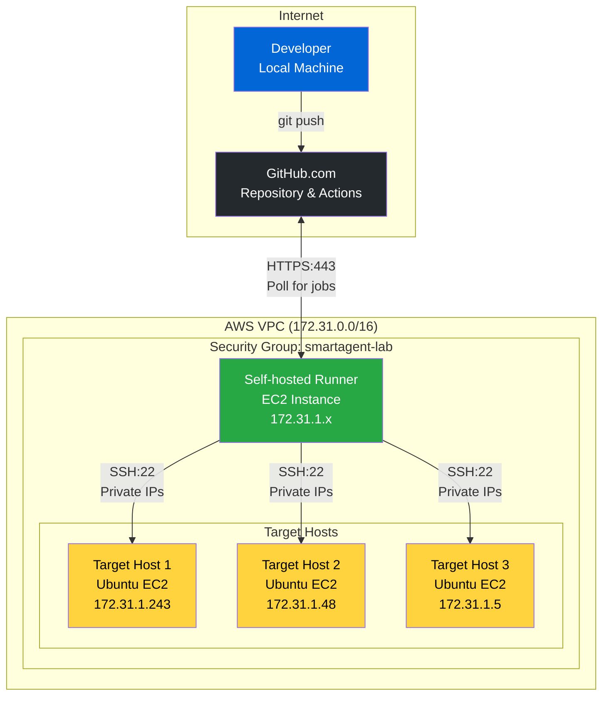
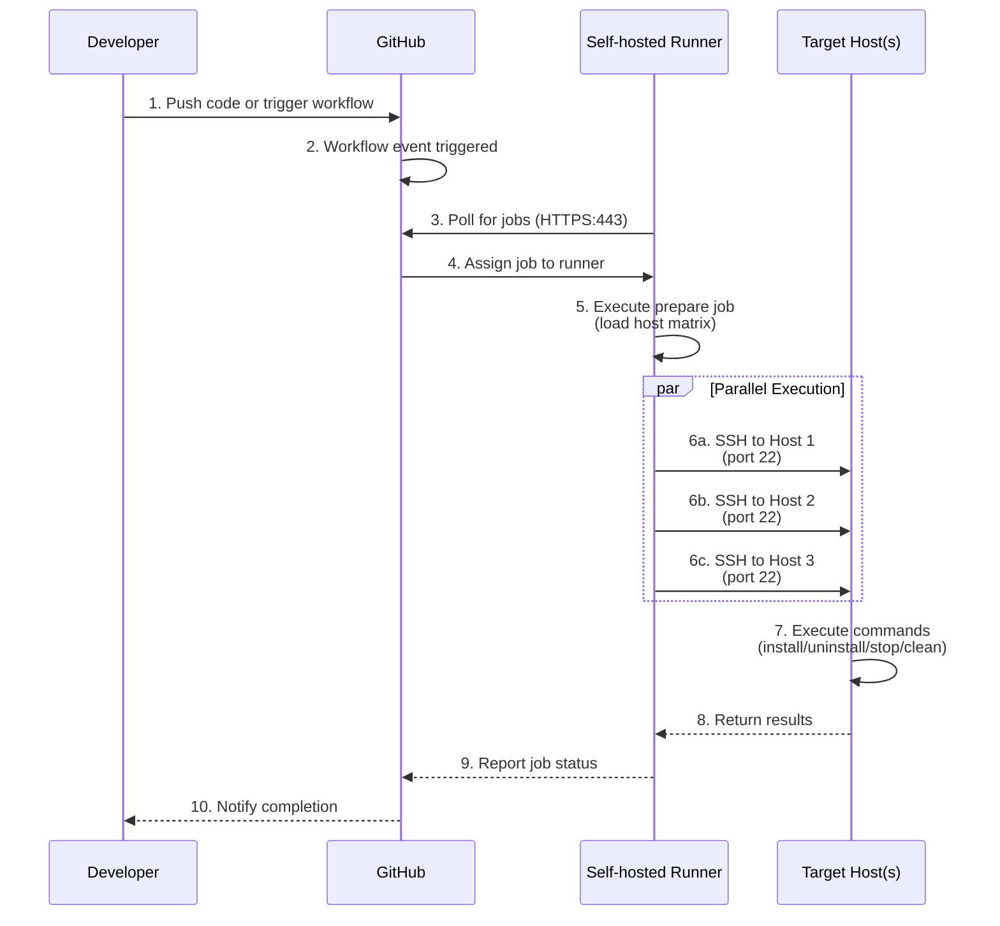

## System Architecture

The GitHub Actions-based Smart Agent deployment system uses a self-hosted runner within your AWS VPC to orchestrate deployments to multiple target hosts via SSH.

### High-Level Architecture



## Network Architecture

All infrastructure runs in a single AWS VPC with a shared security group. The self-hosted runner communicates with target hosts via private IPs.

### VPC Layout

```
┌─────────────────────────────────────────────────────────────────┐
│                        AWS VPC (172.31.0.0/16)                  │
│  ┌───────────────────────────────────────────────────────────┐  │
│  │          Security Group: smartagent-lab                   │  │
│  │  Rules:                                                   │  │
│  │  - Inbound: SSH (22) from same security group            │  │
│  │  - Outbound: HTTPS (443) to GitHub                       │  │
│  └───────────────────────────────────────────────────────────┘  │
│                                                                  │
│  ┌─────────────┐    ┌──────────────┐    ┌──────────────┐       │
│  │ Self-hosted │    │  Target EC2  │    │  Target EC2  │       │
│  │   Runner    │    │              │    │              │       │
│  │             │───▶│ Private IP:  │    │ Private IP:  │       │
│  │ 172.31.1.x  │SSH │ 172.31.1.243 │    │ 172.31.1.48  │       │
│  │             │───▶│              │    │              │       │
│  │ Polls GitHub│    │ Ubuntu 20.04 │    │ Ubuntu 20.04 │       │
│  └─────────────┘    └──────────────┘    └──────────────┘       │
│         │                    │                    │             │
│         │                    │                    │             │
│         └────────────────────┴────────────────────┘             │
│                              │                                  │
└──────────────────────────────┼──────────────────────────────────┘
                               │
                               ▼
                    ┌──────────────────┐
                    │   AppDynamics    │
                    │    Controller    │
                    │  (SaaS/On-Prem)  │
                    └──────────────────┘
```

## Workflow Execution Flow

### Complete Deployment Sequence



## Component Details

### GitHub Repository

**Stores:**

- 11 workflow YAML files
- Smart Agent installation package
- Configuration file (config.ini)

**Secrets:**

- SSH private key

**Variables:**

- Host list (DEPLOYMENT_HOSTS)
- User/group settings (optional)

### Self-hosted Runner

**Location:**

- AWS VPC (same as targets)
- Private network access

**Responsibilities:**

- Poll GitHub for workflow jobs
- Execute workflow steps
- SSH to target hosts
- File transfers (SCP)
- Parallel execution
- Error collection

**Requirements:**

- Ubuntu/Amazon Linux 2
- Outbound HTTPS (443) to GitHub
- Outbound SSH (22) to target hosts
- SSH key authentication

**Access:**

- Outbound HTTPS (443) to GitHub
- Outbound SSH (22) to target hosts
- Uses SSH key authentication

### Target Hosts

**Pre-requisites:**

- Ubuntu 20.04+
- SSH server running
- User with sudo access
- Authorized SSH key

**Post-deployment:**

```
/opt/appdynamics/
└── appdsmartagent/
    ├── smartagentctl
    ├── config.ini
    └── agents/
        ├── machine/
        ├── java/
        ├── node/
        └── db/
```

## Security Architecture

### Security Layers

1. **AWS VPC Isolation**
   - Private subnet for hosts
   - No direct internet access required
   - VPC flow logs enabled

2. **Security Groups**
   - SSH (22) within same security group only
   - HTTPS (443) outbound for GitHub access
   - Stateful firewall rules

3. **SSH Key Authentication**
   - No password authentication
   - Keys stored in GitHub Secrets
   - Temporary key files on runner
   - Keys removed after workflow

4. **GitHub Security**
   - Repository access controls
   - Branch protection rules
   - Secrets never exposed in logs
   - Environment variable masking

5. **Network Security**
   - Private IP communication only
   - No public IPs required
   - Runner in same VPC as targets

## Workflow Categories

The system includes 11 workflows organized into 4 categories:

```
GitHub Actions Workflows (11 Total)
├── Deployment (1 workflow)
│   └── Deploy Smart Agent (Batched)
├── Agent Installation (4 workflows)
│   ├── Install Node Agent (Batched)
│   ├── Install Machine Agent (Batched)
│   ├── Install DB Agent (Batched)
│   └── Install Java Agent (Batched)
├── Agent Uninstallation (4 workflows)
│   ├── Uninstall Node Agent (Batched)
│   ├── Uninstall Machine Agent (Batched)
│   ├── Uninstall DB Agent (Batched)
│   └── Uninstall Java Agent (Batched)
└── Smart Agent Management (2 workflows)
    ├── Stop and Clean Smart Agent (Batched)
    └── Cleanup All Agents (Batched)
```

## Batching Strategy

All workflows use automatic batching to support deployments at any scale.

### How Batching Works

```
HOST LIST (1000 hosts)              BATCH_SIZE = 256

Host 001: 172.31.1.1                ┌──────────────────┐
Host 002: 172.31.1.2      ────────▶ │   BATCH 1        │
    ...                              │   Hosts 1-256    │ ───┐
Host 256: 172.31.1.256               │   Sequential     │    │
                                     └──────────────────┘    │
Host 257: 172.31.1.257               ┌──────────────────┐    │
Host 258: 172.31.1.258   ────────▶  │   BATCH 2        │    │ SEQUENTIAL
    ...                              │   Hosts 257-512  │    │ EXECUTION
Host 512: 172.31.1.512               │   Sequential     │    │
                                     └──────────────────┘    │
Host 513: 172.31.1.513               ┌──────────────────┐    │
    ...                              │   BATCH 3        │    │
Host 768: 172.31.1.768   ────────▶  │   Hosts 513-768  │ ───┘
                                     └──────────────────┘
Host 769: 172.31.1.769               ┌──────────────────┐
    ...                              │   BATCH 4        │
Host 1000: 172.31.2.232  ────────▶  │   Hosts 769-1000 │
                                     │   (232 hosts)    │
                                     └──────────────────┘

WITHIN EACH BATCH:
┌────────────────────────────────────────┐
│  All hosts deploy in PARALLEL          │
│                                        │
│  Host 1 ──┐                           │
│  Host 2 ──┤                           │
│  Host 3 ──┼─▶ Background processes (&)│
│    ...    │                           │
│  Host 256─┘   └─▶ wait command        │
└────────────────────────────────────────┘
```

### Why Sequential Batches?

**Resource Management:**

- Prevents overwhelming the self-hosted runner
- Each batch opens 256 parallel SSH connections
- Sequential processing ensures stable performance

**Configurable:**

- Default batch size: 256 (GitHub Actions matrix limit)
- Adjustable via workflow input for smaller batches
- Balance between speed and resource usage

### Scaling Characteristics

**Deployment Speed (default BATCH_SIZE=256):**

- 10 hosts → 1 batch → ~2 minutes
- 100 hosts → 1 batch → ~3 minutes
- 500 hosts → 2 batches → ~6 minutes
- 1,000 hosts → 4 batches → ~12 minutes
- 5,000 hosts → 20 batches → ~60 minutes

**Factors affecting speed:**

- Network bandwidth (19MB package per host)
- SSH connection overhead (~1s per host)
- Target host CPU/disk speed
- Runner resources (CPU/memory)

## Next Steps

Now that you understand the architecture, let's move on to setting up GitHub and configuring the self-hosted runner.
