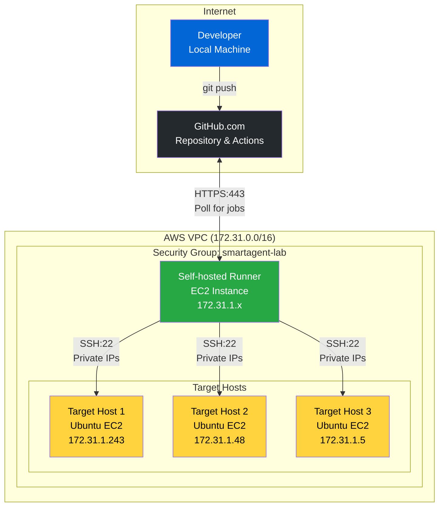
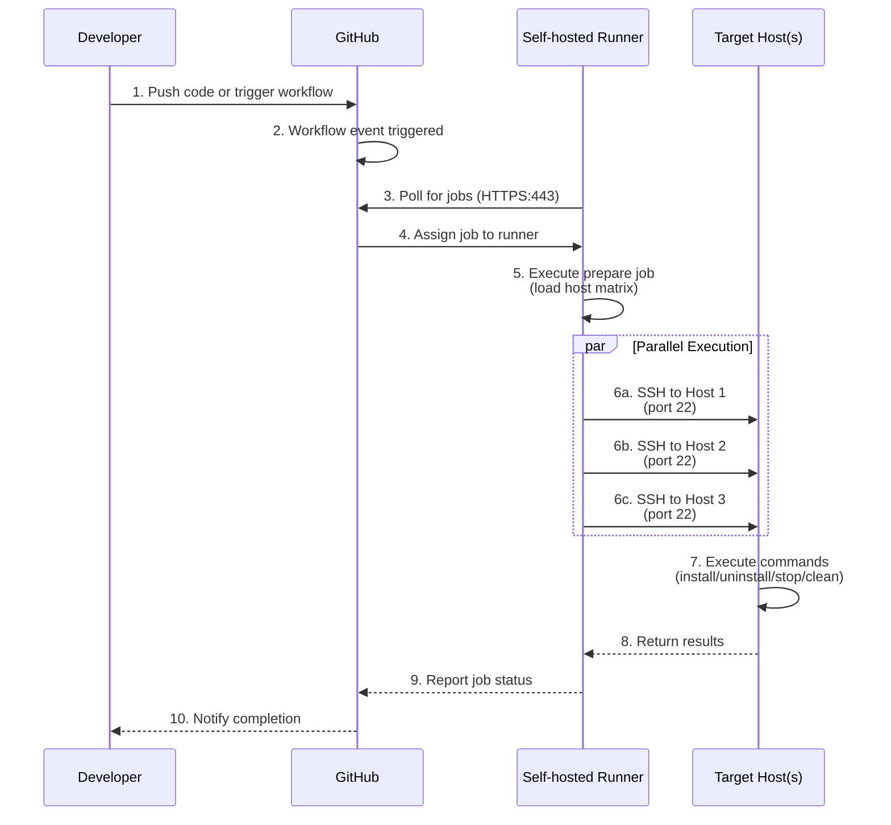

## システムアーキテクチャ

GitHub Actions ベースの Smart Agent デプロイシステムは、AWS VPC 内のセルフホストランナーを使用して、SSH 経由で複数のターゲットホストへのデプロイを調整します。

### ハイレベルアーキテクチャ



## ネットワークアーキテクチャ

すべてのインフラストラクチャは、共有セキュリティグループを持つ単一の AWS VPC 内で動作します。セルフホストランナーはプライベート IP 経由でターゲットホストと通信します。

### VPC レイアウト

```text
┌─────────────────────────────────────────────────────────────────┐
│                        AWS VPC (172.31.0.0/16)                  │
│  ┌───────────────────────────────────────────────────────────┐  │
│  │          Security Group: smartagent-lab                   │  │
│  │  Rules:                                                   │  │
│  │  - Inbound: SSH (22) from same security group            │  │
│  │  - Outbound: HTTPS (443) to GitHub                       │  │
│  └───────────────────────────────────────────────────────────┘  │
│                                                                  │
│  ┌─────────────┐    ┌──────────────┐    ┌──────────────┐       │
│  │ Self-hosted │    │  Target EC2  │    │  Target EC2  │       │
│  │   Runner    │    │              │    │              │       │
│  │             │───▶│ Private IP:  │    │ Private IP:  │       │
│  │ 172.31.1.x  │SSH │ 172.31.1.243 │    │ 172.31.1.48  │       │
│  │             │───▶│              │    │              │       │
│  │ Polls GitHub│    │ Ubuntu 20.04 │    │ Ubuntu 20.04 │       │
│  └─────────────┘    └──────────────┘    └──────────────┘       │
│         │                    │                    │             │
│         │                    │                    │             │
│         └────────────────────┴────────────────────┘             │
│                              │                                  │
└──────────────────────────────┼──────────────────────────────────┘
                               │
                               ▼
                    ┌──────────────────┐
                    │   AppDynamics    │
                    │    Controller    │
                    │  (SaaS/On-Prem)  │
                    └──────────────────┘
```

## ワークフロー実行フロー

### 完全なデプロイシーケンス



## コンポーネントの詳細

### GitHub リポジトリ

**格納内容:**

- 11のワークフロー YAML ファイル
- Smart Agent インストールパッケージ
- 設定ファイル（config.ini）

**Secrets:**

- SSH 秘密鍵

**Variables:**

- ホストリスト（DEPLOYMENT_HOSTS）
- ユーザー/グループ設定（オプション）

### セルフホストランナー

**配置場所:**

- AWS VPC（ターゲットと同じ）
- プライベートネットワークアクセス

**責務:**

- GitHub からワークフロージョブをポーリング
- ワークフローステップの実行
- ターゲットホストへの SSH 接続
- ファイル転送（SCP）
- 並列実行
- エラー収集

**要件:**

- Ubuntu/Amazon Linux 2
- GitHub への送信 HTTPS（443）
- ターゲットホストへの送信 SSH（22）
- SSH キー認証

**アクセス:**

- GitHub への送信 HTTPS（443）
- ターゲットホストへの送信 SSH（22）
- SSH キー認証を使用

### ターゲットホスト

**前提条件:**

- Ubuntu 20.04+
- SSH サーバーが稼働中
- sudo アクセス権を持つユーザー
- 認証済み SSH キー

**デプロイ後:**

```text
/opt/appdynamics/
└── appdsmartagent/
    ├── smartagentctl
    ├── config.ini
    └── agents/
        ├── machine/
        ├── java/
        ├── node/
        └── db/
```

## セキュリティアーキテクチャ

### セキュリティレイヤー

1. **AWS VPC の分離**
   - ホスト用のプライベートサブネット
   - 直接のインターネットアクセスは不要
   - VPC フローログを有効化

2. **セキュリティグループ**
   - 同じセキュリティグループ内のみ SSH（22）
   - GitHub アクセス用の送信 HTTPS（443）
   - ステートフルファイアウォールルール

3. **SSH キー認証**
   - パスワード認証なし
   - キーは GitHub Secrets に保存
   - ランナー上の一時キーファイル
   - ワークフロー完了後にキーを削除

4. **GitHub セキュリティ**
   - リポジトリアクセス制御
   - ブランチ保護ルール
   - Secrets はログに公開されない
   - 環境変数のマスキング

5. **ネットワークセキュリティ**
   - プライベート IP 通信のみ
   - パブリック IP は不要
   - ランナーはターゲットと同じ VPC 内

## ワークフローカテゴリ

システムには4つのカテゴリに分類された11のワークフローが含まれています:

```text
GitHub Actions Workflows (11 Total)
├── Deployment (1 workflow)
│   └── Deploy Smart Agent (Batched)
├── Agent Installation (4 workflows)
│   ├── Install Node Agent (Batched)
│   ├── Install Machine Agent (Batched)
│   ├── Install DB Agent (Batched)
│   └── Install Java Agent (Batched)
├── Agent Uninstallation (4 workflows)
│   ├── Uninstall Node Agent (Batched)
│   ├── Uninstall Machine Agent (Batched)
│   ├── Uninstall DB Agent (Batched)
│   └── Uninstall Java Agent (Batched)
└── Smart Agent Management (2 workflows)
    ├── Stop and Clean Smart Agent (Batched)
    └── Cleanup All Agents (Batched)
```

## バッチ処理戦略

すべてのワークフローは、あらゆるスケールのデプロイをサポートするために自動バッチ処理を使用します。

### バッチ処理の仕組み

```text
HOST LIST (1000 hosts)              BATCH_SIZE = 256

Host 001: 172.31.1.1                ┌──────────────────┐
Host 002: 172.31.1.2      ────────▶ │   BATCH 1        │
    ...                              │   Hosts 1-256    │ ───┐
Host 256: 172.31.1.256               │   Sequential     │    │
                                     └──────────────────┘    │
Host 257: 172.31.1.257               ┌──────────────────┐    │
Host 258: 172.31.1.258   ────────▶  │   BATCH 2        │    │ SEQUENTIAL
    ...                              │   Hosts 257-512  │    │ EXECUTION
Host 512: 172.31.1.512               │   Sequential     │    │
                                     └──────────────────┘    │
Host 513: 172.31.1.513               ┌──────────────────┐    │
    ...                              │   BATCH 3        │    │
Host 768: 172.31.1.768   ────────▶  │   Hosts 513-768  │ ───┘
                                     └──────────────────┘
Host 769: 172.31.1.769               ┌──────────────────┐
    ...                              │   BATCH 4        │
Host 1000: 172.31.2.232  ────────▶  │   Hosts 769-1000 │
                                     │   (232 hosts)    │
                                     └──────────────────┘

WITHIN EACH BATCH:
┌────────────────────────────────────────┐
│  All hosts deploy in PARALLEL          │
│                                        │
│  Host 1 ──┐                           │
│  Host 2 ──┤                           │
│  Host 3 ──┼─▶ Background processes (&)│
│    ...    │                           │
│  Host 256─┘   └─▶ wait command        │
└────────────────────────────────────────┘
```

### シーケンシャルバッチの理由

**リソース管理:**

- セルフホストランナーの過負荷を防止
- 各バッチは256の並列 SSH 接続を開く
- シーケンシャル処理により安定したパフォーマンスを確保

**設定変更可能:**

- デフォルトバッチサイズ: 256（GitHub Actions のマトリックス制限）
- ワークフロー入力でより小さなバッチに調整可能
- 速度とリソース使用量のバランスを調整

### スケーリング特性

**デプロイ速度（デフォルト BATCH_SIZE=256）:**

- 10台のホスト → 1バッチ → 約2分
- 100台のホスト → 1バッチ → 約3分
- 500台のホスト → 2バッチ → 約6分
- 1,000台のホスト → 4バッチ → 約12分
- 5,000台のホスト → 20バッチ → 約60分

**速度に影響する要因:**

- ネットワーク帯域幅（ホストあたり19MBのパッケージ）
- SSH 接続のオーバーヘッド（ホストあたり約1秒）
- ターゲットホストの CPU/ディスク速度
- ランナーのリソース（CPU/メモリ）

## 次のステップ

アーキテクチャを理解したところで、GitHub のセットアップとセルフホストランナーの設定に進みましょう。
