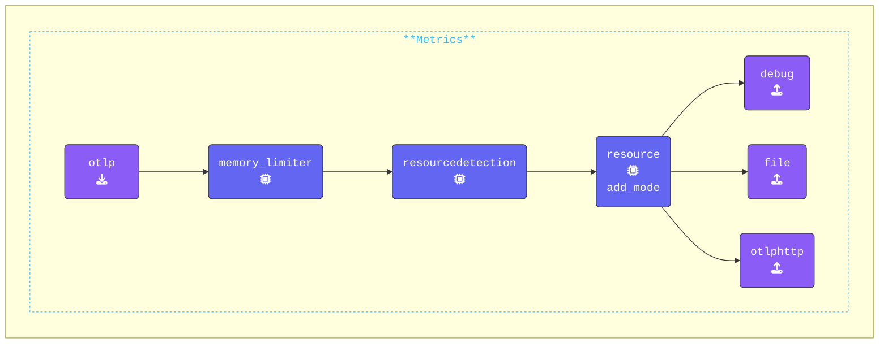

この演習では、`agent.yaml` ファイルの `extensions:` セクションを更新します。このセクションは OpenTelemetry 設定 YAML の一部であり、OpenTelemetry Collector の動作を拡張または変更するオプションのコンポーネントを定義します。

これらのコンポーネントはテレメトリーデータを直接処理しませんが、Collector の機能を向上させる貴重な機能とサービスを提供します。

{}

> [!IMPORTANT]
> **_すべての_ ターミナルウィンドウを `2-building-resilience` ディレクトリに移動し、`clear` コマンドを実行してください。**

ディレクトリ構造は以下のようになります：

```text { title="Updated Directory Structure" }
.
├── agent.yaml
└── gateway.yaml
```

**`agent.yaml` の更新**: **Agent ターミナル** ウィンドウで、既存の `health_check` Extension の下に `file_storage` Extension を追加します：

```yaml
  file_storage/checkpoint:             # Extension Type/Name
    directory: "./checkpoint-dir"      # Define directory
    create_directory: true             # Create directory
    timeout: 1s                        # Timeout for file operations
    compaction:                        # Compaction settings
      on_start: true                   # Start compaction at Collector startup
      # Define compaction directory
      directory: "./checkpoint-dir/tmp"
      max_transaction_size: 65536      # Max. size limit before compaction occurs
```

**Exporter への `file_storage` の追加**: `otlphttp` Exporter を変更して、リトライとキューイングメカニズムを設定し、障害が発生した場合にデータが保持され再送信されるようにします。`endpoint: "http://localhost:5318"` の下に以下を追加し、インデントが `endpoint` と一致していることを確認してください：

```yaml
    retry_on_failure:
      enabled: true                    # Enable retry on failure
    sending_queue:                     #
      enabled: true                    # Enable sending queue
      num_consumers: 10                # No. of consumers
      queue_size: 10000                # Max. queue size
      storage: file_storage/checkpoint # File storage extension
```

**`services` セクションの更新**: 既存の `extensions:` セクションに `file_storage/checkpoint` Extension を追加します。設定は以下のようになります：

```yaml
service:
  extensions:
  - health_check
  - file_storage/checkpoint            # Enabled extensions for this collector
```

**`metrics` パイプラインの更新**: この演習では、デバッグとログのノイズを減らすために、Metric パイプラインから `hostmetrics` Receiver をコメントアウトします。設定は以下のようになります：

```yaml
    metrics:
      receivers:
      # - hostmetrics                    # Hostmetric reciever (cpu only)
      - otlp
```

{}

**[otelbin.io](https://www.otelbin.io/)** を使用して **Agent** 設定を検証してください。参考までに、パイプラインの `metrics:` セクションは以下のようになります：


