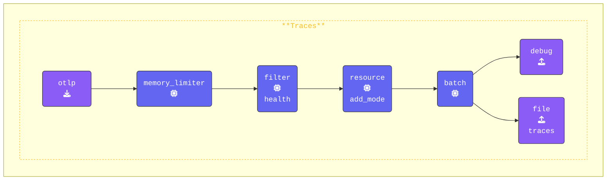

{}

**Gateway terminal** ウィンドウに切り替えて、`gateway.yaml` ファイルを開きます。以下の設定で `processors` セクションを更新します：

1. **`filter` プロセッサを追加する**：
   `/_healthz` という名前のSpanを除外するようにGatewayを設定します。`error_mode: ignore` ディレクティブは、フィルタリング中に発生したエラーを無視し、パイプラインがスムーズに動作し続けることを保証します。`traces` セクションはフィルタリングルールを定義し、`/_healthz` という名前のSpanを除外対象として指定します。

   ```yaml
     filter/health:                       # Defines a filter processor
       error_mode: ignore                 # Ignore errors
       traces:                            # Filtering rules for traces
         span:                            # Exclude spans named "/_healthz"
          - 'name == "/_healthz"'
   ```

2. **`traces` パイプラインに `filter` プロセッサを追加する**：
   `traces` パイプラインに `filter/health` プロセッサを追加します。最適なパフォーマンスを得るために、フィルターはできるだけ早い段階に配置します。`memory_limiter` の直後、`batch` プロセッサの前に配置してください。設定は次のようになります：

   ```yaml
     traces:
       receivers:
         - otlp
       processors:
         - memory_limiter
         - filter/health             # Filters data based on rules
         - resource/add_mode
         - batch
       exporters:
         - debug
         - file/traces
   ```

この設定により、ヘルスチェック関連のSpan（`/_healthz`）がパイプラインの早い段階でフィルタリングされ、テレメトリーデータの不要なノイズが削減されます。

{}

**[otelbin.io](https://www.otelbin.io/)** を使用してAgent設定を検証します。参考として、パイプラインの `traces:` セクションは次のようになります：


