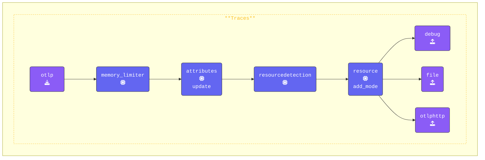

このステップでは、`agent.yaml` を修正して `attributes` と `redaction` プロセッサを追加します。これらのプロセッサは、Span属性内の機密データがログに記録またはエクスポートされる前に適切に処理されるようにします。

以前、コンソールに表示されたSpan属性の一部に個人情報や機密データが含まれていることに気づいたかもしれません。これから、この情報を効果的にフィルタリングおよび秘匿化するために必要なプロセッサを設定します。

```text
Attributes:
     -> user.name: Str(George Lucas)
     -> user.phone_number: Str(+1555-867-5309)
     -> user.email: Str(george@deathstar.email)
     -> user.account_password: Str(LOTR>StarWars1-2-3)
     -> user.visa: Str(4111 1111 1111 1111)
     -> user.amex: Str(3782 822463 10005)
     -> user.mastercard: Str(5555 5555 5555 4444)
  {"kind": "exporter", "data_type": "traces", "name": "debug"}
```

{}

**Agent terminal** ウィンドウに切り替えて、エディタで `agent.yaml` ファイルを開きます。テレメトリーデータのセキュリティとプライバシーを強化するために、2つのプロセッサを追加します。

**1. `attributes` プロセッサを追加する**：[**Attributes Processor**](https://github.com/open-telemetry/opentelemetry-collector-contrib/tree/main/processor/attributesprocessor) を使用すると、Span属性（タグ）の値を更新、削除、またはハッシュ化して変更できます。これは、機密情報をエクスポートする前に難読化する場合に特に便利です。

このステップでは：

1. `user.phone_number` 属性を静的な値（`"UNKNOWN NUMBER"`）に**更新**します。
2. `user.email` 属性を**ハッシュ化**して、元のメールアドレスが公開されないようにします。
3. `user.password` 属性を**削除**して、Spanから完全に取り除きます。

```yaml
  attributes/update:
    actions:                           # Actions
      - key: user.phone_number         # Target key
        action: update                 # Update action
        value: "UNKNOWN NUMBER"        # New value
      - key: user.email                # Target key
        action: hash                   # Hash the email value
      - key: user.password             # Target key
        action: delete                 # Delete the password
  ```

**2. `redaction` プロセッサを追加する**：[**Redaction Processor**](https://github.com/open-telemetry/opentelemetry-collector-contrib/tree/main/processor/redactionprocessor) は、クレジットカード番号やその他の個人識別情報（PII）などの定義済みパターンに基づいて、Span属性内の機密データを検出して秘匿化します。

このステップでは：

- すべての属性が処理されるように `allow_all_keys: true` を設定します（`false` に設定すると、明示的に許可されたキーのみが保持されます）。

- **Visa** と **MasterCard** のクレジットカード番号を検出して秘匿化するための正規表現を `blocked_values` で定義します。

- `summary: debug` オプションは、デバッグ目的で秘匿化プロセスに関する詳細情報をログに記録します。

```yaml
  redaction/redact:
    allow_all_keys: true               # If false, only allowed keys will be retained
    blocked_values:                    # List of regex patterns to block
      - '\b4[0-9]{3}[\s-]?[0-9]{4}[\s-]?[0-9]{4}[\s-]?[0-9]{4}\b'       # Visa
      - '\b5[1-5][0-9]{2}[\s-]?[0-9]{4}[\s-]?[0-9]{4}[\s-]?[0-9]{4}\b'  # MasterCard
    summary: debug                     # Show debug details about redaction
```

**`traces` パイプラインを更新する**：両方のプロセッサを `traces` パイプラインに統合します。最初は redaction プロセッサをコメントアウトしておいてください（後の演習で有効にします）。設定は次のようになります：

```yaml
    traces:
      receivers:
      - otlp
      processors:
      - memory_limiter
      - attributes/update              # Update, hash, and remove attributes
      #- redaction/redact               # Redact sensitive fields using regex
      - resourcedetection
      - resource/add_mode
      - batch
      exporters:
      - debug
      - file
      - otlphttp
```

{}

**[otelbin.io](https://www.otelbin.io/)** を使用してAgent設定を検証します。参考として、パイプラインの `traces:` セクションは次のようになります：


