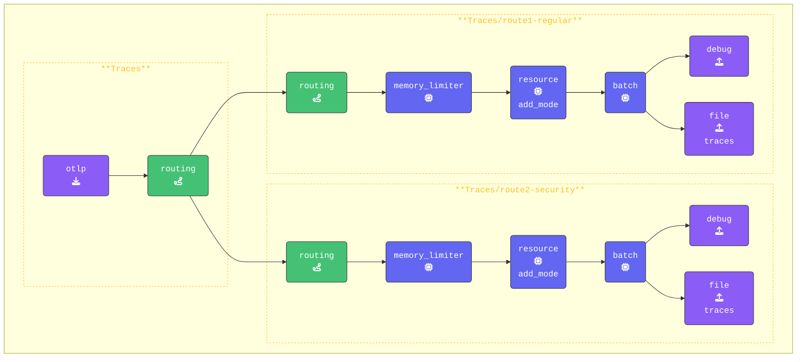

{}

**元の `traces` パイプラインをルーティングを使用するように更新する**:

1. `routing` を有効にするには、元の `traces` パイプラインを更新して、`routing` のみをエクスポーターとして使用します。これにより、すべてのスパンデータが **Routing Connector** を経由して評価され、接続されたパイプラインに転送されます。また、**すべての** プロセッサーを削除し、空の配列（`[]`）に置き換えます。これは、`traces/route1-regular` と `traces/route2-security` パイプラインで処理されるようになり、各ルートに対してカスタム動作が可能になるためです。`traces:` の設定は次のようになります：

    ```yaml
    traces:                       # Traces pipeline
      receivers:
      - otlp                      # OTLP receiver
      processors: []              # Processors for traces
      exporters:
      - routing
    ```

**既存の `traces` パイプラインの下に `route1-regular` と `route2-security` の両方のトレースパイプラインを追加する**:

1. **Route1-regular パイプラインを設定する**: このパイプラインは、コネクターのルーティングテーブルに**一致しない**すべてのスパンを処理します。
   これは唯一のレシーバーとして `routing` を使用し、元の traces パイプラインからの `connection` を通じてデータを受信することに注意してください。

    ```yaml
        traces/route1-regular:         # Default pipeline for unmatched spans
          receivers:
          - routing                    # Receive data from the routing connector
          processors:
          - memory_limiter             # Memory Limiter Processor
          - resource/add_mode          # Adds collector mode metadata
          - batch
          exporters:
          - debug                      # Debug Exporter
          - file/traces/route1-regular # File Exporter for unmatched spans
    ```

2. **route2-security パイプラインを追加する**: このパイプラインは、ルーティングルールの `"[deployment.environment"] == "security-applications"` ルールに一致するすべてのスパンを処理します。このパイプラインもレシーバーとして `routing` を使用しています。このパイプラインを `traces/route1-regular` の下に追加します。

    ```yaml
        traces/route2-security:         # Default pipeline for unmatched spans
          receivers:
          - routing                     # Receive data from the routing connector
          processors:
          - memory_limiter              # Memory Limiter Processor
          - resource/add_mode           # Adds collector mode metadata
          - batch
          exporters:
          - debug                       # Debug exporter
          - file/traces/route2-security # File exporter for unmatched spans
    ```

{}

**[otelbin.io](https://www.otelbin.io/)** を使用して Agent の設定を検証します。参考として、パイプラインの `traces:` セクションは次のようになります：


