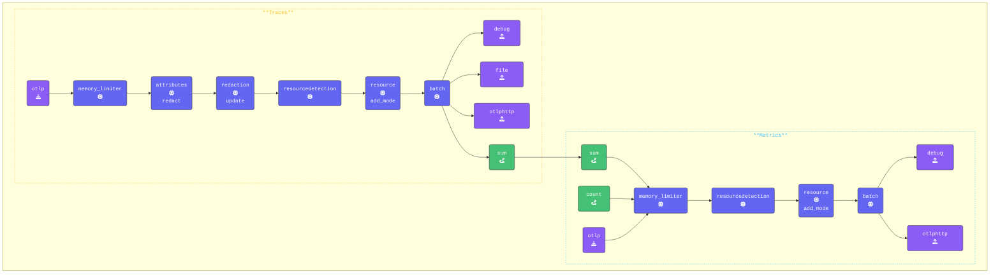

このセクションでは、[**Sum Connector**](https://github.com/open-telemetry/opentelemetry-collector-contrib/tree/main/connector/sumconnector) がスパンから値を抽出してメトリクスに変換する方法を説明します。

具体的には、ベーススパンからクレジットカードの請求額を取得し、Sum Connector を活用して合計請求額をメトリクスとして取得します。

この connector は、スパン、スパンイベント、メトリクス、データポイント、およびログレコードから属性値を収集（**sum**）するために使用できます。各個別の値をキャプチャし、メトリクスに変換して転送します。ただし、これらのメトリクスと属性を使用して計算やさらなる処理を行うのは**バックエンド**の役割です。

{}

**Agent terminal** ウィンドウに切り替えて、エディターで `agent.yaml` ファイルを開きます。

- **Sum Connector を追加する**
設定の connectors セクションに Sum Connector を追加し、メトリクスカウンターを定義します

```yaml
  sum:
    spans:
       user.card-charge:
        source_attribute: payment.amount
        conditions:
          - attributes["payment.amount"] != "NULL"
        attributes:
          - key: user.name

```

{}

上記の例では、スパン内の `payment.amount` 属性をチェックしています。有効な値がある場合、**Sum** connector は `user.card-charge` というメトリクスを生成し、`user.name` を属性として含めます。これにより、バックエンドは請求サイクルなどの長期間にわたってユーザーの合計請求額を追跡して表示できます。

以下のパイプライン設定では、connector exporter が traces セクションに追加され、connector receiver が metrics セクションに追加されています。

{}

- **パイプラインで Count Connector を設定する**

```yaml
  pipelines:
    traces:
      receivers:
      - otlp
      processors:
      - memory_limiter
      - attributes/update              # Update, hash, and remove attributes
      - redaction/redact               # Redact sensitive fields using regex
      - resourcedetection
      - resource/add_mode
      - batch
      exporters:
      - debug
      - file
      - otlphttp
      - sum                            # Sum connector which aggregates payment.amount from spans and sends to metrics pipeline
    metrics:
      receivers:
      - sum                            # Receives metrics from the sum exporter in the traces pipeline
      - count                          # Receives count metric from logs count exporter in logs pipeline.
      - otlp
      #- hostmetrics                   # Host Metrics Receiver
      processors:
      - memory_limiter
      - resourcedetection
      - resource/add_mode
      - batch
      exporters:
      - debug
      - otlphttp
    logs:
      receivers:
      - otlp
      - filelog/quotes
      processors:
      - memory_limiter
      - resourcedetection
      - resource/add_mode
      - transform/logs                 # Transform logs processor
      - batch
      exporters:
      - count                          # Count Connector that exports count as a metric to metrics pipeline.
      - debug
      - otlphttp
```

- **[otelbin.io](https://www.otelbin.io/)** を使用して agent 設定を**検証**してください。参考として、パイプラインの `traces` と `metrics:` セクションは以下のようになります



{}
