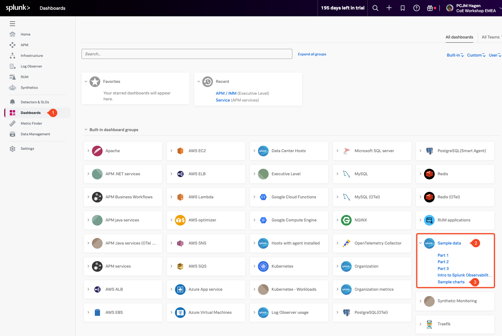

## 1. ダッシュボード

ダッシュボードは、主要なメトリクスを1か所に表示するチャートと可視化のコレクションです。適切に設計されたダッシュボードは、システムの健全性とパフォーマンスに関する迅速で実用的な洞察を提供します。シンプルなものから詳細なものまで、いくつかのフォーカスされたチャートから複数のサービスにまたがる複雑なビューまで、必要に応じて作成できます。

このモジュールでは、いくつかのチャートを作成し、それらを以下のカスタムダッシュボードにまとめます。

---

## 2. ダッシュボードへのアクセス

まず、Splunk Observability Suite でダッシュボードを見つけましょう。

左側のナビゲーションメニューで **Dashboards (1)** ボタンをクリックします。メニューが折りたたまれている場合は、画面左上のハンバーガーアイコンをクリックして展開できます。

これにより、メインのダッシュボードビューに移動し、Splunk Observability によって提供される事前構築されたダッシュボードを含むすべての利用可能なダッシュボードが表示されます。

組織が Cloud API 統合または Splunk OpenTelemetry Agent を通じてすでにデータを取り込んでいる場合は、それらのサービスに関連する追加のダッシュボードも表示されることがあります。

