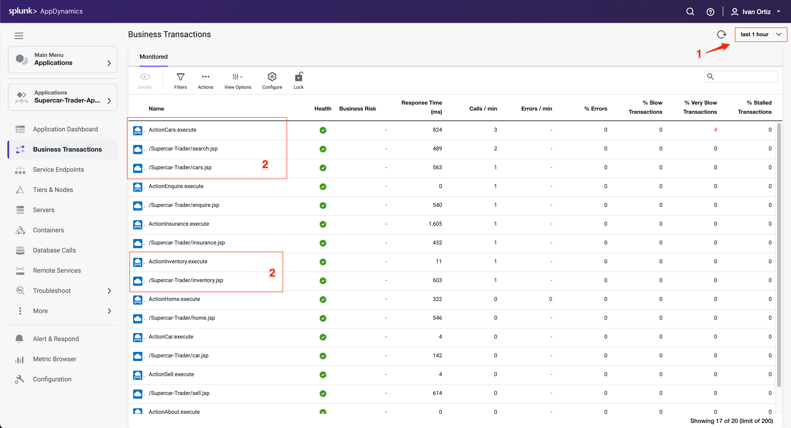
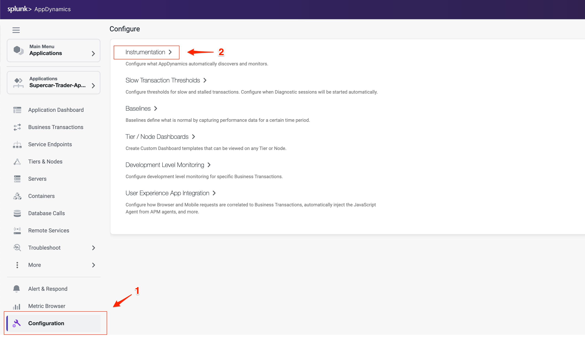
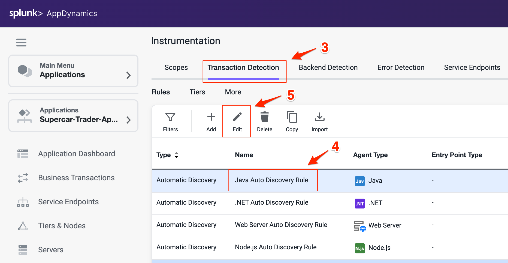
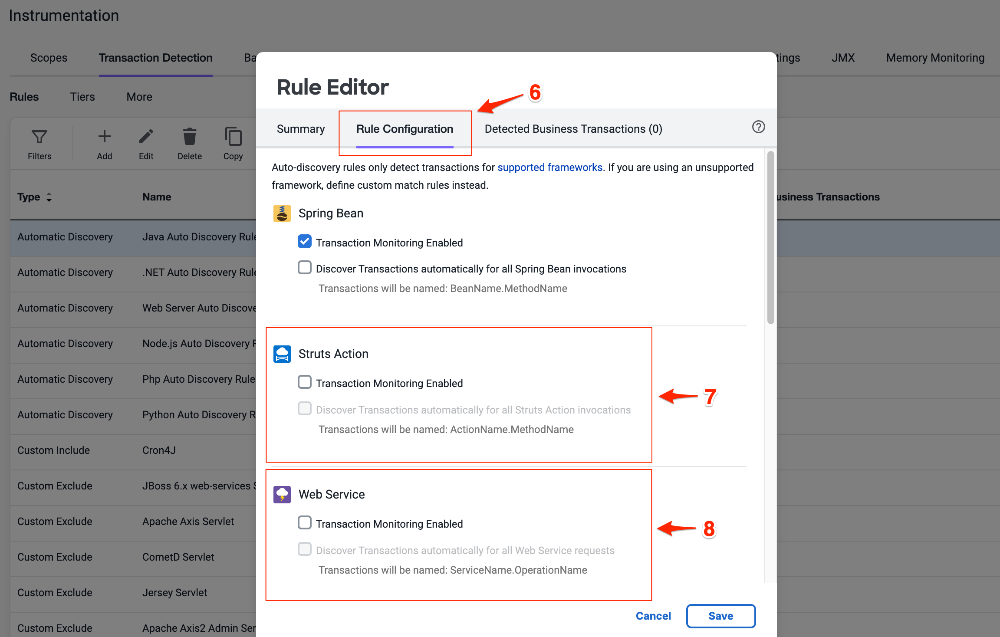
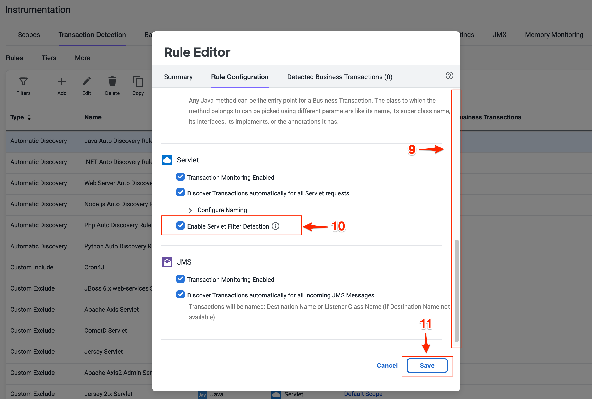
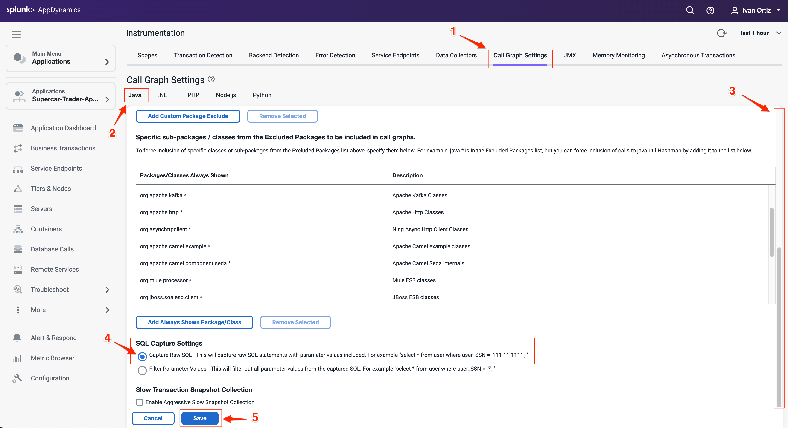
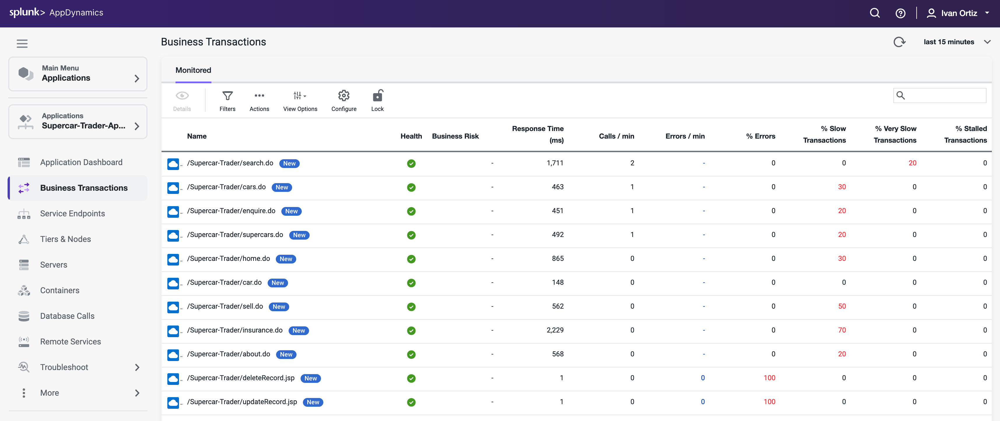

この演習では、以下のタスクを実施します。

- Business Transaction の設定を調整します。
- Call Graph の設定を調整します。
- Business Transaction の変化を観察します。

## Business Transaction 設定の調整

前の演習で、Business Transaction が自動検出されていることを確認しました。Business Transaction の自動検出ルールを最適な状態にするために、ルールを調整したい場合があります。今回のサンプルアプリケーションは古い Apache Struts フレームワークで構築されており、まさにそうしたケースに該当します。

次の画像でハイライトされている Business Transaction を見ると、それぞれのペアが Struts Action (.execute) と Servlet タイプ (.jsp) で構成されていることがわかります。これら 2 種類のトランザクションが 1 つに統合されるように、トランザクション検出ルールの設定を調整していきます。

AppDynamics UI で時間枠セレクターが表示されているときは、表示されているビューは選択した時間枠のコンテキストを表します。あらかじめ定義された時間枠から選ぶことも、確認したい日付や時間範囲を指定したカスタム時間枠を作成することもできます。

1. **last 1 hour** の時間枠を選択します。
2. マウスを青いアイコンの上にホバーして、トランザクションの Entry Point Type を確認します。

以下の手順でトランザクション検出を最適化します。

1. 左下メニューの **Configuration** オプションをクリックします。
2. **Instrumentation** リンクをクリックします。

    

3. Instrumentation メニューから **Transaction Detection** を選択します。
4. **Java Auto Discovery Rule** を選択します。
5. **Edit** をクリックします。

    

6. Rule Editor で **Rule Configuration** タブを選択します。
7. **Struts Action** セクションのチェックボックスをすべてオフにします。
8. **Web Service** セクションのチェックボックスをすべてオフにします。
9. 下にスクロールして Servlet 設定を見つけます。
10. **Enable Servlet Filter Detection** のチェックボックスをオンにします（Servlet 設定では 3 つのチェックボックスがすべてオンになっている状態にします）。
11. **Save** をクリックして変更を保存します。

Transaction Detection Rules の詳細は[こちら](https://help.splunk.com/en/appdynamics-saas/application-performance-monitoring/25.7.0/configure-instrumentation/transaction-detection-rules)で確認できます。

## Call Graph 設定の調整

以下の Call Graph Settings ウィンドウを使用すると、トランザクションスナップショット内の Call Graph で取得されるデータを制御できます。このステップでは、各 SQL クエリのパラメータを完全なクエリと共に取得するように SQL Capture 設定を変更します。SQL Capture の設定は以下の手順で変更できます。

1. Instrumentation ウィンドウから **Call Graph Settings** タブを選択します。これは前の演習で開いた **Instrumentation** 設定の中にあります。
2. 設定内で **Java** タブが選択されていることを確認します。
3. **SQL Capture Settings** が表示されるまで下にスクロールします。
4. **Capture Raw SQL** オプションをクリックします。
5. **Save** をクリックします。

Call Graph 設定の詳細は[こちら](https://help.splunk.com/en/appdynamics-saas/application-performance-monitoring/25.7.0/configure-instrumentation/call-graph-settings)で確認できます。

## Business Transaction の変化を観察する

新しい Business Transaction が以前のトランザクションを置き換えるまで、最大で 30 分かかることがあります。新しいトランザクションが検出された後の Business Transaction のリストは、次の例のような表示になります。

1. 左メニューの **Business Transactions** をクリックします。
2. 時間範囲ピッカーを **last 15 minutes** に調整します。

