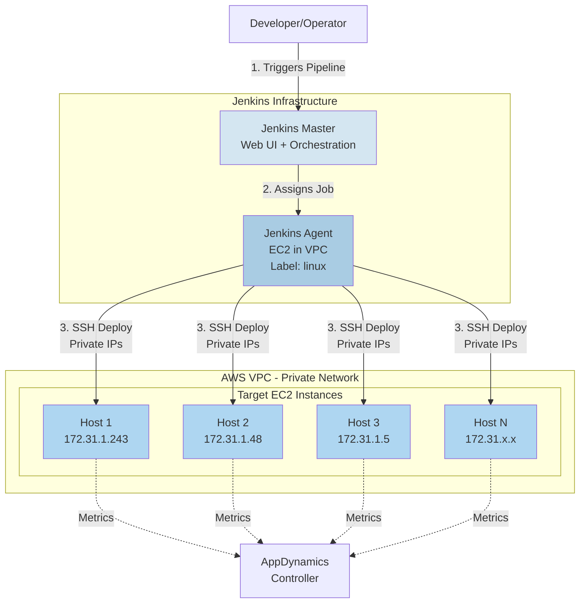
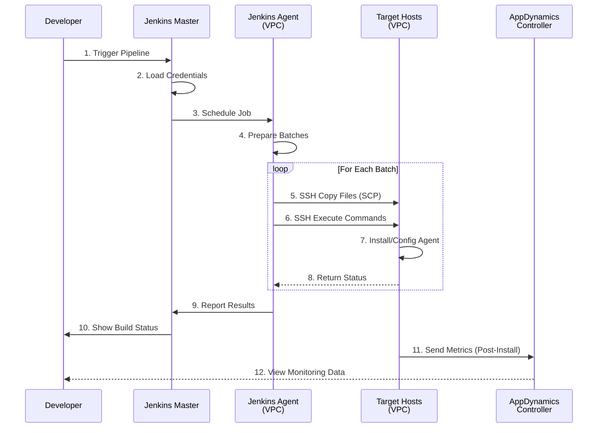
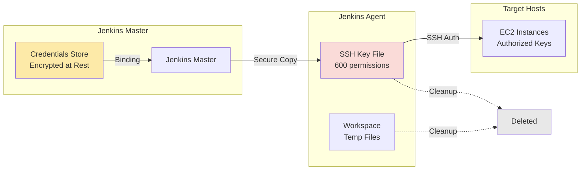

## システムアーキテクチャ

Jenkins ベースの Smart Agent デプロイメントシステムは、ハブアンドスポーク型のアーキテクチャを採用しており、AWS VPC 内の Jenkins agent が SSH 経由で複数のターゲットホストへのデプロイメントをオーケストレーションします。

### ハイレベルアーキテクチャ



## ネットワークアーキテクチャ

すべてのインフラストラクチャは、共有のセキュリティグループを持つ単一の AWS VPC 内で稼働します。Jenkins agent はプライベート IP を介してターゲットホストと通信するため、ターゲットホストにパブリック IP アドレスを割り当てる必要はありません。

### VPC レイアウト

```
┌─────────────────────────────────────────────────────────────────┐
│                        AWS VPC (10.0.0.0/16)                    │
│  ┌───────────────────────────────────────────────────────────┐  │
│  │              Security Group: app-agents-sg                │  │
│  │  Rules:                                                   │  │
│  │  - Inbound: SSH (22) from Jenkins Agent only             │  │
│  │  - Outbound: HTTPS (443) to AppDynamics Controller       │  │
│  └───────────────────────────────────────────────────────────┘  │
│                                                                  │
│  ┌──────────────┐    ┌──────────────┐    ┌──────────────┐      │
│  │ Jenkins Agent│    │  Target EC2  │    │  Target EC2  │      │
│  │              │    │              │    │              │      │
│  │ Private IP:  │───▶│ Private IP:  │    │ Private IP:  │      │
│  │ 172.31.50.10 │SSH │ 172.31.1.243 │    │ 172.31.1.48  │      │
│  │              │───▶│              │    │              │      │
│  │ Label: linux │    │ Ubuntu 20.04 │    │ Ubuntu 20.04 │      │
│  └──────────────┘    └──────────────┘    └──────────────┘      │
│         │                    │                    │             │
│         │                    │                    │             │
│         └────────────────────┴────────────────────┘             │
│                              │                                  │
└──────────────────────────────┼──────────────────────────────────┘
                               │
                               ▼
                    ┌──────────────────┐
                    │   AppDynamics    │
                    │    Controller    │
                    │  (SaaS/On-Prem)  │
                    └──────────────────┘
```

## デプロイメントフロー

### デプロイメントの全体シーケンス



## コンポーネントの詳細

### Jenkins Master

**役割:**

- ユーザー向け Web UI
- パイプラインのオーケストレーション
- 認証情報の管理
- ビルド履歴とログ
- ジョブのスケジューリング

**要件:**

- Jenkins 2.300+
- プラグイン: Pipeline、SSH Agent、Credentials、Git
- agent へのネットワークアクセス

### Jenkins Agent

**配置場所:**

- AWS VPC（ターゲットと同一の VPC）
- プライベートネットワークアクセス

**役割:**

- パイプラインステージの実行
- ターゲットホストへの SSH 接続
- ファイル転送 (SCP)
- バッチ処理ロジック
- エラーの収集

**要件:**

- ラベル: `linux`
- Java 11+
- SSH クライアント
- ネットワーク: すべてのターゲットへの SSH 接続
- ディスク: アーティファクト用に約 20GB

### ターゲットホスト

**前提条件:**

- Ubuntu 20.04+
- SSH サーバーが稼働していること
- sudo 権限を持つユーザー
- 認可された SSH キー

**デプロイメント後:**

```
/opt/appdynamics/
└── appdsmartagent/
    ├── smartagentctl
    ├── config.ini
    └── agents/
        ├── machine/
        ├── java/
        ├── node/
        └── db/
```

## セキュリティアーキテクチャ

### セキュリティレイヤー

1. **AWS VPC による分離**
   - agent 用のプライベートサブネット
   - インターネットへの直接アクセスは不要
   - VPC フローログを有効化

2. **セキュリティグループ**
   - Jenkins Agent の IP をホワイトリスト登録
   - ポート 22 (SSH) のみを許可
   - ステートフルなファイアウォールルール

3. **SSH キー認証**
   - パスワード認証は使用しない
   - キーは Jenkins credentials に保管
   - 一時的なキーファイル (600 パーミッション)
   - 各ビルド完了後にキーを削除

4. **Jenkins RBAC**
   - ロールベースのアクセス制御
   - パイプラインレベルの権限管理
   - 認証情報へのアクセス制限
   - 監査ログを有効化

5. **シークレット管理**
   - コードやログにシークレットを含めない
   - Credentials binding のみを使用
   - 環境変数のマスキング
   - シークレットの自動ローテーション (オプション)

### 認証情報のフロー



## バッチ処理

このシステムは、あらゆる規模のデプロイメントに対応するため自動バッチ処理を採用しています。デフォルトでは、ホストは 256 台ずつのバッチで処理され、各バッチ内のすべてのホストは並列にデプロイされます。

### バッチ処理の仕組み

```
HOST LIST (1000 hosts)              BATCH_SIZE = 256

Host 001: 172.31.1.1                ┌──────────────────┐
Host 002: 172.31.1.2      ────────▶ │   BATCH 1        │
    ...                              │   Hosts 1-256    │ ───┐
Host 256: 172.31.1.256               │   Sequential     │    │
                                     └──────────────────┘    │
Host 257: 172.31.1.257               ┌──────────────────┐    │
Host 258: 172.31.1.258   ────────▶  │   BATCH 2        │    │ SEQUENTIAL
    ...                              │   Hosts 257-512  │    │ EXECUTION
Host 512: 172.31.1.512               │   Sequential     │    │
                                     └──────────────────┘    │
Host 513: 172.31.1.513               ┌──────────────────┐    │
    ...                              │   BATCH 3        │    │
Host 768: 172.31.1.768   ────────▶  │   Hosts 513-768  │ ───┘
                                     └──────────────────┘
Host 769: 172.31.1.769               ┌──────────────────┐
    ...                              │   BATCH 4        │
Host 1000: 172.31.2.232  ────────▶  │   Hosts 769-1000 │
                                     │   (232 hosts)    │
                                     └──────────────────┘

WITHIN EACH BATCH:
┌────────────────────────────────────────┐
│  All hosts deploy in PARALLEL          │
│                                        │
│  Host 1 ──┐                           │
│  Host 2 ──┤                           │
│  Host 3 ──┼─▶ Background processes (&)│
│    ...    │                           │
│  Host 256─┘   └─▶ wait command        │
└────────────────────────────────────────┘
```

### スケーリング特性

**デプロイメント速度 (デフォルト BATCH_SIZE=256):**

- 10 ホスト → 1 バッチ → 約 2 分
- 100 ホスト → 1 バッチ → 約 3 分
- 500 ホスト → 2 バッチ → 約 6 分
- 1,000 ホスト → 4 バッチ → 約 12 分
- 5,000 ホスト → 20 バッチ → 約 60 分

**速度に影響する要因:**

- ネットワーク帯域幅 (ホスト 1 台あたり 19MB のパッケージ)
- SSH 接続のオーバーヘッド (ホスト 1 台あたり約 1 秒)
- ターゲットホストの CPU とディスク速度
- Jenkins agent のリソース

## 次のステップ

アーキテクチャの理解が得られたら、次は Jenkins のセットアップと認証情報の構成に進みます。
