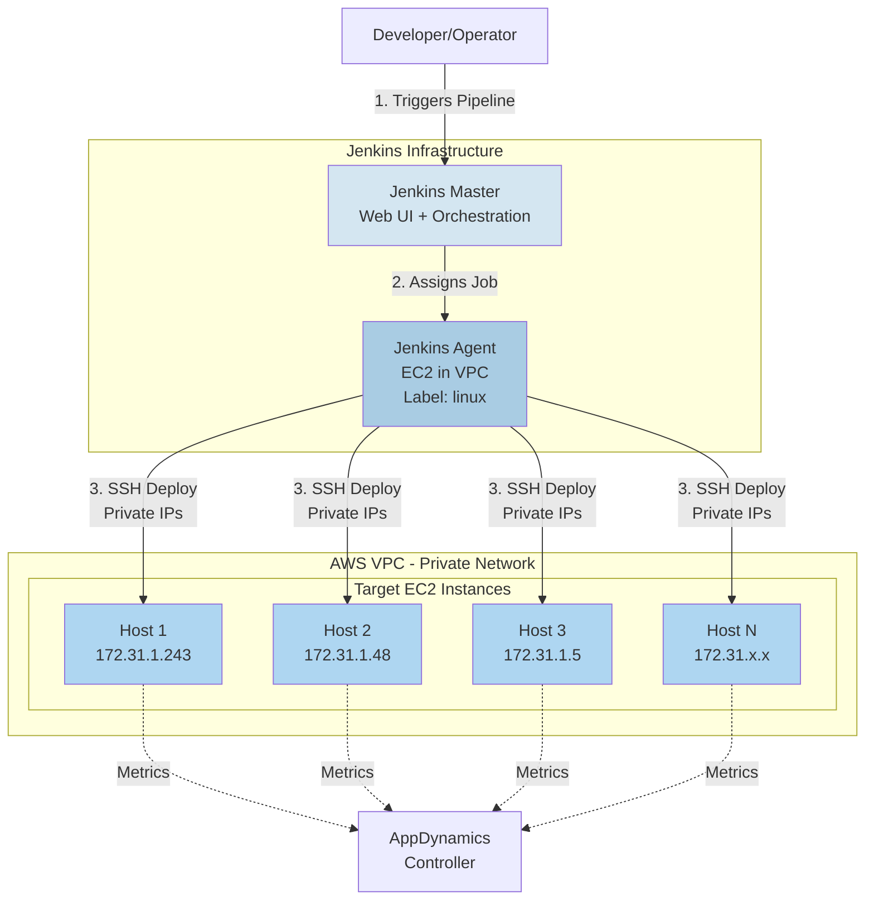
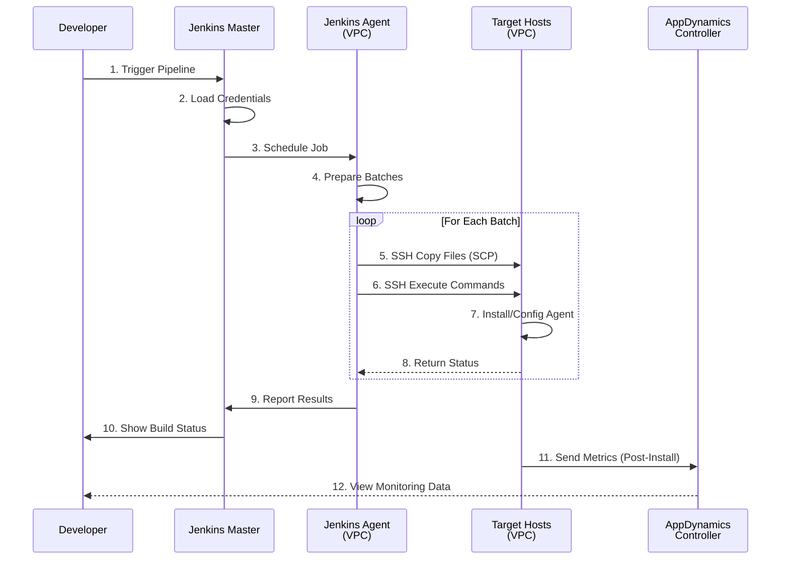
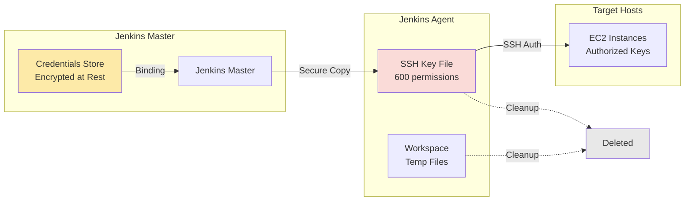

## システムアーキテクチャ

Jenkins ベースの Smart Agent デプロイメントシステムは、ハブアンドスポークアーキテクチャを使用しています。AWS VPC 内の Jenkins エージェントが SSH を介して複数のターゲットホストへのデプロイメントをオーケストレーションします。

### 全体アーキテクチャ



## ネットワークアーキテクチャ

すべてのインフラストラクチャは、共有セキュリティグループを持つ単一の AWS VPC 内で実行されます。Jenkins エージェントはプライベート IP を介してターゲットホストと通信するため、ターゲットホストにパブリック IP アドレスは必要ありません。

### VPC レイアウト

```
┌─────────────────────────────────────────────────────────────────┐
│                        AWS VPC (10.0.0.0/16)                    │
│  ┌───────────────────────────────────────────────────────────┐  │
│  │              Security Group: app-agents-sg                │  │
│  │  Rules:                                                   │  │
│  │  - Inbound: SSH (22) from Jenkins Agent only             │  │
│  │  - Outbound: HTTPS (443) to AppDynamics Controller       │  │
│  └───────────────────────────────────────────────────────────┘  │
│                                                                  │
│  ┌──────────────┐    ┌──────────────┐    ┌──────────────┐      │
│  │ Jenkins Agent│    │  Target EC2  │    │  Target EC2  │      │
│  │              │    │              │    │              │      │
│  │ Private IP:  │───▶│ Private IP:  │    │ Private IP:  │      │
│  │ 172.31.50.10 │SSH │ 172.31.1.243 │    │ 172.31.1.48  │      │
│  │              │───▶│              │    │              │      │
│  │ Label: linux │    │ Ubuntu 20.04 │    │ Ubuntu 20.04 │      │
│  └──────────────┘    └──────────────┘    └──────────────┘      │
│         │                    │                    │             │
│         │                    │                    │             │
│         └────────────────────┴────────────────────┘             │
│                              │                                  │
└──────────────────────────────┼──────────────────────────────────┘
                               │
                               ▼
                    ┌──────────────────┐
                    │   AppDynamics    │
                    │    Controller    │
                    │  (SaaS/On-Prem)  │
                    └──────────────────┘
```

## デプロイメントフロー

### 完全なデプロイメントシーケンス



## コンポーネントの詳細

### Jenkins Master

**役割:**

- ユーザー向け Web UI
- パイプラインオーケストレーション
- 認証情報管理
- ビルド履歴とログ
- ジョブスケジューリング

**要件:**

- Jenkins 2.300+
- プラグイン: Pipeline, SSH Agent, Credentials, Git
- エージェントへのネットワークアクセス

### Jenkins Agent

**配置場所:**

- AWS VPC（ターゲットと同じ）
- プライベートネットワークアクセス

**役割:**

- パイプラインステージの実行
- ターゲットホストへの SSH 接続
- ファイル転送（SCP）
- バッチ処理ロジック
- エラー収集

**要件:**

- Label: `linux`
- Java 11+
- SSH クライアント
- ネットワーク: すべてのターゲットへの SSH 接続
- ディスク: アーティファクト用に約 20GB

### ターゲットホスト

**前提条件:**

- Ubuntu 20.04+
- SSH サーバーが稼働中
- sudo アクセス権を持つユーザー
- 認可済み SSH キー

**デプロイ後:**

```
/opt/appdynamics/
└── appdsmartagent/
    ├── smartagentctl
    ├── config.ini
    └── agents/
        ├── machine/
        ├── java/
        ├── node/
        └── db/
```

## セキュリティアーキテクチャ

### セキュリティレイヤー

1. **AWS VPC 分離**
   - エージェント用プライベートサブネット
   - 直接のインターネットアクセスは不要
   - VPC フローログが有効

2. **セキュリティグループ**
   - Jenkins Agent IP のホワイトリスト登録
   - ポート 22（SSH）のみ
   - ステートフルファイアウォールルール

3. **SSH キー認証**
   - パスワード認証なし
   - キーは Jenkins の認証情報に保存
   - 一時キーファイル（600 パーミッション）
   - 各ビルド後にキーを削除

4. **Jenkins RBAC**
   - ロールベースアクセス制御
   - パイプラインレベルの権限
   - 認証情報アクセスの制限
   - 監査ログが有効

5. **シークレット管理**
   - コード/ログにシークレットを含めない
   - 認証情報バインディングのみ
   - 環境変数のマスキング
   - 自動シークレットローテーション（オプション）

### 認証情報フロー



## バッチ処理

このシステムは、あらゆる規模のデプロイメントをサポートするために自動バッチ処理を使用します。デフォルトでは、ホストは 256 台ずつのバッチで処理され、各バッチ内のすべてのホストは並列でデプロイされます。

### バッチ処理の仕組み

```
HOST LIST (1000 hosts)              BATCH_SIZE = 256

Host 001: 172.31.1.1                ┌──────────────────┐
Host 002: 172.31.1.2      ────────▶ │   BATCH 1        │
    ...                              │   Hosts 1-256    │ ───┐
Host 256: 172.31.1.256               │   Sequential     │    │
                                     └──────────────────┘    │
Host 257: 172.31.1.257               ┌──────────────────┐    │
Host 258: 172.31.1.258   ────────▶  │   BATCH 2        │    │ SEQUENTIAL
    ...                              │   Hosts 257-512  │    │ EXECUTION
Host 512: 172.31.1.512               │   Sequential     │    │
                                     └──────────────────┘    │
Host 513: 172.31.1.513               ┌──────────────────┐    │
    ...                              │   BATCH 3        │    │
Host 768: 172.31.1.768   ────────▶  │   Hosts 513-768  │ ───┘
                                     └──────────────────┘
Host 769: 172.31.1.769               ┌──────────────────┐
    ...                              │   BATCH 4        │
Host 1000: 172.31.2.232  ────────▶  │   Hosts 769-1000 │
                                     │   (232 hosts)    │
                                     └──────────────────┘

WITHIN EACH BATCH:
┌────────────────────────────────────────┐
│  All hosts deploy in PARALLEL          │
│                                        │
│  Host 1 ──┐                           │
│  Host 2 ──┤                           │
│  Host 3 ──┼─▶ Background processes (&)│
│    ...    │                           │
│  Host 256─┘   └─▶ wait command        │
└────────────────────────────────────────┘
```

### スケーリング特性

**デプロイ速度（デフォルト BATCH_SIZE=256）:**

- 10 ホスト → 1 バッチ → 約 2 分
- 100 ホスト → 1 バッチ → 約 3 分
- 500 ホスト → 2 バッチ → 約 6 分
- 1,000 ホスト → 4 バッチ → 約 12 分
- 5,000 ホスト → 20 バッチ → 約 60 分

**速度に影響する要因:**

- ネットワーク帯域幅（ホストあたり 19MB のパッケージ）
- SSH 接続オーバーヘッド（ホストあたり約 1 秒）
- ターゲットホストの CPU/ディスク速度
- Jenkins エージェントのリソース

## 次のステップ

アーキテクチャを理解できたので、次は Jenkins のセットアップと認証情報の設定に進みましょう。
