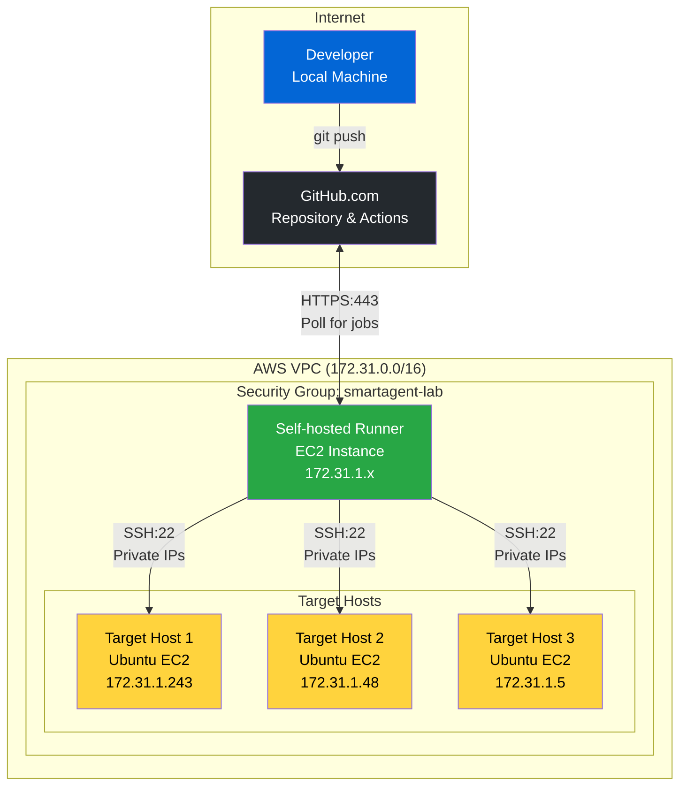
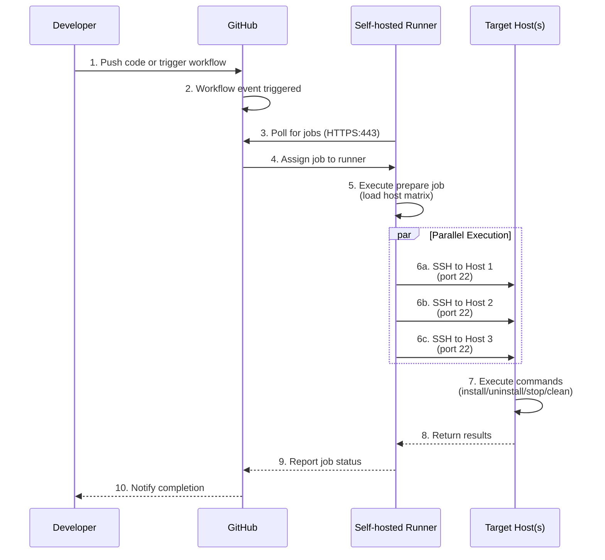

## システムアーキテクチャ

GitHub Actions ベースの Smart Agent デプロイメントシステムは、AWS VPC 内のセルフホストランナーを使用して、SSH 経由で複数のターゲットホストへのデプロイを調整します。

### ハイレベルアーキテクチャ



## ネットワークアーキテクチャ

すべてのインフラストラクチャは、共有セキュリティグループを持つ単一の AWS VPC 内で動作します。セルフホストランナーはプライベート IP を介してターゲットホストと通信します。

### VPC レイアウト

```
┌─────────────────────────────────────────────────────────────────┐
│                        AWS VPC (172.31.0.0/16)                  │
│  ┌───────────────────────────────────────────────────────────┐  │
│  │          Security Group: smartagent-lab                   │  │
│  │  Rules:                                                   │  │
│  │  - Inbound: SSH (22) from same security group            │  │
│  │  - Outbound: HTTPS (443) to GitHub                       │  │
│  └───────────────────────────────────────────────────────────┘  │
│                                                                  │
│  ┌─────────────┐    ┌──────────────┐    ┌──────────────┐       │
│  │ Self-hosted │    │  Target EC2  │    │  Target EC2  │       │
│  │   Runner    │    │              │    │              │       │
│  │             │───▶│ Private IP:  │    │ Private IP:  │       │
│  │ 172.31.1.x  │SSH │ 172.31.1.243 │    │ 172.31.1.48  │       │
│  │             │───▶│              │    │              │       │
│  │ Polls GitHub│    │ Ubuntu 20.04 │    │ Ubuntu 20.04 │       │
│  └─────────────┘    └──────────────┘    └──────────────┘       │
│         │                    │                    │             │
│         │                    │                    │             │
│         └────────────────────┴────────────────────┘             │
│                              │                                  │
└──────────────────────────────┼──────────────────────────────────┘
                               │
                               ▼
                    ┌──────────────────┐
                    │   AppDynamics    │
                    │    Controller    │
                    │  (SaaS/On-Prem)  │
                    └──────────────────┘
```

## ワークフロー実行フロー

### 完全なデプロイメントシーケンス



## コンポーネントの詳細

### GitHub リポジトリ

**格納物:**

- 11 個のワークフロー YAML ファイル
- Smart Agent インストールパッケージ
- 設定ファイル (config.ini)

**シークレット:**

- SSH 秘密鍵

**変数:**

- ホストリスト (DEPLOYMENT_HOSTS)
- ユーザー/グループ設定 (オプション)

### セルフホストランナー

**配置場所:**

- AWS VPC (ターゲットと同一)
- プライベートネットワークアクセス

**役割:**

- GitHub のワークフロージョブをポーリング
- ワークフローステップの実行
- ターゲットホストへの SSH 接続
- ファイル転送 (SCP)
- 並列実行
- エラー収集

**要件:**

- Ubuntu/Amazon Linux 2
- GitHub へのアウトバウンド HTTPS (443)
- ターゲットホストへのアウトバウンド SSH (22)
- SSH 鍵認証

**アクセス:**

- GitHub へのアウトバウンド HTTPS (443)
- ターゲットホストへのアウトバウンド SSH (22)
- SSH 鍵認証を使用

### ターゲットホスト

**前提条件:**

- Ubuntu 20.04+
- SSH サーバーが稼働していること
- sudo アクセス権を持つユーザー
- 承認済み SSH 鍵

**デプロイ後:**

```
/opt/appdynamics/
└── appdsmartagent/
    ├── smartagentctl
    ├── config.ini
    └── agents/
        ├── machine/
        ├── java/
        ├── node/
        └── db/
```

## セキュリティアーキテクチャ

### セキュリティレイヤー

1. **AWS VPC の分離**
   - ホスト用のプライベートサブネット
   - 直接のインターネットアクセスは不要
   - VPC フローログが有効

2. **セキュリティグループ**
   - 同一セキュリティグループ内の SSH (22) のみ
   - GitHub アクセス用のアウトバウンド HTTPS (443)
   - ステートフルファイアウォールルール

3. **SSH 鍵認証**
   - パスワード認証なし
   - GitHub Secrets に鍵を格納
   - ランナー上の一時的な鍵ファイル
   - ワークフロー完了後に鍵を削除

4. **GitHub セキュリティ**
   - リポジトリのアクセス制御
   - ブランチ保護ルール
   - ログにシークレットが公開されない
   - 環境変数のマスキング

5. **ネットワークセキュリティ**
   - プライベート IP 通信のみ
   - パブリック IP は不要
   - ランナーはターゲットと同じ VPC に配置

## ワークフローカテゴリ

このシステムは 4 つのカテゴリに整理された 11 のワークフローを含みます:

```
GitHub Actions Workflows (11 Total)
├── Deployment (1 workflow)
│   └── Deploy Smart Agent (Batched)
├── Agent Installation (4 workflows)
│   ├── Install Node Agent (Batched)
│   ├── Install Machine Agent (Batched)
│   ├── Install DB Agent (Batched)
│   └── Install Java Agent (Batched)
├── Agent Uninstallation (4 workflows)
│   ├── Uninstall Node Agent (Batched)
│   ├── Uninstall Machine Agent (Batched)
│   ├── Uninstall DB Agent (Batched)
│   └── Uninstall Java Agent (Batched)
└── Smart Agent Management (2 workflows)
    ├── Stop and Clean Smart Agent (Batched)
    └── Cleanup All Agents (Batched)
```

## バッチ処理戦略

すべてのワークフローは、あらゆる規模のデプロイメントをサポートするために自動バッチ処理を使用します。

### バッチ処理の仕組み

```
HOST LIST (1000 hosts)              BATCH_SIZE = 256

Host 001: 172.31.1.1                ┌──────────────────┐
Host 002: 172.31.1.2      ────────▶ │   BATCH 1        │
    ...                              │   Hosts 1-256    │ ───┐
Host 256: 172.31.1.256               │   Sequential     │    │
                                     └──────────────────┘    │
Host 257: 172.31.1.257               ┌──────────────────┐    │
Host 258: 172.31.1.258   ────────▶  │   BATCH 2        │    │ SEQUENTIAL
    ...                              │   Hosts 257-512  │    │ EXECUTION
Host 512: 172.31.1.512               │   Sequential     │    │
                                     └──────────────────┘    │
Host 513: 172.31.1.513               ┌──────────────────┐    │
    ...                              │   BATCH 3        │    │
Host 768: 172.31.1.768   ────────▶  │   Hosts 513-768  │ ───┘
                                     └──────────────────┘
Host 769: 172.31.1.769               ┌──────────────────┐
    ...                              │   BATCH 4        │
Host 1000: 172.31.2.232  ────────▶  │   Hosts 769-1000 │
                                     │   (232 hosts)    │
                                     └──────────────────┘

WITHIN EACH BATCH:
┌────────────────────────────────────────┐
│  All hosts deploy in PARALLEL          │
│                                        │
│  Host 1 ──┐                           │
│  Host 2 ──┤                           │
│  Host 3 ──┼─▶ Background processes (&)│
│    ...    │                           │
│  Host 256─┘   └─▶ wait command        │
└────────────────────────────────────────┘
```

### なぜ順次バッチ処理なのか？

**リソース管理:**

- セルフホストランナーの過負荷を防止
- 各バッチは 256 の並列 SSH 接続を開く
- 順次処理により安定したパフォーマンスを確保

**設定可能:**

- デフォルトバッチサイズ: 256 (GitHub Actions マトリックスの上限)
- ワークフロー入力でより小さなバッチに調整可能
- 速度とリソース使用量のバランス

### スケーリング特性

**デプロイ速度 (デフォルト BATCH_SIZE=256):**

- 10 hosts → 1 batch → 約 2 分
- 100 hosts → 1 batch → 約 3 分
- 500 hosts → 2 batches → 約 6 分
- 1,000 hosts → 4 batches → 約 12 分
- 5,000 hosts → 20 batches → 約 60 分

**速度に影響する要因:**

- ネットワーク帯域幅 (ホストあたり 19MB パッケージ)
- SSH 接続のオーバーヘッド (ホストあたり約 1 秒)
- ターゲットホストの CPU/ディスク速度
- ランナーのリソース (CPU/メモリ)

## 次のステップ

アーキテクチャを理解したところで、GitHub のセットアップとセルフホストランナーの設定に進みましょう。
