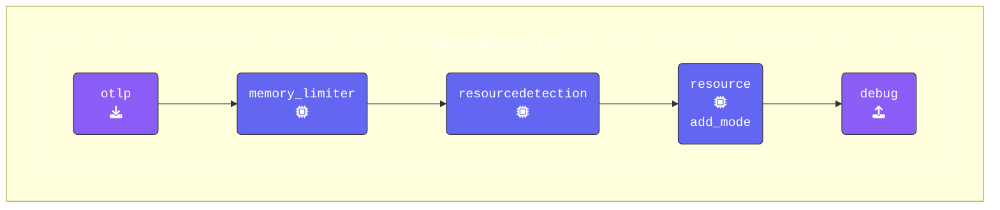

このワークショップでは、[**https://otelbin.io**](https://otelbin.io/)を使用してYAML構文を素早く検証し、OpenTelemetry設定が正確であることを確認します。このステップにより、セッション中にテストを実行する前にエラーを回避できます。

{}
設定を検証する方法は以下の通りです。

1. [**https://otelbin.io**](https://otelbin.io/)を開き、左ペインにYAMLを貼り付けて既存の設定を置き換えます。
    > [!INFO]
    > Macを使用しており、Splunk Workshopインスタンスを使用して **いない** 場合は、以下のコマンドを実行して `agent.yaml` ファイルの内容をクリップボードにコピーできます。
    >
    > ```bash
    > cat agent.yaml | pbcopy
    > ```

2. ページ上部で、検証ターゲットとして **Splunk OpenTelemetry Collector** が選択されていることを確認します。このオプションを選択 **しない** 場合、UIに `Receiver "hostmetrics" is unused. (Line 8)` という警告が表示されます。

3. 検証が完了したら、以下の画像表現を参照してパイプラインが正しく設定されていることを確認します。

ほとんどの場合、 **主要なパイプライン** のみを表示します。ただし、3つのパイプライン（Traces、Metrics、Logs）がすべて同じ構造を共有している場合は、それぞれを個別に表示する代わりにその旨を記載します。



{}

---

## 負荷生成ツール

このワークショップでは、専用に開発した `loadgen` ツールを使用します。`loadgen` はトレースとロギングアクティビティをシミュレートするための柔軟な負荷生成ツールです。デフォルトでbase、health、securityトレースをサポートし、オプションでランダムな引用文をプレーンテキストまたはJSON形式でファイルにログ記録できます。

`loadgen` が生成する出力はOpenTelemetry計装ライブラリが生成するものを模倣しており、Collectorの処理ロジックをテストし、実際のシナリオをシンプルかつ強力にシミュレートできます。
