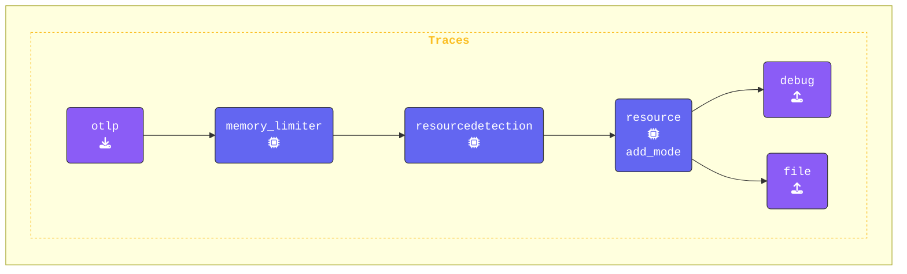

画面上のデバッグ出力だけでなく、パイプラインのエクスポートフェーズでも出力を生成したい場合があります。そのために、比較用にOTLPデータをファイルに書き込む **File Exporter** を追加します。

OpenTelemetryの **debug exporter** と **file exporter** の違いは、目的と出力先にあります。

| 機能             | Debug Exporter                  | File Exporter                 |
|---------------------|---------------------------------|-------------------------------|
| **出力先** | コンソール/ログ                     | ディスク上のファイル                  |
| **目的**         | リアルタイムデバッグ             | 永続的なオフライン分析   |
| **最適な用途**        | テスト中の素早い確認 | 一時的な保存と共有 |
| **本番利用**  | いいえ                              | まれだが可能            |
| **永続性**     | なし                              | あり                           |

まとめると、 **Debug Exporter** はリアルタイムの開発中トラブルシューティングに最適であり、 **File Exporter** はテレメトリデータをローカルに保存して後で使用する場合に適しています。

{}

**Agent terminal** ウィンドウでCollectorが実行されていないことを確認し、`agent.yaml` を編集して **File Exporter** を設定します。

1. **`file` exporterの設定**: [**File Exporter**](https://github.com/open-telemetry/opentelemetry-collector-contrib/blob/main/exporter/fileexporter/README.md)はテレメトリデータをディスク上のファイルに書き込みます。

    ```yaml
      file:                                # File Exporter
        path: "./agent.out"                # Save path (OTLP/JSON)
        append: false                      # Overwrite the file each time
    ```

1. **Pipelinesセクションの更新**: `file` exporterを `traces` パイプラインにのみ追加します。

    ```yaml
      pipelines:
        traces:
          receivers:
          - otlp                           # OTLP Receiver
          processors:
          - memory_limiter                 # Memory Limiter processor
          - resourcedetection              # Add system attributes to the data
          - resource/add_mode              # Add collector mode metadata
          exporters:
          - debug                          # Debug Exporter
          - file                           # File Exporter
        metrics:
          receivers:
          - otlp
          processors:
          - memory_limiter
          - resourcedetection
          - resource/add_mode
          exporters:
          - debug
        logs:
          receivers:
          - otlp
          processors:
          - memory_limiter
          - resourcedetection
          - resource/add_mode
          exporters:
          - debug
    ```

{}

[**https://otelbin.io**](https://otelbin.io/)を使用してエージェント設定を検証します。


