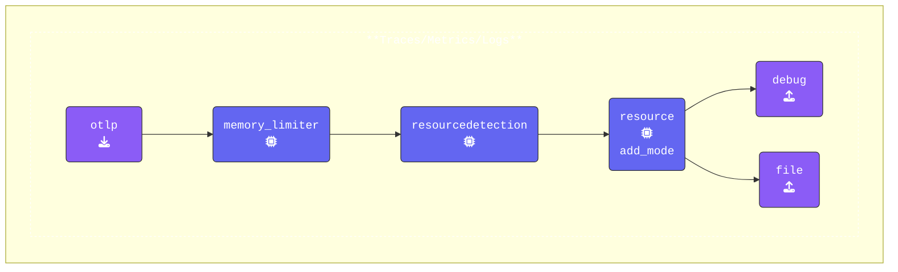

ここまでは、OpenTelemetry Collectorを通して送信されたSpanの正確なコピーをそのままエクスポートしていました。

次に、Processorを使用してメタデータを追加し、基本のSpanを改善しましょう。この追加情報はトラブルシューティングや相関分析に役立ちます。

{}
**Collectorを停止する**: **Agent terminal** ウィンドウで、`Ctrl-C` を押して実行中のCollectorを停止します。`agent` が停止したら、`agent.yaml` を開きます。

**すべてのパイプラインを更新する**: 両方のProcessor（`resourcedetection` と `resource/add_mode`）を **すべてのパイプライン** の `processors` 配列に追加します。`memory_limiter` が最初のProcessorのままであることを確認してください。

- [**Resource Detection Processor**](https://github.com/open-telemetry/opentelemetry-collector-contrib/blob/main/processor/resourcedetectionprocessor/README.md) は、ホストからリソース情報を検出し、テレメトリデータのリソース値にその情報を追加または上書きするために使用されます。
- [**Resource Processor**](https://github.com/open-telemetry/opentelemetry-collector-contrib/blob/main/processor/resourceprocessor/README.md) は、リソース属性に変更を適用するために使用されます。この場合、デフォルト設定では値が `agent` の新しい属性 `otelcol.service.mode` が追加されます。

```yaml
service:                          # Services configured for this Collector
  extensions:                     # Enabled extensions
  - health_check
  pipelines:                      # Array of configured pipelines
    traces:
      receivers:
      - otlp                      # OTLP Receiver
      processors:
      - memory_limiter            # Memory Limiter Processor
      - resourcedetection         # Adds system attributes to the data
      - resource/add_mode         # Adds collector mode metadata
      exporters:
      - debug                     # Debug Exporter
      - file                      # File Exporter
    metrics:
      receivers:
      - otlp                      # OTLP Receiver
      processors:
      - memory_limiter            # Memory Limiter Processor
      - resourcedetection         # Adds system attributes to the data
      - resource/add_mode         # Adds collector mode metadata
      exporters:
      - debug                     # Debug Exporter
      - file                      # File Exporter
    logs:
      receivers:
      - otlp                      # OTLP Receiver
      processors:
      - memory_limiter            # Memory Limiter Processor
      - resourcedetection         # Adds system attributes to the data
      - resource/add_mode         # Adds collector mode metadata
      exporters:
      - debug                     # Debug Exporter
      - file                      # File Exporter

```

{}

これらのProcessorを追加することで、データにシステムメタデータとエージェントの動作モードが付加され、トラブルシューティングに役立ち、関連コンテンツに有用なコンテキストを提供します。

**[otelbin.io](https://www.otelbin.io/)** を使用してエージェント設定を検証します。


