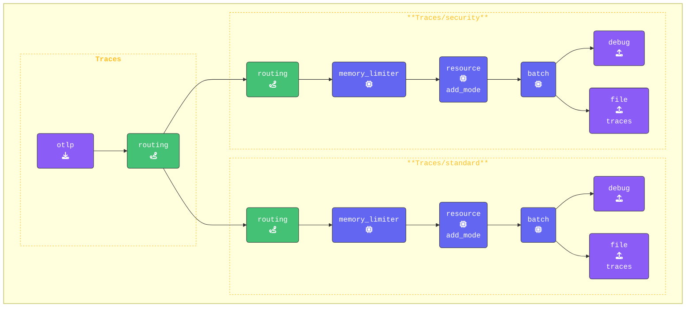

{}

**`traces` パイプラインを更新してルーティングを使用する**:

1. `routing`を有効にするために、`routing`を唯一のExporterとして使用するように元の `traces:` パイプラインを更新します。これにより、すべてのSpanデータが評価のためにrouting connectorを通じて送信されます。
2. すべてのProcessorを削除し、空の配列（`[]`）に置き換えます。これらは `traces/standard` および `traces/security` パイプラインで定義されるようになりました。

    ```yaml
      pipelines:
        traces:                           # Original traces pipeline
          receivers: 
          - otlp                          # OTLP Receiver
          processors: []
          exporters: 
          - routing                       # Routing Connector
    ```

**`standard` と `security` の両方のTracesパイプラインを追加する**:

1. **Securityパイプラインの設定**: このパイプラインは、`security`のルーティングルールに一致するすべてのSpanを処理します。
これはReceiverとして `routing` を使用します。既存の `traces:` パイプラインの下に配置します。

    ```yaml
        traces/security:              # New Security Traces/Spans Pipeline
          receivers: 
          - routing                   # Receive data from the routing connector
          processors:
          - memory_limiter            # Memory Limiter Processor
          - resource/add_mode         # Adds collector mode metadata
          - batch
          exporters:
          - debug                     # Debug Exporter 
          - file/traces/security      # File Exporter for spans matching rule
    ```

2. **Standardパイプラインの追加**: このパイプラインは、ルーティングルールに一致しないすべてのSpanを処理します。
このパイプラインもReceiverとして `routing` を使用します。`traces/security` の下に追加します。

    ```yaml
        traces/standard:              # Default pipeline for unmatched spans
          receivers: 
          - routing                   # Receive data from the routing connector
          processors:
          - memory_limiter            # Memory Limiter Processor
          - resource/add_mode         # Adds collector mode metadata
          - batch
          exporters:
          - debug                     # Debug exporter
          - file/traces/standard      # File exporter for unmatched spans
    ```

{}

**[otelbin.io](https://www.otelbin.io/)** を使用してエージェント設定を検証します。参考として、パイプラインの `traces:` セクションは以下のようになります。


