このセクションでは、[**Count Connector**](https://github.com/open-telemetry/opentelemetry-collector-contrib/tree/main/connector/countconnector) を使用して、ログから属性値を抽出し、意味のあるメトリクスに変換する方法を説明します。

具体的には、Count Connectorを使用して、ログに表示される「Star Wars」と「Lord of the Rings」の引用の数を追跡し、測定可能なデータポイントに変換します。

{}

- `[WORKSHOP]` ディレクトリ内に、`9-sum-count` という名前の新しいサブディレクトリを作成します。
- 次に、`8-routing-data` ディレクトリから `*.yaml` を `9-sum-count` にコピーします。
- **すべての** ターミナルウィンドウを `[WORKSHOP]/9-sum-count` ディレクトリに変更します。

```text { title="Updated Directory Structure" }
.
├── agent.yaml
└── gateway.yaml
```

- **agent.yamlを更新** して、ログを読み取る頻度を変更します。
`agent.yaml` 内の `filelog/quotes` Receiverを見つけて、`poll_interval` 属性を追加します。

```yaml
  filelog/quotes:                      # Receiver Type/Name
    poll_interval: 10s                 # Only read every ten seconds 
```
  
{}

遅延を設定する理由は、OpenTelemetry CollectorのCount Connectorが各処理インターバル内でのみログをカウントするためです。つまり、データが読み取られるたびに、次のインターバルのためにカウントがゼロにリセットされます。デフォルトの `Filelog reciever` インターバルである200msでは、loadgenが書き込むすべての行を読み取り、カウントが1になります。このインターバルを設定することで、カウントする複数のエントリを確保します。

Collectorは、以下に示すように条件を省略することで、各読み取りインターバルの累積カウントを維持できます。ただし、バックエンドはより長い期間にわたってカウントを追跡できるため、累積カウントはバックエンドに任せることがベストプラクティスです。

{}

- **Count Connectorを追加する**

設定のconnectorsセクションにCount Connectorを追加し、使用するメトリクスカウンターを定義します。

```yaml
connectors:
  count:
    logs:
      logs.full.count:
        description: "Running count of all logs read in interval"
      logs.sw.count:
        description: "StarWarsCount"
        conditions:
        - attributes["movie"] == "SW"
      logs.lotr.count:
        description: "LOTRCount"
        conditions:
        - attributes["movie"] == "LOTR"
      logs.error.count:
        description: "ErrorCount"
        conditions:
        - attributes["level"] == "ERROR"
```

- **メトリクスカウンターの説明**

  - `logs.full.count`: 各読み取りインターバル中に処理されたログの総数を追跡します。
  このメトリクスにはフィルタリング条件がないため、システムを通過するすべてのログがカウントに含まれます。
  - `logs.sw.count`: Star Wars映画の引用を含むログをカウントします。
  - `logs.lotr.count`: Lord of the Rings映画の引用を含むログをカウントします。
  - `logs.error.count`: 読み取りインターバル中に重大度レベルがERRORのログをカウントする、実際のシナリオを表します。

- **パイプラインでCount Connectorを設定する**
以下のパイプライン設定では、Connector Exporterが `logs` セクションに追加され、Connector Receiverが `metrics` セクションに追加されています。

```yaml
  pipelines:
    traces:
      receivers:
      - otlp
      processors:
      - memory_limiter
      - attributes/update              # Update, hash, and remove attributes
      - redaction/redact               # Redact sensitive fields using regex
      - resourcedetection
      - resource/add_mode
      - batch
      exporters:
      - debug
      - file
      - otlphttp
    metrics:
      receivers:
      - count                           # Count Connector that receives count metric from logs count exporter in logs pipeline. 
      - otlp
      #- hostmetrics                    # Host Metrics Receiver
      processors:
      - memory_limiter
      - resourcedetection
      - resource/add_mode
      - batch
      exporters:
      - debug
      - otlphttp
    logs:
      receivers:
      - otlp
      - filelog/quotes
      processors:
      - memory_limiter
      - resourcedetection
      - resource/add_mode
      - transform/logs                 # Transform logs processor
      - batch
      exporters:
      - count                          # Count Connector that exports count as a metric to metrics pipeline.
      - debug
      - otlphttp
```

{}

ログは属性に基づいてカウントされます。ログデータが属性ではなくログ本文に格納されている場合、パイプラインで `Transform` Processorを使用してキー/値ペアを抽出し、属性として追加する必要があります。

このワークショップでは、`07-transform` セクションで既に `merge_maps(attributes, cache, "upsert")` を追加しています。これにより、すべての関連データが処理用のログ属性に含まれることが保証されます。

属性を作成するフィールドを選択する際は注意が必要です。すべてのフィールドを無差別に追加することは、本番環境では一般的に理想的ではありません。不要なデータの混乱を避けるために、本当に必要なフィールドのみを選択してください。

{}

- **[otelbin.io](https://www.otelbin.io/)** を使用してエージェント設定を **検証** します。参考として、パイプラインの `logs` と `metrics:` セクションは以下のようになります。

```mermaid
%%{init:{"fontFamily":"monospace"}}%%
graph LR
    %% Nodes
    REC1(otlp<br>fa:fa-download):::receiver
    REC2(filelog<br>fa:fa-download<br>quotes):::receiver
    REC3(otlp<br>fa:fa-download):::receiver
    PRO1(memory_limiter<br>fa:fa-microchip):::processor
    PRO2(memory_limiter<br>fa:fa-microchip):::processor
    PRO3(resource<br>fa:fa-microchip<br>add_mode):::processor
    PRO4(resource<br>fa:fa-microchip<br>add_mode):::processor
    PRO5(batch<br>fa:fa-microchip):::processor
    PRO6(batch<br>fa:fa-microchip):::processor
    PRO7(resourcedetection<br>fa:fa-microchip):::processor
    PRO8(resourcedetection<br>fa:fa-microchip):::processor
    PRO9(transfrom<br>fa:fa-microchip<br>logs):::processor
    EXP1(&nbsp;&ensp;debug&nbsp;&ensp;<br>fa:fa-upload):::exporter
    EXP2(&emsp;&emsp;otlphttp&emsp;&emsp;<br>fa:fa-upload):::exporter
    EXP3(&nbsp;&ensp;debug&nbsp;&ensp;<br>fa:fa-upload):::exporter
    EXP4(&emsp;&emsp;otlphttp&emsp;&emsp;<br>fa:fa-upload):::exporter
    ROUTE1(&nbsp;count&nbsp;<br>fa:fa-route):::con-export
    ROUTE2(&nbsp;count&nbsp;<br>fa:fa-route):::con-receive

    %% Links
    subID1:::sub-logs
    subID2:::sub-metrics
    subgraph " " 
      direction LR
      subgraph subID1[**Logs**]
      direction LR
      REC1 --> PRO1
      REC2 --> PRO1
      PRO1 --> PRO7
      PRO7 --> PRO3
      PRO3 --> PRO9
      PRO9 --> PRO5
      PRO5 --> ROUTE1
      PRO5 --> EXP1
      PRO5 --> EXP2
      end
      
      subgraph subID2["`**Metrics**`"]
      direction LR
      ROUTE1 --> ROUTE2       
      ROUTE2 --> PRO2
      REC3 --> PRO2
      PRO2 --> PRO8
      PRO8 --> PRO4
      PRO4 --> PRO6
      PRO6 --> EXP3
      PRO6 --> EXP4
      end
    end
classDef receiver,exporter fill:#8b5cf6,stroke:#333,stroke-width:1px,color:#fff;
classDef processor fill:#6366f1,stroke:#333,stroke-width:1px,color:#fff;
classDef con-receive,con-export fill:#45c175,stroke:#333,stroke-width:1px,color:#fff;
classDef sub-logs stroke:#34d399,stroke-width:1px, color:#34d399,stroke-dasharray: 3 3;
classDef sub-metrics stroke:#38bdf8,stroke-width:1px, color:#38bdf8,stroke-dasharray: 3 3;
```



{}
