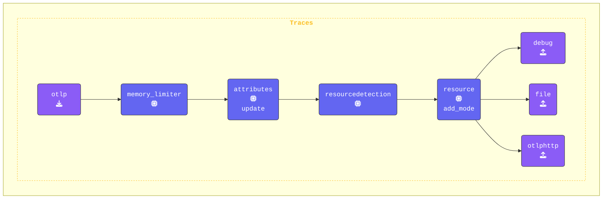

このステップでは、`agent.yaml`に`attributes`および`redaction` Processorを追加します。これらのProcessorにより、Span属性内の機密データがログ出力やエクスポートされる前に適切に処理されるようになります。

以前のステップで、コンソールに表示された一部のSpan属性に個人情報や機密データが含まれていることに気付いたかもしれません。ここでは、これらの情報を効果的にフィルタリングおよびリダクションするために必要なProcessorを設定します。

```text
Attributes:
     -> user.name: Str(George Lucas)
     -> user.phone_number: Str(+1555-867-5309)
     -> user.email: Str(george@deathstar.email)
     -> user.account_password: Str(LOTR>StarWars1-2-3)
     -> user.visa: Str(4111 1111 1111 1111)
     -> user.amex: Str(3782 822463 10005)
     -> user.mastercard: Str(5555 5555 5555 4444)
  {"kind": "exporter", "data_type": "traces", "name": "debug"}
```

{}

**Agent terminal** ウィンドウに切り替え、エディターで`agent.yaml`ファイルを開きます。テレメトリデータのセキュリティとプライバシーを強化するために、2つのProcessorを追加します。

**1. `attributes` Processorの追加**: [**Attributes Processor**](https://github.com/open-telemetry/opentelemetry-collector-contrib/tree/main/processor/attributesprocessor) を使用すると、Span属性（タグ）の値を更新、削除、またはハッシュ化して変更できます。これは、機密情報がエクスポートされる前に難読化する際に特に有用です。

このステップでは以下を行います。

1. `user.phone_number`属性を固定値 `("UNKNOWN NUMBER")` に **更新** します。
2. `user.email`属性を **ハッシュ化** して、元のメールアドレスが公開されないようにします。
3. `user.password`属性を **削除** して、Spanから完全に除去します。

```yaml
  attributes/update:
    actions:                           # Actions
      - key: user.phone_number         # Target key
        action: update                 # Update action
        value: "UNKNOWN NUMBER"        # New value
      - key: user.email                # Target key
        action: hash                   # Hash the email value
      - key: user.password             # Target key
        action: delete                 # Delete the password
  ```

**2. `redaction` Processorの追加**: [**Redaction Processor**](https://github.com/open-telemetry/opentelemetry-collector-contrib/tree/main/processor/redactionprocessor) は、クレジットカード番号やその他の個人識別情報（PII）などの事前定義されたパターンに基づいて、Span属性内の機密データを検出しリダクションします。

このステップでは以下を行います。

- `allow_all_keys: true`を設定して、すべての属性が処理されるようにします（`false`に設定すると、明示的に許可されたキーのみが保持されます）。

- `blocked_values`に正規表現を定義して、**Visa** および **MasterCard** のクレジットカード番号を検出しリダクションします。

- `summary: debug`オプションにより、デバッグ目的でリダクションプロセスの詳細情報がログに記録されます。

```yaml
  redaction/redact:
    allow_all_keys: true               # If false, only allowed keys will be retained
    blocked_values:                    # List of regex patterns to block
      - '\b4[0-9]{3}[\s-]?[0-9]{4}[\s-]?[0-9]{4}[\s-]?[0-9]{4}\b'       # Visa
      - '\b5[1-5][0-9]{2}[\s-]?[0-9]{4}[\s-]?[0-9]{4}[\s-]?[0-9]{4}\b'  # MasterCard
    summary: debug                     # Show debug details about redaction
```

**`traces`パイプラインの更新**: 両方のProcessorを`traces`パイプラインに統合します。最初はredaction Processorをコメントアウトしてください（後の別の演習で有効にします）。設定は以下のようになります。

```yaml
    traces:
      receivers:
      - otlp
      processors:
      - memory_limiter
      - attributes/update              # Update, hash, and remove attributes
      #- redaction/redact               # Redact sensitive fields using regex
      - resourcedetection
      - resource/add_mode
      - batch
      exporters:
      - debug
      - file
      - otlphttp
```

{}

**[otelbin.io](https://www.otelbin.io/)** を使用してエージェント設定を検証します。参考として、パイプラインの`traces:`セクションは以下のようになります。


