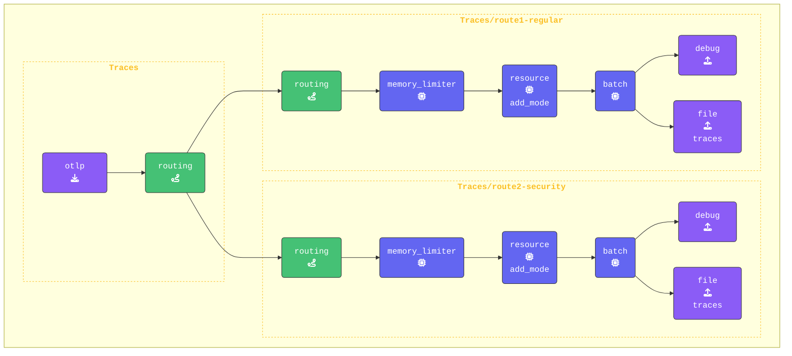

{}

**元の `traces` パイプラインを routing を使用するように更新します**:

1. `routing` を有効にするために、元の `traces` パイプラインで `routing` を唯一のExporterとして使用するように更新します。これにより、すべてのSpanデータが **Routing Connector** を通じて評価され、接続されたパイプラインに転送されます。また、**すべての** Processorを削除し、空の配列（`[]`）に置き換えます。これは `traces/route1-regular` と `traces/route2-security` パイプラインで処理されるようになり、各ルートにカスタム動作を設定できるようになります。`traces:` の設定は以下のようになります:

    ```yaml
    traces:                       # Traces pipeline
      receivers:
      - otlp                      # OTLP receiver
      processors: []              # Processors for traces
      exporters:
      - routing
    ```

**既存の `traces` パイプラインの下に `route1-regular` と `route2-security` の両方のTracesパイプラインを追加します**:

1. **Route1-regularパイプラインの設定**: このパイプラインは、Connectorのルーティングテーブルで **一致しない** すべてのSpanを処理します。このパイプラインは `routing` を唯一のReceiverとして使用し、元のTracesパイプラインからの `connection` を通じてデータを受信します。

    ```yaml
        traces/route1-regular:         # Default pipeline for unmatched spans
          receivers: 
          - routing                    # Receive data from the routing connector
          processors:
          - memory_limiter             # Memory Limiter Processor
          - resource/add_mode          # Adds collector mode metadata
          - batch
          exporters:
          - debug                      # Debug Exporter 
          - file/traces/route1-regular # File Exporter for unmatched spans 
    ```

2. **route2-securityパイプラインの追加**: このパイプラインは、ルーティングルールで `"[deployment.environment"] == "security-applications"` に一致するすべてのSpanを処理します。このパイプラインも `routing` をReceiverとして使用します。`traces/route1-regular` の下にこのパイプラインを追加します。

    ```yaml
        traces/route2-security:         # Default pipeline for unmatched spans
          receivers: 
          - routing                     # Receive data from the routing connector
          processors:
          - memory_limiter              # Memory Limiter Processor
          - resource/add_mode           # Adds collector mode metadata
          - batch
          exporters:
          - debug                       # Debug exporter
          - file/traces/route2-security # File exporter for unmatched spans
    ```

{}

**[otelbin.io](https://www.otelbin.io/)** を使用してエージェントの設定を検証します。参考として、パイプラインの `traces:` セクションは以下のようになります:


