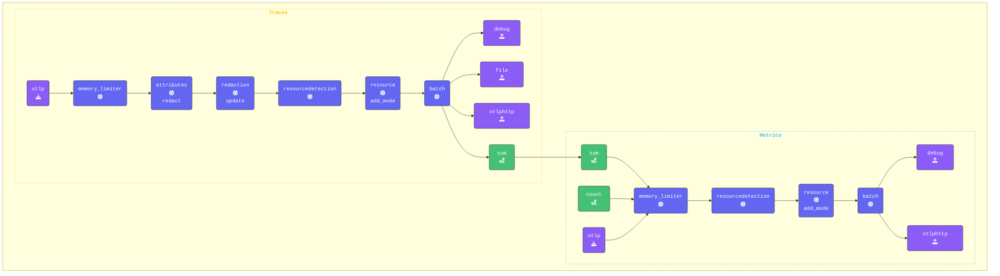

このセクションでは、[**Sum Connector**](https://github.com/open-telemetry/opentelemetry-collector-contrib/tree/main/connector/sumconnector) がSpanから値を抽出してメトリクスに変換する方法を探ります。

具体的には、ベースとなるSpanからクレジットカードの請求額を取得し、Sum Connectorを利用して合計請求額をメトリクスとして取得します。

このConnectorは、Span、Spanイベント、メトリクス、データポイント、ログレコードから属性値を収集（**sum**）するために使用できます。個々の値をキャプチャし、メトリクスに変換して送信します。ただし、これらのメトリクスとその属性を使用して計算やさらなる処理を行うのは **バックエンド** の役割です。

{}

**Agent terminal** ウィンドウに切り替えて、エディタで `agent.yaml` ファイルを開きます。

- **Sum Connectorを追加する**  
設定のconnectorsセクションにSum Connectorを追加し、メトリクスカウンターを定義します

```yaml
  sum:
    spans:
       user.card-charge:
        source_attribute: payment.amount
        conditions:
          - attributes["payment.amount"] != "NULL"
        attributes:
          - key: user.name
    
```

{}

上記の例では、Span内の `payment.amount` 属性を確認します。有効な値がある場合、**Sum** Connectorは `user.card-charge` というメトリクスを生成し、`user.name` を属性として含めます。これにより、バックエンドは請求サイクルなどの長期間にわたるユーザーの合計請求額を追跡・表示できます。

以下のパイプライン設定では、ConnectorのExporterがtracesセクションに追加され、ConnectorのReceiverがmetricsセクションに追加されています。

{}

- **Count Connectorをパイプラインに設定する**

```yaml
  pipelines:
    traces:
      receivers:
      - otlp
      processors:
      - memory_limiter
      - attributes/update              # Update, hash, and remove attributes
      - redaction/redact               # Redact sensitive fields using regex
      - resourcedetection
      - resource/add_mode
      - batch
      exporters:
      - debug
      - file
      - otlphttp
      - sum                            # Sum connector which aggregates payment.amount from spans and sends to metrics pipeline
    metrics:
      receivers:
      - sum                            # Receives metrics from the sum exporter in the traces pipeline
      - count                          # Receives count metric from logs count exporter in logs pipeline. 
      - otlp
      #- hostmetrics                   # Host Metrics Receiver
      processors:
      - memory_limiter
      - resourcedetection
      - resource/add_mode
      - batch
      exporters:
      - debug
      - otlphttp
    logs:
      receivers:
      - otlp
      - filelog/quotes
      processors:
      - memory_limiter
      - resourcedetection
      - resource/add_mode
      - transform/logs                 # Transform logs processor
      - batch
      exporters:
      - count                          # Count Connector that exports count as a metric to metrics pipeline.
      - debug
      - otlphttp
```

- **[otelbin.io](https://www.otelbin.io/)** を使用してエージェント設定を **検証** します。参考として、パイプラインの `traces` と `metrics:` セクションは以下のようになります



{}
