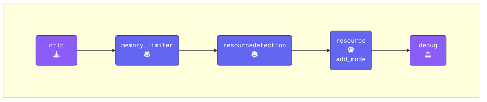

このワークショップでは、[**https://otelbin.io**](https://otelbin.io/) を使用して YAML 構文を素早く検証し、OpenTelemetry の構成が正確であることを確認します。このステップは、セッション中にテストを実行する前にエラーを回避するのに役立ちます。

{}
構成を検証する方法は次のとおりです。

1. [**https://otelbin.io**](https://otelbin.io/) を開き、左ペインに YAML を貼り付けて既存の構成を置き換えます。
    > [!INFO]
    > Mac を使用しており、Splunk Workshop インスタンスを使用していない場合は、次のコマンドを実行することで、`agent.yaml` ファイルの内容を素早くクリップボードにコピーできます。
    >
    > ```bash
    > cat agent.yaml | pbcopy
    > ```

2. ページの上部で、検証対象として **Splunk OpenTelemetry Collector** が選択されていることを確認してください。このオプションを選択し**ない**場合、UI に `Receiver "hostmetrics" is unused. (Line 8)` という警告が表示されます。

3. 検証が完了したら、以下の画像表現を参照して、パイプラインが正しく設定されていることを確認してください。

ほとんどの場合、**主要なパイプライン**のみを表示します。ただし、3 つのパイプライン (Traces、Metrics、Logs) すべてが同じ構造を共有している場合は、それぞれを個別に示すのではなく、その旨を記載します。



{}

---

## Load Generation Tool

このワークショップのために、`loadgen` ツールを特別に開発しました。`loadgen` は、トレースおよびロギングアクティビティをシミュレートするための柔軟な負荷生成ツールです。デフォルトで base、health、security のトレースをサポートし、オプションでランダムな引用をプレーンテキストまたは JSON 形式でファイルにロギングする機能も備えています。

`loadgen` によって生成される出力は、OpenTelemetry インストルメンテーションライブラリによって生成されるものを模倣しており、Collector の処理ロジックをテストすることを可能にし、現実のシナリオを模倣するためのシンプルかつ強力な方法を提供します。
