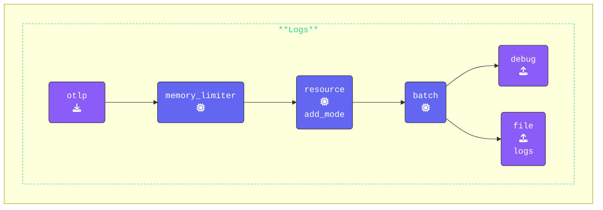

`gateway` の設定は、機能させるために追加の設定変更を必要としません。これは、時間を節約し、**Gateway** の中核となる概念に集中するためです。

**[otelbin.io](https://www.otelbin.io/)** を使用して `gateway` の設定を検証します。参考までに、パイプラインの `logs:` セクションは次のようになります。



{}

**Gateway の起動**: **Gateway ターミナル** ウィンドウで、次のコマンドを実行して `gateway` を起動します。

```bash {title="Start the Gateway"}
../otelcol --config=gateway.yaml
```

すべて正しく設定されていれば、出力の最初と最後の行は次のようになります。

```text
2025/01/15 15:33:53 settings.go:478: Set config to [gateway.yaml]
<snip to the end>
2025-01-13T12:43:51.747+0100 info service@v0.120.0/service.go:261 Everything is ready. Begin running and processing data.
```

{}

次に、新しく作成した `gateway` にデータを送信するように `agent` を設定します。
